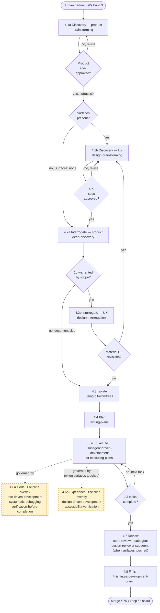

# Combined Workflow Prompt

A single high-level prompt for building an opinionated agent-workflow repository, framed as a deterministic developer-session pipeline with code and experience discipline applied at the handoffs.

## Table of Contents

1. [Purpose](#1-purpose)
2. [Intended Use](#2-intended-use)
3. [The Prompt](#3-the-prompt)
4. [Pipeline Stages](#4-pipeline-stages)
   - [4.1 Discovery](#41-discovery)
   - [4.2 Interrogate](#42-interrogate)
   - [4.3 Isolate](#43-isolate)
   - [4.4 Plan](#44-plan)
   - [4.5 Execute](#45-execute)
   - [4.6 Discipline](#46-discipline)
   - [4.7 Review](#47-review)
   - [4.8 Finish](#48-finish)
5. [Repository Structure](#5-repository-structure)
   - [5.1 Skills](#51-skills)
   - [5.2 Agents](#52-agents)
   - [5.3 Hooks](#53-hooks)
   - [5.4 Scripts](#54-scripts)
   - [5.5 Commands](#55-commands)
   - [5.6 Per-Harness Manifests](#56-per-harness-manifests)
   - [5.7 Docs](#57-docs)
   - [5.8 Tests](#58-tests)
   - [5.9 Repo Metadata](#59-repo-metadata)
6. [Iron Laws](#6-iron-laws)
7. [Notes for Expansion](#7-notes-for-expansion)

---

## 1. Purpose

Provide a single prompt that a coding agent can act on to scaffold a repository whose product is an opinionated developer-session workflow. The prompt leads with the session narrative and applies behavior-shaping discipline on two axes — code correctness and experience quality — only where the pipeline is most vulnerable to shortcut-taking.

## 2. Intended Use

Send the prompt in section 3 as the first message to a capable coding agent. The agent should read it as a specification for an entire repository, not a single feature. It is framed at the level of "what the repo contains and how its pieces hand off," not at the level of specific code.

## 3. The Prompt

Build a repo that encodes one coherent developer session from first message to merged branch as a deterministic pipeline of skills that hand off to each other in a fixed order. When the human partner says "let's build X," the agent enters Discovery, which runs two sequential co-skills: first `brainstorming` produces a product spec (explore context, ask clarifying questions one at a time, propose two or three approaches with trade-offs, declare a `Surfaces` field, obtain explicit approval); then, when surfaces are present, `design-brainstorming` produces a UX spec (surfaces enumerated, user flows with failure paths, a state matrix covering empty/loading/error/success/permission-denied/offline, accessibility targets, voice and tone). Both specs must be approved by the human partner before the pipeline advances. A `deep-discovery` skill then pressure-tests the product spec with a 100-question self-interrogation; a conditional `design-interrogation` co-skill pressure-tests the UX spec when scope warrants. Material revisions loop back to the relevant Discovery co-skill. A git-worktrees skill then creates an isolated branch workspace and verifies a clean test baseline. Each skill is written to resist the shortcuts agents reach for under pressure — terminology, red-flags tables, and anti-pattern rebuttals exist so the pipeline runs instead of getting talked out of.

A writing-plans skill turns the approved specs into a plan of bite-sized tasks (two to five minutes each). Code tasks carry exact file paths, complete code, and verification steps; UX tasks carry the artifact reference, the state matrix row to implement, and the accessibility procedure. Execution branches: subagent-driven-development for independent tasks in the current session, dispatching a fresh subagent per task with constructed context and running two review passes (spec compliance, then code quality) plus a third design-review pass when the task touches a user-facing surface; or executing-plans for batch execution with human checkpoints. Execute is governed by two overlays. Code Discipline — test-driven-development, systematic-debugging, verification-before-completion — governs every code change under the iron laws that no production code exists without a failing test, no fix precedes root-cause investigation, and no completion claim lacks fresh verification evidence. Experience Discipline — design-driven-development and accessibility-verification — governs every surface-touching task under the iron laws that no user-facing surface is built without an approved design artifact and no surface is claimed complete without fresh accessibility evidence.

Finally, a requesting-code-review skill runs a pre-review checklist and a code-reviewer subagent reports issues by severity; a requesting-design-review skill dispatches a harness-aware design-reviewer subagent in parallel when surfaces were touched; receiving-code-review and receiving-design-review skills discipline the responses (verify before implementing, no performative agreement); a finishing-a-development-branch skill presents merge / PR / keep / discard options and cleans up the worktree. Each skill names its successor explicitly so the pipeline is deterministic. Ship the whole thing as a zero-dependency plugin across Claude Code, Cursor, Codex, OpenCode, Copilot CLI, and Gemini CLI, with per-harness manifest files, a session-start hook that injects the entry skill on every new session, install docs per harness, a tests directory, a CHANGELOG, a versioned package.json, and a LICENSE. A meta-skill, writing-skills, lets contributors extend the pipeline without breaking its contracts by writing a pressure test against a subagent first and only keeping skill text that actually changes the agent's behavior.

## 4. Pipeline Stages

### 4.1 Discovery

Sequential co-skills. Both must be approved before stage 2.

- **4.1a `brainstorming`** — product spec. Output: `docs/leyline/specs/YYYY-MM-DD-<topic>-design.md`. Required field: `Surfaces: [none | developer-facing | cli-only | single-screen-ui | multi-screen-ui | cross-platform]`. Default `multi-screen-ui`.
- **4.1b `design-brainstorming`** — UX spec (runs when surfaces present). Output: `docs/leyline/design/YYYY-MM-DD-<topic>-ux.md`. Mandatory sections: surfaces, flows, state matrix, IA (multi-screen only), voice & tone, accessibility targets, platform constraints, non-goals.
- **Hard gates:** no implementation until product spec approved; additionally, no implementation of any surface until UX spec approved.
- **Successor:** `deep-discovery` (2a) always; `design-interrogation` (2b) conditionally.

### 4.2 Interrogate

Co-skills. 2a always; 2b conditionally.

- **4.2a `deep-discovery`** — 100-question pressure test of the product spec. Returns critical issues, strengths, revised proposal. Material revisions loop back to 1a.
- **4.2b `design-interrogation`** — 100-question pressure test of the UX spec. Required for `multi-screen-ui` / `cross-platform` / state matrix covering >1 surface; optional for complex `cli-only` or `developer-facing`; skipped otherwise. Skip must be documented explicitly in the spec; no silent skipping.
- **Successor:** `using-git-worktrees` (3) on clean; loop back on material revisions.

### 4.3 Isolate

- **Skill:** `using-git-worktrees`
- **Successor:** `writing-plans` (4)
- **Exit:** isolated branch workspace, project setup complete, green test baseline.

### 4.4 Plan

- **Skill:** `writing-plans`
- **Successor:** `subagent-driven-development` or `executing-plans` (5)
- **Exit:** plan of 2–5-minute tasks with exact paths and code (for code tasks) plus artifact references and state-matrix rows (for UX tasks).

### 4.5 Execute

- **Skills:** `subagent-driven-development` (in-session) or `executing-plans` (batched)
- **Successor:** `requesting-code-review` (+ `requesting-design-review` when surfaces touched) (7)
- **Exit:** all tasks complete; spec, code-quality, and (when applicable) design reviews passed.

### 4.6 Discipline

Two overlays, both applying during Execute (5). Neither is a sequential step.

- **4.6a Code Discipline** — `test-driven-development`, `systematic-debugging`, `verification-before-completion`. Governs all work.
- **4.6b Experience Discipline** — `design-driven-development`, `accessibility-verification`. Additionally governs every task whose "Files:" block touches a user-facing surface.
- **Exit:** five iron laws satisfied on every change, every failure, every surface, every completion claim.

### 4.7 Review

Parallel branches. Both run when surfaces are touched; only code review runs otherwise.

- **Code review:** `requesting-code-review`, `receiving-code-review`, `code-reviewer` subagent.
- **Design review (when surfaces touched):** `requesting-design-review`, `receiving-design-review`, `design-reviewer` subagent.
- **Harness-aware.** The design-reviewer inspects available tools (browser automation, design-tool MCPs, a11y scanners, snapshot tools) and uses them when present; falls back to structural review when absent.
- **Exit:** all Critical + Important findings across both reviews resolved.
- **Successor:** `finishing-a-development-branch` (8).

### 4.8 Finish

- **Skill:** `finishing-a-development-branch`
- **Successor:** none — pipeline terminates.
- **Exit:** merge / PR / keep / discard chosen and executed; worktree cleaned.

## 5. Repository Structure

### 5.1 Skills

- **Directory:** `skills/`
- **Contents:** One folder per skill. Each contains a `SKILL.md` with YAML frontmatter (`name`, `description`) plus optional supporting files.
- **Role:** The behavior-shaping library. Every pipeline stage is realized by one or more skills here. Includes the meta-skill `writing-skills` for extending the library under the same TDD-for-prose methodology.

### 5.2 Agents

- **Directory:** `agents/`
- **Contents:** Specialized subagent definitions — `code-reviewer.md` and `design-reviewer.md`.
- **Role:** Dispatched by skills during execution and review. Subagents receive constructed context rather than inheriting the parent session.

### 5.3 Hooks

- **Directory:** `hooks/`
- **Contents:** `hooks.json` (Claude Code), `hooks-cursor.json` (Cursor), `run-hook.cmd` (Windows launcher), `session-start` (POSIX launcher).
- **Role:** `SessionStart` hook matching `startup|clear|compact` prints the entry skill content so the harness injects it as system context before the model's first reply.

### 5.4 Scripts

- **Directory:** `scripts/`
- **Contents:** Build / install / validation / maintenance helpers.
- **Role:** Keeps the repository zero-dependency at runtime while allowing tooling alongside the content.

### 5.5 Commands

- **Directory:** `commands/`
- **Contents:** Markdown slash-command definitions that redirect to skills.
- **Role:** Thin redirectors. The skill is the source of truth; the command is a convenience entry point.

### 5.6 Per-Harness Manifests

- **Location:** Repository root
- **Contents:** `CLAUDE.md`, `AGENTS.md`, `GEMINI.md`, `gemini-extension.json`.
- **Role:** Tell each harness (Claude Code, Cursor, Codex, OpenCode, Copilot CLI, Gemini CLI) how to discover skills, agents, and hooks.

### 5.7 Docs

- **Directory:** `docs/`
- **Contents:** Per-harness install guides; spec archive (`docs/leyline/specs/`); design archive (`docs/leyline/design/`); plan archive (`docs/leyline/plans/`); Windows notes; testing methodology.
- **Role:** Everything a user or contributor needs to install, use, and extend the plugin without reading source.

### 5.8 Tests

- **Directory:** `tests/`
- **Contents:** Verification for hook wiring, skill discovery, skill triggering, per-harness scenarios, and adversarial skill-compliance pressure scenarios.
- **Role:** CI-gated proof that skills still change agent behavior under pressure.

### 5.9 Repo Metadata

- **Location:** Repository root
- **Contents:** `CHANGELOG.md`, versioned `package.json`, `RELEASE-NOTES.md`, `LICENSE`, `CODE_OF_CONDUCT.md`.
- **Role:** Publish-ready metadata so the plugin can be installed from marketplaces and versioned predictably.

## 6. Iron Laws

### Code Discipline (6a)

- **Test-Driven Development:** `NO PRODUCTION CODE WITHOUT A FAILING TEST FIRST`
- **Systematic Debugging:** `NO FIXES WITHOUT ROOT CAUSE INVESTIGATION FIRST`
- **Verification Before Completion:** `NO COMPLETION CLAIMS WITHOUT FRESH VERIFICATION EVIDENCE`

### Experience Discipline (6b)

- **Design-Driven Development:** `NO USER-FACING SURFACE WITHOUT AN APPROVED DESIGN ARTIFACT FIRST`
- **Accessibility Verification:** `NO COMPLETION CLAIMS ON A USER-FACING SURFACE WITHOUT FRESH ACCESSIBILITY EVIDENCE`

All five are preceded in their home skills by the sentence: *"Violating the letter of the rules is violating the spirit of the rules."*

## 7. Notes for Expansion

Reserved for your additions.
