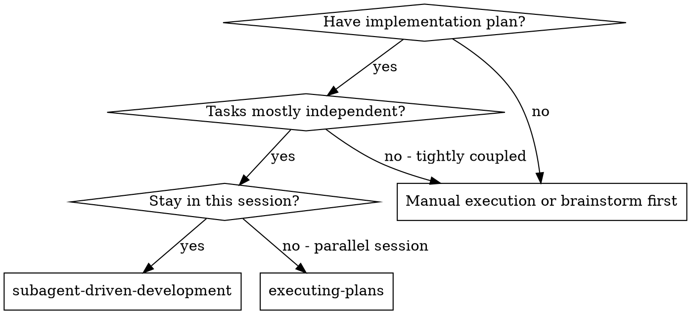

# Diagram conventions

Skills use diagrams to make decision points and process flows explicit. Two formats are supported.

## Graphviz DOT — in-skill diagrams

**Use:** embedded in `SKILL.md` files for decision trees and process flows.
**Why DOT:** renders to images for humans and also parses reliably for agents; does not require a non-text renderer to be useful.

### Example (decision diagram)



### DOT shape conventions (from `skills/writing-skills/graphviz-conventions.dot`)

- `shape=diamond` — decision point
- `shape=box` — action or state
- `shape=doublecircle` — entry or exit state
- `shape=ellipse` — label or metadata
- Edge `label=` — the condition triggering that path

### Rendering

`skills/writing-skills/render-graphs.js` converts DOT to image formats when a human-readable visual is needed.

## Mermaid — in external docs

**Use:** in files outside the skill library (e.g., `../combined-workflow-prompt.md`, per-harness READMEs).
**Why Mermaid:** renders natively in GitHub and most markdown viewers; friendlier for documentation aimed at humans first.

### Example (flowchart)

```
flowchart TD
    Start([Human partner: let's build X]) --> Design
    Design["4.1 Design<br/>brainstorming"]
    Design --> DesignApproved{Spec approved?}
    DesignApproved -->|no, revise| Design
    DesignApproved -->|yes| Interrogate
```

### Mermaid node conventions

- `["..."]` — rectangle (action or stage)
- `{"..."}` — diamond (decision)
- `([...])` — stadium (entry/exit)
- `[[...]]` — subroutine (overlay, e.g., Discipline)
- Solid arrow `-->` — normal flow
- Dotted arrow `-. label .->` — overlay / non-sequential relationship

## Which format where

| Context | Format |
|---------|--------|
| Inside a `SKILL.md` | DOT |
| In `Leyline Plugin/` generated docs | Mermaid |
| In `../combined-workflow-prompt.md` | Mermaid |
| In `docs/README.codex.md`, `docs/README.opencode.md` | Mermaid (renders in marketplace pages) |

## Related

- `principles/tdd-for-prose.md` — `writing-skills` folder contains `graphviz-conventions.dot` and `render-graphs.js`
- `reference/skill-file-format.md` — diagrams sit under the "When to use" and "Process flow" standard body sections
