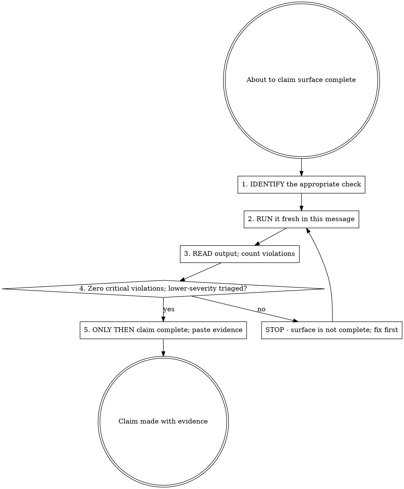

## Announce on entry

> I'm using the accessibility-verification skill. I will not claim this surface is complete until I have run the accessibility verification procedure fresh in this message and pasted its output showing zero critical violations.

## Iron Law

```
NO COMPLETION CLAIMS ON A USER-FACING SURFACE WITHOUT FRESH ACCESSIBILITY EVIDENCE
```

> Violating the letter of the rules is violating the spirit of the rules.

## Why the iron law

Accessibility defects are rare in acute incidents and overwhelming in aggregate. A single inaccessible modal is not the crisis; the hundredth one is, because by then accessibility has become something the team assumes the framework handles. This iron law puts evidence at every completion claim so the assumption cannot form silently.

The evidence is concrete. Not "I followed best practices." Not "the framework handles this." A pasted tool output, a keyboard-walk transcript, a screen-reader narration. If you cannot paste it, you did not run it.

## The "fresh" rule

Matches `verification-before-completion`: "fresh" means the accessibility check was run AFTER the last change to the surface AND in the current message. A check from three messages ago is not evidence for the current code. Session memory is not evidence. An earlier run is not evidence.

## Tool-agnostic

The iron law does not require any specific tool. It requires that *some* accessibility verification ran in this message and produced readable output. Any of the following satisfies the law:

- **Automated scanner output:** axe-core, Lighthouse, pa11y, WAVE, similar. Paste the output verbatim.
- **Manual keyboard walkthrough:** a transcript of pressing Tab / Shift+Tab / Enter / Escape through the surface, naming where focus went, what was announced, and whether any step trapped focus or skipped elements.
- **Screen-reader narration:** a transcript of what VoiceOver, NVDA, or JAWS announced during the flow.
- **Manual contrast and semantic check:** a statement of the contrast ratios checked, the aria attributes inspected, the landmarks confirmed.

Automated tools are faster and catch more. Manual transcripts are slower but valid. See `../../dev/reference/recommended-optional-tools.md` for optional tools.

"Looks fine on my machine" is NOT evidence. "I followed best practices" is NOT evidence. "The framework handles accessibility" is NOT evidence.

## The gate



### 1. IDENTIFY

Pick the appropriate check for the surface type:

- **Web UI:** automated scan with axe-core or equivalent AND a manual keyboard walk. The scan catches labels, contrast, semantics; the keyboard walk catches focus traps, announcement order, skip links.
- **Native mobile:** platform accessibility inspector (Xcode Accessibility Inspector on iOS; Accessibility Scanner on Android) AND a VoiceOver/TalkBack walk.
- **CLI:** a manual re-read of the output for screen-reader-friendliness (no color-only signals, no ASCII art that distorts under line-by-line reading, reasonable terminal width). Contrast in terminal is the user's concern; the skill checks color independence.
- **Email / notification:** alt text on images, text alternative to any visual-only information, logical reading order.
- **Error message / empty-state text:** blame-free, action-oriented, translatable.

If the task touches more than one surface type, run the check appropriate to each.

### 2. RUN

Run the check in the current message. Now, with the code at its current state. Not from memory, not from a prior run.

### 3. READ

Read the full output:

- For automated tools: every violation, including severity. Do not skim to "0 errors"; the tool may report 0 errors and many warnings; warnings matter.
- For manual walks: the full transcript. If the transcript is short, say so explicitly ("three focus stops; tab order matches visual order; all elements announced").

### 4. VERIFY

The bar is the WCAG level declared in the UX spec's "Accessibility targets" section (per `design-brainstorming` and `../../dev/reference/surface-types.md`). If the UX spec does not declare a level, the default is **WCAG 2.2 AA**. Do not ship below the declared level without the human partner's explicit authorization recorded verbatim in the review log.

The surface is accessible for the purpose of the iron law when:

- Zero critical / blocker violations at the declared WCAG level. "Critical" is whatever the chosen tool's highest severity tier is (axe-core: `critical`; Lighthouse: `audit failed` on a11y category; pa11y: `ERROR`). For manual walks, "critical" means any of: focus trap, unlabeled interactive element, inaccessible state (empty / error / loading not reachable or not announced), color-only information.
- Warnings triaged (each either fixed in this message or explicitly deferred with a task created for later).
- The manual walk, if run, reports no focus trap, no unlabeled interactive element, no color-only information.

If any of these fail, the surface is not complete. STOP. Fix the surface and re-run.

### 5. CLAIM

Paste the evidence alongside the claim. "Surface complete" alone is not a claim; "surface complete (axe-core: 0 violations, 2 warnings; keyboard walk: 5 stops, tab order matches visual order)" is.

## Claim-to-evidence mapping

Extends the `verification-before-completion` table specifically for surfaces.

| Claim | Requires | Not sufficient |
|-------|----------|----------------|
| UX complete | Every state in the state matrix implemented AND walked through in this message | Happy-path screenshot |
| Accessible | Fresh a11y scan with 0 critical violations, OR manual keyboard + screen-reader walk transcript in this message | "I followed accessibility practices" |
| Design matches spec | Fresh side-by-side walk (artifact vs implementation) in this message - see `design-driven-development` | "It looks right" |
| Empty / loading / error states | Each state triggered and observed in this message, with text matching the UX spec's voice examples | "We have the components for it" |
| Flow works | Full user journey walked end-to-end in this message, including the failure path | Individual screens rendered |
| Permission-denied state | Triggered explicitly (revoke permission, retry) in this message | "We handle the case" |
| Offline state | Triggered explicitly (disable network, retry) in this message | "We have offline handling" |

## Checklist

For every surface-touching task, before claiming complete:

1. Identify the check appropriate to the surface(s).
2. Run it fresh in this message.
3. Read the full output.
4. Verify zero critical violations, warnings triaged.
5. Paste the evidence alongside the completion claim (or into the review-log entry for Stage 7 to consume).

## Anti-patterns

- **"I Followed Accessibility Best Practices"** - evidence or it did not happen.
- **"It Renders Fine For Me"** - you are not every user.
- **"The Framework Handles Accessibility"** - no framework handles all of it. Run the check.
- **"I Tested Keyboard Navigation Earlier"** - earlier is not this message. Run fresh.
- **"This Is Internal, Doesn't Need a11y"** - internal users also have disabilities.
- **"Warnings Are Fine, Only Errors Matter"** - warnings often are contrast failures or ambiguous labels. Triage, do not ignore.
- **"I Can Paste The Automated Scan, Skip The Keyboard Walk"** - automated scans do not catch focus traps or announcement order. Run both when both apply.

## Red flags

| Thought | Reality |
|---------|---------|
| "I know this component is accessible" | Then running the check takes a minute. Run it. |
| "The scan found 2 critical violations but they are stylistic" | Critical is critical. Fix or escalate. |
| "My machine's screen reader is off; I'll skip the walk" | Enable it or describe the fallback manual walk. Do not skip. |
| "The artifact didn't specify a11y, I'll follow defaults" | The iron law's default is WCAG 2.2 AA when the UX spec is silent. Framework defaults rarely meet AA. Run the check. |
| "I'll add a11y in a polish PR" | Accessibility is how it is built, not a polish pass. |
| "Zero violations; claim complete" | Pastes the output before claiming. Evidence alongside claim. |

## Forbidden phrases

Do not say:

- "A11y verified" (without pasted output)
- "Looks fine on my machine"
- "Followed accessibility best practices"
- "Framework handles it"
- "I'll do a11y in a polish pass"
- "Zero errors, skipping the warnings"

## Returns to caller

This is an overlay. After the gate completes and the claim is made with evidence, control returns to the caller (typically `subagent-driven-development` or `executing-plans`). No explicit successor.

## Related

- `../../dev/principles/iron-laws.md` - catalogues this iron law
- `../../dev/principles/experience-discipline.md` - the 6b overlay rationale
- `../../dev/stages/06-discipline.md` - canonical overlay definition
- `../../dev/reference/recommended-optional-tools.md` - optional a11y tooling (axe-core, Lighthouse, pa11y, etc.)
- `../design-driven-development/SKILL.md` - the sibling iron law that runs for the same surface
- `../verification-before-completion/SKILL.md` - the general-purpose fresh-evidence gate this one specializes
