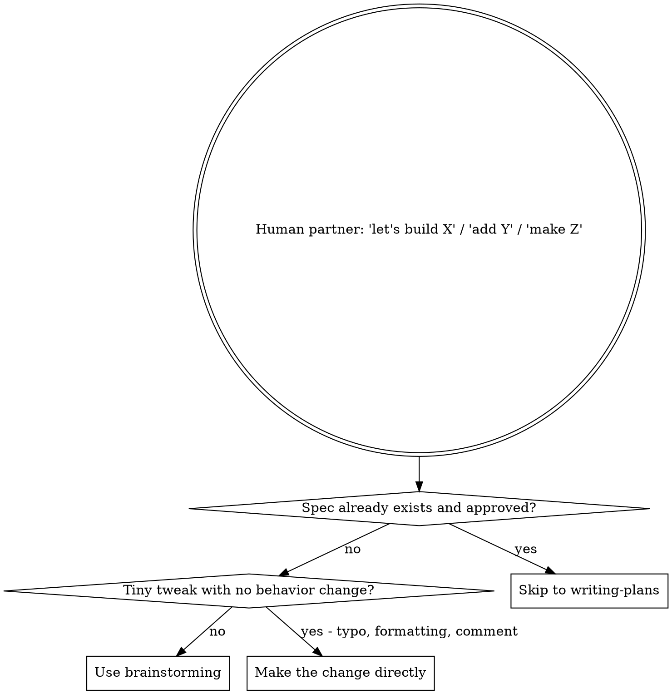
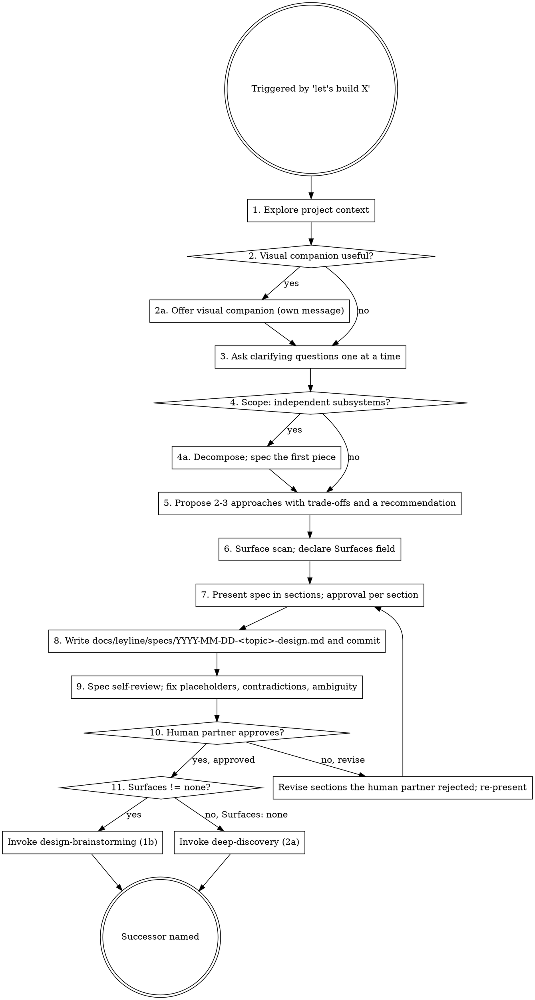

## Announce on entry

> I'm using the brainstorming skill to produce a product spec before any implementation. No code, no scaffolding, no implementation skill runs until you approve the written spec.

## Hard gate

```
Do NOT invoke any implementation skill, write any code, scaffold any project, or take
any implementation action until you have presented a product spec and the human partner
has approved it. This applies to EVERY project regardless of perceived simplicity.
```

> Violating the letter of the rules is violating the spirit of the rules.

## Why the gate exists

"Simple" projects are where unexamined assumptions cause the most wasted work. The cost of a 10-minute spec is one tenth of the cost of throwing away a half-built feature that solved the wrong problem. Skipping the gate to "save time" is the dominant failure mode for agents under pressure.

## When to use



The "tiny tweak" exit applies only to changes a code reviewer would not flag. Anything that adds, removes, or alters behavior goes through brainstorming.

## Process



## Checklist

Create one task entry (TodoWrite or harness equivalent) per item. Mark complete as you go.

1. **Explore project context** - read top-level files, recent commits, the relevant directory structure. Identify constraints already encoded in the codebase before proposing anything.
2. **Offer visual companion** - if the question involves layout, flow, or geometry, offer to attach a visual companion (`visual-companion.md`). Send the offer as its own message; do not combine it with a clarifying question. Wait for the human partner's answer before step 3.
3. **Ask clarifying questions one at a time** - never batch. Each question targets purpose, constraint, or success criteria. Wait for the answer before the next question.
4. **Scope check** - if the request decomposes into independent subsystems (different data models, different lifecycles, different audiences), say so and propose specing the first piece only. Do not silently widen scope.
5. **Propose 2-3 approaches** - for each: one-paragraph description, trade-offs (cost / risk / fit / reversibility), and a clear recommendation. Do not propose only the recommended one.
6. **Surface scan** - declare `Surfaces` (one of: `none`, `developer-facing`, `cli-only`, `single-screen-ui`, `multi-screen-ui`, `cross-platform`). Default `multi-screen-ui`. Anything other than the default requires active justification in the spec. Most "no UI" projects are `developer-facing`, not `none`. See `../../dev/reference/surface-types.md` for per-type definitions.
7. **Present spec in sections** - tailored to complexity. Get explicit approval per section ("Approved? Y/N") before moving on.
8. **Write the spec doc** - save to `docs/leyline/specs/YYYY-MM-DD-<topic>-design.md` and commit it. The required `Surfaces` field appears in the doc verbatim.
9. **Spec self-review** - read your own document. Fix placeholders ("TODO", "TBD"), resolve contradictions, replace vague phrases. Use the `spec-document-reviewer-prompt.md` template if dispatching a reviewer subagent.
10. **Human partner reviews the written spec** - present the document. Wait for approval. Do not advance until approval is explicit. Once the human partner says approved, append the verbatim approval marker to the spec's front matter or a "Approvals" subsection so downstream stages can grep for it without relying on session state:

    ```
    Product spec approved - round <N> - YYYY-MM-DD
    ```

    Commit the spec with the marker line included.
11. **Transition** - if `Surfaces` is anything other than `none`, announce and invoke `design-brainstorming` (stage 1b). Otherwise, announce and invoke `deep-discovery` (stage 2a).

## Required spec field

Every product spec must contain this field, verbatim, with one value chosen:

```
Surfaces: [none | developer-facing | cli-only | single-screen-ui | multi-screen-ui | cross-platform]
```

See `../../dev/reference/surface-types.md` for full per-type definitions and triggering rules.

## Spec document structure (default)

```
# <Topic> - product spec
Date: YYYY-MM-DD
Author: <human partner name or handle>
Surfaces: <one value>

## Problem
<one paragraph: what problem this solves and for whom>

## Goals
- <observable outcome 1>
- <observable outcome 2>

## Non-goals
- <thing this is explicitly not addressing>

## Constraints
- <technical, organizational, regulatory, or timeline constraints>

## Approaches considered
### Approach A - <short name>
<one paragraph>
Trade-offs: <cost / risk / fit / reversibility>

### Approach B - <short name>
<one paragraph>
Trade-offs: ...

(2-3 approaches total)

## Recommendation
<which approach, and why>

## Open questions
- <questions surfaced during clarification but not yet answered>

## Success criteria
- <how we know this is done>
```

## Anti-patterns

- **"This Is Too Simple To Need A Spec"** - the gate applies to EVERY project. The simpler the project feels, the more likely an unexamined assumption is hiding in it.
- **"I'll Spec As I Go"** - you won't. The spec written after implementation rationalizes whatever was built.
- **"Just One Approach Is Enough"** - presenting a single approach is presenting a decision, not a brainstorm. The human partner needs alternatives to push back on.
- **"Surfaces: none Because There's No UI"** - if the project produces ANY output a human reads (errors, logs, exit codes, API shapes, library docs), it has surfaces. `none` is for purely internal computations with zero observable output.
- **"Batched Clarifying Questions Save Time"** - they don't; they get answered shallowly and miss follow-ups. One at a time.
- **"The Human Partner Said To Skip The Spec"** - record the override. Say one sentence out loud naming the cost ("we are skipping the spec; I will not have a written record of intent to review against later"). Then proceed exactly as directed. Do not offer a compromise spec the human partner did not ask for. The hard gate respects human partner instructions; ignoring the gate without acknowledgment does not.

## Red flags

| Thought | Reality |
|---------|---------|
| "I already know what they want" | Then writing it down takes 90 seconds. Do it. |
| "We can iterate after we see code" | Iteration on the wrong thing is rework, not progress. |
| "The request is too small for a spec" | Small requests are where assumptions hide. |
| "Just let me start coding to explore" | Exploration in code is hard to throw away; exploration in prose is free. |
| "I'll add the Surfaces field later" | Later means never. Declare it before approval. |
| "The product spec covers UX too" | No - product spec says what; UX spec says how it's experienced. They are different artifacts. |
| "I asked five questions, that's enough clarification" | The right number is the number that resolves ambiguity, not five. |
| "The human partner is busy, I'll just decide" | Then say so out loud and ask explicitly for permission to decide. Never silently. |

## Anti-pattern preemption (named)

Before any of the following sentences leaves your reply, stop:

- "Let me just sketch the implementation..."
- "I'll prototype this real quick..."
- "Here's a starter implementation, we can refine the spec from there..."
- "This is small enough that we can skip the spec..."
- "Let me draft a first-pass file structure..."
- "I'll write the scaffolding; we can iterate on the spec as we build..."

Each is the brainstorming hard gate being violated. Re-enter the checklist at step 1.

## Forbidden phrases

Do not say:

- "Let me just sketch the implementation..."
- "I'll prototype this real quick..."
- "Here's a starter implementation, we can refine the spec from there..."
- "This is small enough that we can skip the spec..."
- "Let me draft a first-pass file structure..."
- "I'll write the scaffolding; we can iterate on the spec as we build..."
- "Quick spec; we'll fill in details in the plan..."
- "Skipping clarifying questions; the request is clear..."
- "Bundling these questions to save time..."

## Output artifacts

- **Required:** `docs/leyline/specs/YYYY-MM-DD-<topic>-design.md` committed to the repo.
- **Optional supporting files in `skills/brainstorming/`:**
  - `spec-document-reviewer-prompt.md` - prompt template for dispatching a reviewer subagent at step 9
  - `visual-companion.md` - guidance for offering and constructing a visual companion

## Successor

If `Surfaces` is anything other than `none`:

> Invoking design-brainstorming (stage 1b). The product spec is approved; the UX spec is the next gate.

If `Surfaces` is `none`:

> Invoking deep-discovery (stage 2a). The product spec is approved and there are no user-facing surfaces; pressure-testing the spec next.

### Missing-successor fallback

If the named successor skill (`design-brainstorming` or `deep-discovery`) is not present in this version of the plugin, STOP. Tell the human partner the pipeline is incomplete and which skill is missing. Do not improvise the missing stage; do not skip ahead to a later successor. A pipeline that silently skips a gate is worse than one that visibly halts.

Do not exit without naming and invoking the named successor.
