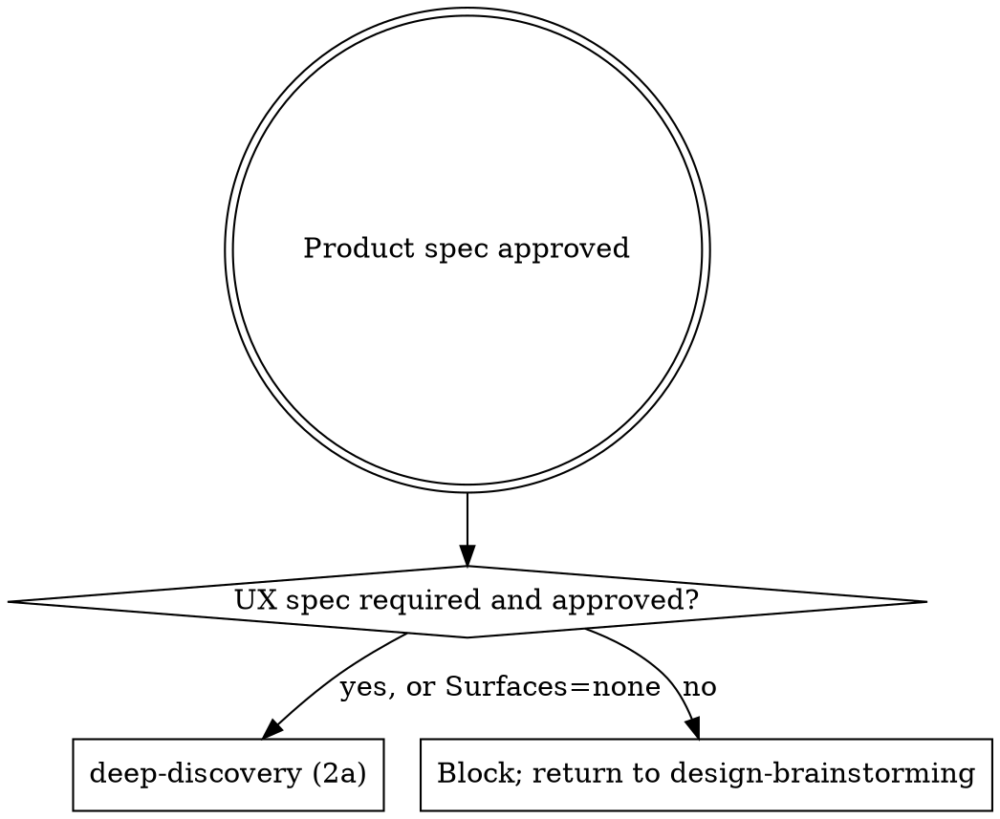
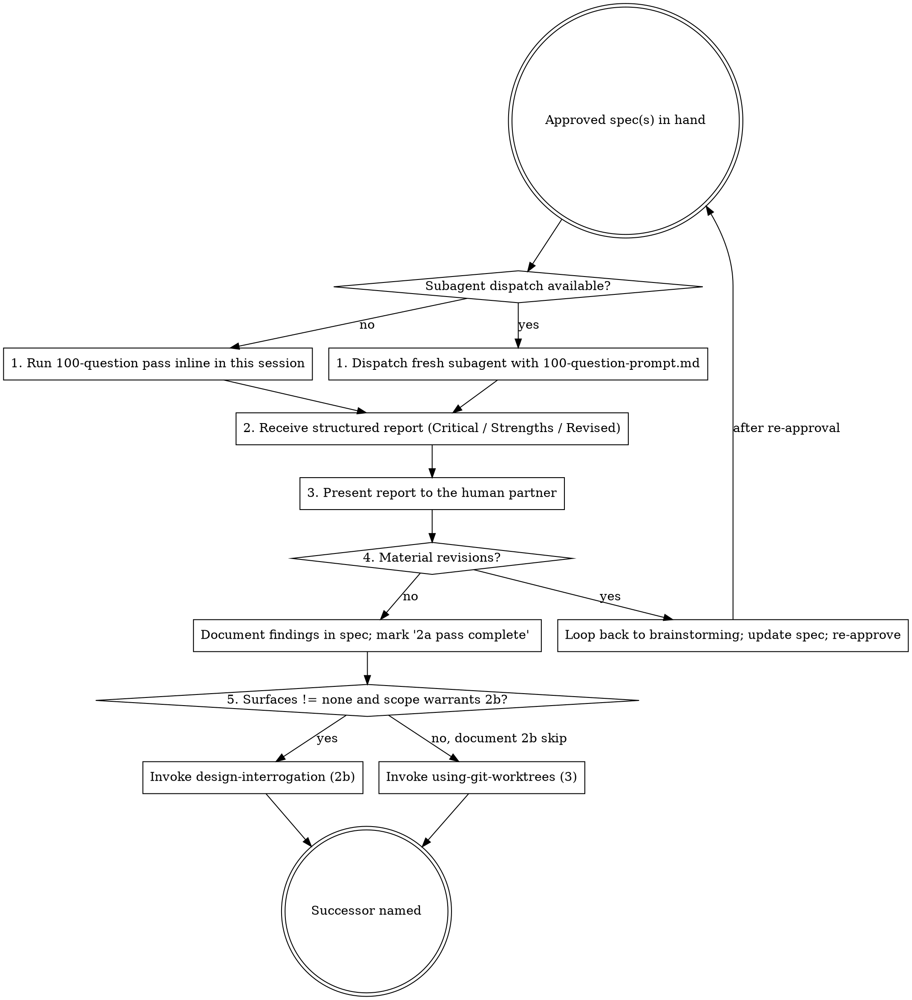

## Announce on entry

> I'm using the deep-discovery skill to pressure-test the approved product spec with a 100-question interrogation before any implementation work. Material revisions will loop back to brainstorming.

## Purpose

A brainstorming spec ships the best version of what the human partner and the agent could think of while co-writing it. Deep-discovery is the adversarial pass: one hundred questions, each building on the previous answer, hunting for assumptions, edge cases, missing requirements, and failure modes that the authoring frame could not see. The output is structured findings, not prose; findings that are material loop back to `brainstorming` for a spec revision.

## Precondition

- An approved product spec exists at `docs/leyline/specs/YYYY-MM-DD-<topic>-design.md`.
- If `Surfaces` is anything other than `none`, the UX spec from `design-brainstorming` also exists at `docs/leyline/design/YYYY-MM-DD-<topic>-ux.md` and is approved. (deep-discovery targets the product spec; the UX spec is pressure-tested by `design-interrogation` in 2b.)

## Hard gate

```
Do NOT run a 100-question pass, document findings, or advance to any successor
skill until both preconditions are satisfied: (1) the product spec exists at the
stated path, AND (2) the human partner has explicitly approved it. If either
fails, STOP. Route the first back to `brainstorming`; surface the second to the
human partner and wait for approval. This applies to EVERY project regardless
of perceived simplicity or obviousness.
```

> Violating the letter of the rules is violating the spirit of the rules.

## When to use



deep-discovery runs on every project regardless of scope. Skipping 2a because "the spec is obviously right" is the exact failure mode the pass exists to prevent.

## Process



## Checklist

Create one task entry (TodoWrite or harness equivalent) per item.

1. **Dispatch, or run inline only as a fallback.** If the harness supports subagent dispatch, dispatch a fresh subagent with the contents of `100-question-prompt.md` and the absolute path to the product spec. Do not paraphrase the prompt; use the template verbatim.

   "Supports dispatch" means the primitive exists in the harness. Token pressure, rate limits, and session length are NOT reasons to fall back to inline. The subagent is bias-free by construction; the inline path inherits session bias and produces a lower-confidence report. Fall back to inline only when dispatch is literally unavailable, and say so out loud when you do.
2. **Consume the structured report.** The output has three sections: **Critical Issues**, **Strengths**, **Revised Proposal**. Do not edit the report; record it as returned.
3. **Present to the human partner.** Show the full report. Do not triage silently. Do not hide findings you disagree with.
4. **Decide: material revisions?** A finding is material if a named approach, constraint, goal, or non-goal in the product spec cannot survive the finding as written. Cosmetic findings (clarity fixes, terminology) are not material.
   - **Material:** loop back to the correct Discovery co-skill. If the finding is product-domain (approach, goal, constraint, non-goal, dependency), loop to `brainstorming`. If the finding is UX-domain (voice, flow, state, accessibility target, IA), loop to `design-brainstorming`. Name the target explicitly when announcing: "Deep-discovery surfaced material <product | UX>-domain revisions; returning to <brainstorming | design-brainstorming> to update the spec and re-obtain approval." Do not proceed.
   - **Not material:** append the findings to the spec (or a sibling notes file referenced by the spec), mark the spec complete with the verbatim line below, and advance.

   Verbatim completion-marker (append to the spec's front matter or a "Deep-discovery" subsection):

   ```
   Deep-discovery pass complete - round <N> - YYYY-MM-DD
   ```
5. **Transition.**
   - If `Surfaces` is not `none` AND scope warrants 2b, invoke `design-interrogation` (stage 2b). Scope rules (full rules in `design-interrogation/SKILL.md`): required for `multi-screen-ui`, `cross-platform`, or any UX spec whose state matrix covers more than one surface; optional for complex `single-screen-ui` / `cli-only` / `developer-facing` with non-trivial error paths; skipped otherwise.
   - If 2b is skipped, document the skip verbatim in the UX spec (`design-interrogation skipped - scope: <reason>`) and invoke `using-git-worktrees` (stage 3).

## The 100-question pass (invariants)

- Each question **builds on the previous answer**. Do not reset context between questions.
- The pass covers, across its 100 questions, at minimum these dimensions (keep this list synchronized with `100-question-prompt.md`):
  - Assumptions (what is taken for granted?)
  - Failure modes (what breaks, and with what blast radius?)
  - Missing requirements (what is implied but not stated?)
  - Dependencies (internal and external)
  - Constraints (technical, organizational, regulatory, timeline)
  - Alternatives rejected (are the rejections sound?)
  - Edge cases (input extremes, empty states, concurrency)
  - Scale boundaries (at what volume does the design break?)
  - Rollback paths (how do we undo this if it ships and hurts?)
  - Testing strategy (how do we know it works?)
  - Observability (how do we know it works in production?)
  - Security (threat model, secrets, authn/authz, data exposure)
  - Operational concerns (runbooks, on-call, deploys)
  - Team / ownership (who maintains this?)
  - Timelines (is the schedule realistic?)
  - Cost and unit economics at target scale
  - Migration / backfill path for stateful features
  - Success criteria (observable, measurable)
  - Known-unknowns (what do we know we do not know?)
- Question weight is not uniform. If an answer opens a larger problem, the next N questions follow that thread.
- No question is off-limits. Soft questions ("is this worth doing?") are on the table.

Deep-discovery is not a checklist of dimensions; it is an adversarial conversation that covers those dimensions in the course of building on each answer.

## Report format (required)

The report the subagent returns, or the agent produces inline, has exactly three sections:

```
## Critical Issues
- <finding>: <file-path-and-line-or-section reference> - <why it matters>

## Strengths
- <finding>: <what the spec got right, worth preserving>

## Revised Proposal
<A short proposal - not a rewrite - naming the changes the spec should adopt to address the Critical Issues. Grouped by file and section.>
```

If a section has no entries, write "None." Do not skip the section.

## Anti-patterns

- **"The Spec Is Obviously Right, Skip The Pass"** - the pass exists to catch obviously-right specs that later surprise on contact with reality.
- **"I'll Ask Ten Questions, That's Enough"** - the 100-question process is the process. Stopping early is agreeing with the spec without having tested it.
- **"The Subagent Was Too Harsh, I'll Soften The Report"** - the report is the report. Present it. The human partner decides what to act on.
- **"The Finding Is Valid But Not Material"** - be honest. If a named approach, constraint, goal, or non-goal cannot survive the finding as written, it is material. Hiding it as a non-material suggestion is rationalization.
- **"The Revision Is Small, I'll Edit The Spec And Skip Re-Approval"** - re-approval is cheap. Silent edits on an approved spec break the gate.
- **"Subagents Are Available But I'll Run Inline To Save Time"** - subagents are bias-free by construction; inline runs inherit session bias. Dispatch unless the primitive is literally unavailable.
- **"Reframe The Finding As A Strength"** - if a finding identifies a risk or gap, it stays in Critical Issues. Noting that the spec "acknowledged" the risk does not neutralize it.
- **"I'll Run It After The Next Step"** - the next step is blocked until 2a completes. No exception.

## Red flags

| Thought | Reality |
|---------|---------|
| "The human partner just approved this; I'll come back to interrogation later" | Later means never. Run it now while the spec is fresh. |
| "The spec is small, 20 questions is fine" | Small specs produce small reports, not short passes. The value is the chain. |
| "Most findings are cosmetic, no need to present" | Present anyway. The human partner judges materiality, not you. |
| "I'll dispatch the subagent without a path to the spec" | The subagent has no context. Constructed context is the entire prompt. |
| "The subagent disagreed with the spec; that's bias" | The subagent is bias-free by construction. You are biased toward the spec you just helped approve. |

## Forbidden phrases

Do not say:

- "Quick pass" - 100 questions is not quick.
- "Rough interrogation" - the shape is the value; there is no rough version.
- "Skipping deep-discovery, the spec is clear" - if the spec is clear, the pass takes less time and finds less. It still runs.
- "Abbreviated 100-question pass" - 100 is the floor, not the ceiling.
- "High-level interrogation" - the chain is the product, not the summary.
- "I'll just hit the key dimensions" - dimensions are covered by chains, not by checklist.
- "The spec is small so the chain will be short" - small specs produce shorter reports, not shorter chains.

## Output artifacts

- The structured report (Critical Issues / Strengths / Revised Proposal) appended to or referenced by the spec.
- If material revisions surface, the spec is updated (by `brainstorming`) and committed with a short note: "deep-discovery round N applied".

## Supporting files

- `100-question-prompt.md` - the prompt template the subagent receives, or the inline runner follows.
- `report-template.md` - blank three-section report for authors to fill when running inline.

## Successor

If `Surfaces` is not `none` AND scope warrants 2b:

> Invoking design-interrogation (stage 2b). The product spec is cleared; pressure-testing the UX spec next.

Otherwise:

> Invoking using-git-worktrees (stage 3). Interrogation cleared. 2b skip documented in the spec as: design-interrogation skipped - scope: <reason>.

### Missing-successor fallback

If `design-interrogation` or `using-git-worktrees` is not present in this version of the plugin, STOP. Tell the human partner the pipeline is incomplete and which skill is missing. Do not improvise; do not skip ahead.

Do not exit without naming and invoking the named successor.
