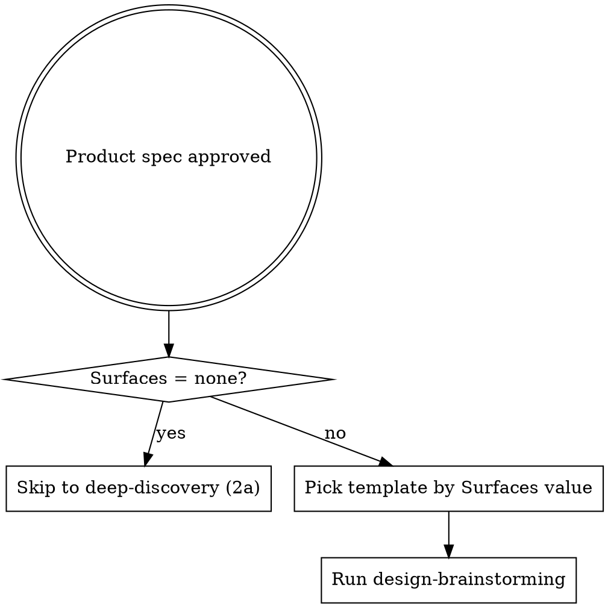
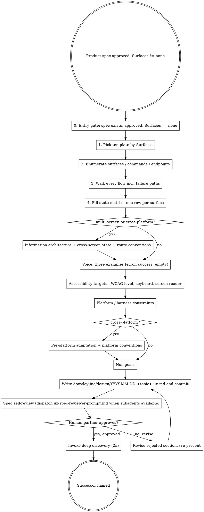

## Announce on entry

> I'm using the design-brainstorming skill to produce a UX spec. The product spec is approved; no surface implementation runs until you approve this UX spec too.

## Hard gate

```
Do NOT invoke any implementation skill on any user-facing surface until the UX spec
has been presented and the human partner has approved it. This applies to EVERY
project that has a user-facing surface, regardless of perceived simplicity. A CLI
has user-facing surfaces. A library has user-facing surfaces if it produces
human-readable output.
```

> Violating the letter of the rules is violating the spirit of the rules.

## Why the gate exists

UX is not an afterthought. Surfaces shipped without design artifacts cannot be verified against intent, and "I'll design as I code" consistently produces the first thing that works rather than the thing that should ship. The product spec says *what*; this skill says *how it is experienced*. They are separate artifacts.

## Precondition

The product spec from `brainstorming` (stage 1a) is approved and committed to `docs/leyline/specs/YYYY-MM-DD-<topic>-design.md`. The `Surfaces` field is anything other than `none`. If `Surfaces` is `none`, this skill does not run; the pipeline goes directly to `deep-discovery` (stage 2a).

### Entry gate (STOP if not satisfied)

Before any other step, verify:

1. A product spec exists at `docs/leyline/specs/YYYY-MM-DD-<topic>-design.md` (or at the path the human partner has specified). If it is missing, STOP and route back to `brainstorming`.
2. The human partner has approved that spec. If approval has not been given in the current session or recorded in the spec, STOP and ask. Do not proceed on an unapproved spec.
3. The spec's `Surfaces` field is declared and not `none`. If `Surfaces: none`, this skill should not have been entered; STOP and invoke `deep-discovery` directly.

## When to use



## Templates by `Surfaces` value

The template you fill in depends on the value declared by `brainstorming`. See `../../dev/reference/surface-types.md` for the canonical per-type definitions; below is the section list per type.

### `developer-facing` (reduced template)

1. Public API surface enumeration
2. Error shapes and failure-mode contracts
3. Log / output schema
4. Exit-code semantics
5. Telemetry-label conventions
6. Documented failure modes
7. Voice and tone in error messages (three example strings)
8. Non-goals

### `cli-only` (reduced template)

1. Commands enumerated
2. Help / usage text (voice, completeness)
3. Error and progress output formatting
4. Voice and tone (three example strings)
5. Output accessibility (color independence, screen-reader-friendly, terminal width)
6. Exit codes and their meanings
7. Non-goals

### `single-screen-ui` (full template)

1. Surface enumerated (one screen / view / modal / widget)
2. User flows (one per goal, including failure paths)
3. State matrix (empty, loading, error, success, permission-denied, offline)
4. Voice and tone (three example strings)
5. Accessibility targets (WCAG level, keyboard flow, screen-reader narration)
6. Platform / harness constraints
7. Non-goals

### `multi-screen-ui` (full template + IA)

Canonical ordering places Information architecture at position 4, between State matrix and Voice:

1. Surfaces enumerated (every screen / view / modal)
2. User flows (one per goal, including failure paths)
3. State matrix (one row per surface)
4. Information architecture (sitemap, navigation hierarchy)
5. Cross-screen state handling
6. Route / URL conventions (web) or screen-transition conventions (native)
7. Voice and tone (three example strings)
8. Accessibility targets (WCAG level, keyboard flow, screen-reader narration)
9. Platform / harness constraints
10. Non-goals

### `cross-platform` (full template + per-platform)

All multi-screen sections, plus two sections at the end:

11. Per-platform adaptation (where the experience diverges intentionally; where it must stay consistent)
12. Platform-conventions compliance targets (iOS HIG, Material, Fluent, native terminal, etc.)

## Process



## Checklist

Create one task entry (TodoWrite or harness equivalent) per item.

1. **Pick the template** matching the `Surfaces` value from the product spec. For `multi-screen-ui` and `cross-platform`, IA is a section; for `single-screen-ui` it is not.
2. **Enumerate every surface** the project will touch. Screens, modals, toasts, error messages, CLI commands, log lines, API error shapes - whichever apply per the chosen template.
3. **Walk every user flow.** For each goal the human partner cares about, write the path from the surface they enter to the surface they leave. Include the failure path; what happens when the network fails, the input is invalid, the permission is missing.
4. **Fill the state matrix.** One row per surface; columns are empty, loading, error, success, permission-denied, offline. If a state does not apply, write "N/A - <one-line reason>" rather than leaving the cell blank. The matrix is the most load-bearing artifact.
5. **Write information architecture (multi-screen and cross-platform only).** Sitemap, navigation hierarchy, cross-screen state handling, and route / URL conventions (web) or screen-transition conventions (native). Skip for single-screen.
6. **Write three voice examples.** One error, one success, one empty state. These set the tone for everything else; they go in the spec verbatim and become the reference for review.
7. **Set accessibility targets.** WCAG level (A / AA / AAA), keyboard flow (tab order, focus traps), screen-reader narration (what is announced when a state changes), motion and color independence.
8. **Document platform / harness constraints.** Browser support, mobile breakpoints, terminal width, screen reader matrix, available framework primitives.
9. **Write per-platform adaptation (cross-platform only).** Where the experience diverges intentionally; where it must stay consistent. Name the platform-conventions compliance targets (iOS HIG, Material, Fluent, native terminal, etc.).
10. **Write non-goals.** What this UX explicitly is NOT addressing. Future surfaces, deferred states, deferred personalization.
11. **Write the UX spec doc.** Save to `docs/leyline/design/YYYY-MM-DD-<topic>-ux.md` and commit it. Cross-reference the product spec by path.
12. **Spec self-review.** Read your own document. Confirm every state-matrix cell is filled (or marked N/A with reason). Confirm voice examples are consistent. Confirm flows include failure paths. If you can dispatch a fresh subagent, use `ux-spec-reviewer-prompt.md` alongside this SKILL.
13. **Human partner reviews the written UX spec.** Present it. Wait for explicit approval. If sections are rejected, revise and re-present; do not advance until approval is explicit. Once the human partner says approved, append the verbatim approval marker to the UX spec's front matter or an "Approvals" subsection so downstream stages can grep for it without relying on session state:

    ```
    UX spec approved - round <N> - YYYY-MM-DD
    ```

    Commit the UX spec with the marker line included.
14. **Transition** - announce and invoke `deep-discovery` (stage 2a). The product spec is its primary input; if `design-interrogation` (2b) applies, the deep-discovery skill will name it.

## UX spec document structure (default - full template, multi-screen ordering)

```
# <Topic> - UX spec
Date: YYYY-MM-DD
Product spec: docs/leyline/specs/YYYY-MM-DD-<topic>-design.md
Surfaces: <value>

## Surfaces enumerated
- <surface 1>: <one-line purpose>
- <surface 2>: <one-line purpose>
...

## User flows
### Flow 1 - <goal>
1. Enter at <surface>
2. <step>
3. <step>
4. Exit at <surface>
Failure path: <what happens on error and how the user recovers>

### Flow 2 - <goal>
...

## State matrix
| Surface | Empty | Loading | Error | Success | Permission-denied | Offline |
|---------|-------|---------|-------|---------|-------------------|---------|
| <name>  | <text>| <text>  | <text>| <text>  | <text>            | <text>  |

(One row per surface. Use "N/A - <reason>" for cells that genuinely do not apply.)

## Information architecture (multi-screen and cross-platform only)
<sitemap, navigation hierarchy>

## Cross-screen state handling (multi-screen and cross-platform only)
<where state persists across screens, where it is reset>

## Route / URL conventions (multi-screen and cross-platform only)
<route patterns for web, or screen-transition conventions for native>

## Voice and tone
Three reference strings, used by reviewers to judge new copy:
- Error: "<example>"
- Success: "<example>"
- Empty state: "<example>"

## Accessibility targets
- WCAG level: <A | AA | AAA>
- Keyboard flow: <tab order summary; focus management notes>
- Screen reader: <what is announced on state change>
- Motion: <reduced-motion behavior>
- Color independence: <how info conveys without color>

## Platform / harness constraints
- <browser / OS / terminal width / framework version targets>

## Per-platform adaptation (cross-platform only)
- <where the experience diverges intentionally, and where it must stay consistent>

## Platform-conventions compliance (cross-platform only)
- <iOS HIG / Material / Fluent / native terminal / etc. targets>

## Non-goals
- <surface or state explicitly out of scope>
```

For `single-screen-ui`, omit the IA / cross-screen / route-conventions blocks. For non-cross-platform, omit the per-platform adaptation and platform-conventions-compliance blocks. For reduced templates (`developer-facing`, `cli-only`), use the section list in the "Templates by Surfaces value" section above.

## Anti-patterns

- **"This Is Just A CLI, No UX Needed"** - CLI output is UX. Voice, error clarity, output formatting, and exit-code handling are UX decisions.
- **"The Product Spec Already Covers UX"** - product spec says what; UX spec says how it is experienced. Different artifact, different reviewer attention.
- **"I'll Design As I Code"** - you won't. You'll ship the first thing that works.
- **"This Surface Is Too Small To Design"** - small surfaces fail worst because defaults leak through.
- **"States I Did Not List Don't Exist"** - they exist. Empty / loading / error / success / permission-denied / offline are the floor; if you do not document them, they ship as whatever the framework defaults render.
- **"Accessibility Is A Polish Pass"** - accessibility is how it is built. Tab order, focus management, semantics, contrast - cheap to design in, expensive to retrofit.
- **"Voice Will Sort Itself Out During Implementation"** - it will not. Three reference strings now save dozens of inconsistent strings later.

## Red flags

| Thought | Reality |
|---------|---------|
| "It's obvious what the UI should be" | Then writing it down takes 90 seconds. Do it. |
| "We'll iterate once we see it" | You won't iterate on the empty state. |
| "Accessibility can come later" | Accessibility is how it is built, not a polish pass. |
| "Mobile / CLI / embedded does not need UX" | Every surface with a human on the other end is UX. |
| "The human partner did not ask about states" | The human partner does not know to ask. You do. |
| "The product spec mentions errors, that is enough" | Mentioning is not designing. Fill the matrix. |
| "I'll write the voice section once we have copy" | Reverse: voice constrains the copy. Write it first. |
| "This UX is too small to need a self-review pass" | A self-review on a small surface costs five minutes; a misaligned small surface costs hours of rework. |

## Output artifact

- **Required:** `docs/leyline/design/YYYY-MM-DD-<topic>-ux.md` committed to the repo.
- The file references the product spec by absolute or repo-root-relative path.

## Successor

Always:

> Invoking deep-discovery (stage 2a). Both the product spec and the UX spec are approved; pressure-testing the product spec next. If `Surfaces` warrants it, design-interrogation (stage 2b) will be invoked from there.

### Missing-successor fallback

If `deep-discovery` is not present in this version of the plugin, STOP. Tell the human partner the pipeline is incomplete and which skill is missing. Do not improvise the missing stage; do not skip ahead to `using-git-worktrees`. A pipeline that silently skips a gate is worse than one that visibly halts.

Do not exit without naming and invoking the named successor.
