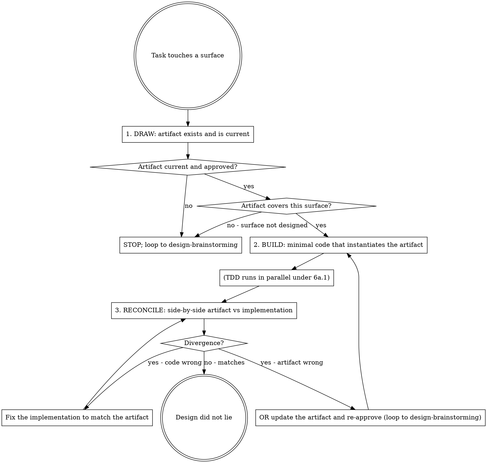

## Announce on entry

> I'm using the design-driven-development skill. The UX artifact at `docs/leyline/design/<file>` is the source of truth. I will not diverge from it without updating the artifact and re-getting approval; I will not implement from memory.

## Iron Law

```
NO USER-FACING SURFACE WITHOUT AN APPROVED DESIGN ARTIFACT FIRST
```

> Violating the letter of the rules is violating the spirit of the rules.

## Why the iron law

Surfaces shipped without an approved artifact ship the first thing that works, not the thing that should ship. Without the artifact as source of truth, implementation decisions - empty-state text, error recovery, spacing, order of operations - are made by the implementer under time pressure and in isolation. Those decisions drift from each other across surfaces, accumulate silently, and become the codebase's UX over time. The artifact exists so the decisions are made once, reviewed once, and applied consistently.

## What counts as a user-facing surface

Any output a human perceives:

- Screens, views, modals, toasts.
- Error messages, empty states, loading states.
- CLI text, command output formatting.
- Log formatting when humans read logs.
- Email templates, notification copy.
- Accessibility affordances (aria attributes, focus indicators, screen-reader announcements).

When in doubt, it is a surface.

## Exceptions (must ask the human partner)

Only these are valid, and they must be asked before taking them:

- Internal admin UI behind a feature flag (used only by the team, not shipped to users).
- Throwaway prototypes that will be deleted before the next commit.
- Library code with no user surface (internal-only functions, no public API errors).
- CLI output already specified verbatim in the product spec (no UX spec was written because the product spec covered it).

"It is a small change" is NOT an exception. "We are in a hurry" is NOT an exception. "The surface is internal" is ONLY an exception for the specific cases above.

## DRAW-BUILD-RECONCILE cycle

The UX analog of RED-GREEN-REFACTOR:



### DRAW - confirm the artifact

> Note on apparent duplication with Stage 5's Experience gate: the dispatching skill (`subagent-driven-development` / `executing-plans`) already runs checks 1-3 pre-dispatch. DRAW re-verifies inside the task because (a) the inline `executing-plans` path may skip the pre-dispatch check under pressure, (b) the UX artifact could have been modified between dispatch and execution (long-running task, another session touched the file), and (c) check 4 (surface coverage in the state matrix) is unique to DRAW and has no pre-dispatch equivalent. The cost of re-running checks 1-3 is seconds; the cost of missing one is a shipped surface with no artifact.

Before any code:

1. **Locate the artifact.** `docs/leyline/design/<YYYY-MM-DD>-<feature-name>-ux.md`. If it does not exist, STOP - there is no source of truth. Route to `design-brainstorming`.
2. **Confirm it is approved.** Grep for the verbatim marker:

   ```
   grep -E '^UX spec approved - round [0-9]+ - [0-9]{4}-[0-9]{2}-[0-9]{2}$' "<path>"
   ```

   If missing, STOP and route to `design-brainstorming`.
3. **Confirm it is current.** The spec's highest-round approval marker is the current round. If the plan's `Spec references` block names a specific UX spec round (`UX spec round <N>`), the spec's current round must be >= N; if the spec is behind, STOP and route to `design-brainstorming` to catch it up. If the plan does NOT name a round (older plans or minimal templates), accept the spec's latest round as current. Drift from a plan-named round to the spec's current round is a finding only when the plan explicitly named the round.
4. **Confirm the surface is covered.** The task's "Files:" block touches surface X. Is X enumerated in the UX spec's Surfaces list? Is X a row in the state matrix? If not, STOP - the task is touching a surface the artifact does not describe. Route to `design-brainstorming` to add the surface.

Exit DRAW only when all four confirmations pass.

### BUILD - minimal code that instantiates the artifact

1. Read the artifact's section for this surface. Copy the state matrix row into your working notes.
2. Write the failing test (TDD runs in parallel under the 6a.1 iron law).
3. Implement the minimal code that instantiates the artifact: same states (or N/A), same flow, same copy for error / success / empty states.
4. "Minimal" does not mean "partial." Every state that is not N/A in the artifact must be present in the code. A surface shipped with the error state unimplemented has diverged from the artifact; the `RECONCILE` step will catch it.

### RECONCILE - side-by-side, resolve any drift

After GREEN (from TDD):

1. **Side-by-side.** Open the artifact. Open the implementation. Walk every state-matrix row; for each, confirm the implementation produces what the artifact says it should produce. Walk every flow; for each step, confirm the implementation's behavior matches the flow's described behavior.
2. **Intentional divergence (cross-platform only).** For `Surfaces: cross-platform`, the UX spec may declare intentional per-platform divergence (iOS modal presents bottom-up; Android presents inline; the same surface diverges by platform by design). Intentional divergence explicitly documented in the UX spec's "Per-platform adaptation" section IS the artifact's truth for that platform. RECONCILE against the per-platform section, not the default section, when the target is one of the declared platforms. Silent divergence - behavior that differs by platform without the UX spec declaring it - is still forbidden; if you implement per-platform behavior that is not in the spec, update the spec first.
3. **Resolve divergence.**
   - **If the code is wrong:** fix the code. This is the common case.
   - **If the artifact is wrong:** update the artifact AND loop back to `design-brainstorming` for the human partner's re-approval. Do not edit the artifact silently; the re-approval is what keeps the artifact a source of truth.
4. **Capture evidence.** Paste the side-by-side walk into the review-log entry for this task. Stage 7's design-reviewer will consume it.

**Silent drift is forbidden.** "Good enough for now, will reconcile later" never reconciles later. Intentional per-platform divergence is NOT silent drift if it is declared in the UX spec; it is the artifact's truth.

## Claim-to-evidence gate

Do not claim a surface-touching task complete until:

- DRAW confirmed (all four checks).
- BUILD completed (every non-N/A state implemented).
- RECONCILE walked and divergences resolved.
- Side-by-side evidence in the review log.
- `accessibility-verification` gate also passed (the 6b.2 iron law is additive).

## Remedy if violated

If a surface was built without an approved artifact (or the artifact drifted silently):

1. **Delete the surface.** Do not adapt it. Do not keep it as reference. Delete it.
2. Author or update the UX artifact and get it approved via `design-brainstorming`.
3. Re-implement from the approved artifact.

"Delete the surface" is not a suggestion. A surface shipped without an artifact carries the implementer's taste, not the team's decisions. Keeping it "to save time" embeds the uncurated decisions into the codebase; the next surface copies them; the pattern propagates.

## Anti-patterns

- **"I Know What Looks Good"** - the artifact is the source of truth, not your taste. If the artifact is wrong, update it; do not override it.
- **"The Artifact Is Out Of Date, I'll Use My Memory"** - then update the artifact. Memory is not evidence.
- **"I'll Match The Artifact Later"** - you will not. "Later" is the silent-drift gateway.
- **"The Artifact Didn't Say"** - if the artifact does not specify the state / flow / surface, it is not designed. STOP and design it.
- **"This Surface Is Too Small For An Artifact"** - small surfaces fail worst; framework defaults leak through.
- **"RECONCILE Passed Just By Looking At The Happy Path"** - walk every state-matrix row and every flow. Happy-path reconcile is no reconcile.
- **"I Updated The Artifact, Didn't Need Re-Approval"** - silent artifact updates are silent drift with extra steps. Loop back to `design-brainstorming`.

## Red flags

| Thought | Reality |
|---------|---------|
| "The artifact is almost right, I'll tweak it in the code" | Tweak it in the artifact, not the code. |
| "This loading state is obvious, artifact doesn't need to say" | Obvious-to-you is framework-default-leaking-through. |
| "The error text is cleaner in my version" | Then update the artifact. Keep one source of truth. |
| "RECONCILE took 30 seconds, passed" | 30 seconds is not every state-matrix row. Do the walk. |
| "Permission-denied is rare, skip it" | Rare is not none. Rare is where user trust breaks. |
| "I'll polish the empty state later" | Empty states ship as first-run experiences. Do not defer. |

## Forbidden phrases

Do not say:

- "Building from memory; artifact is close enough"
- "I'll match the spec later"
- "The artifact didn't say so I improvised"
- "This surface is too small to design"
- "RECONCILE passed" (without naming which states were walked)
- "Silent update to the artifact to match the implementation"

## Returns to caller

This is an overlay. After RECONCILE completes and the task passes the claim-to-evidence gate, control returns to the caller (typically `subagent-driven-development` or `executing-plans`). No explicit successor. `accessibility-verification` runs next for the same task.

## Related

- `../../dev/principles/iron-laws.md` - catalogues this iron law
- `../../dev/principles/experience-discipline.md` - the 6b overlay rationale
- `../../dev/stages/06-discipline.md` - canonical overlay definition
- `../../dev/reference/surface-types.md` - what counts as a surface; template by Surfaces value
- `../design-brainstorming/SKILL.md` - produces the artifact this skill consumes; loop-back target
- `../accessibility-verification/SKILL.md` - the sibling iron law that runs for the same surface
- `../test-driven-development/SKILL.md` - 6a.1 cycle that runs in parallel during BUILD
