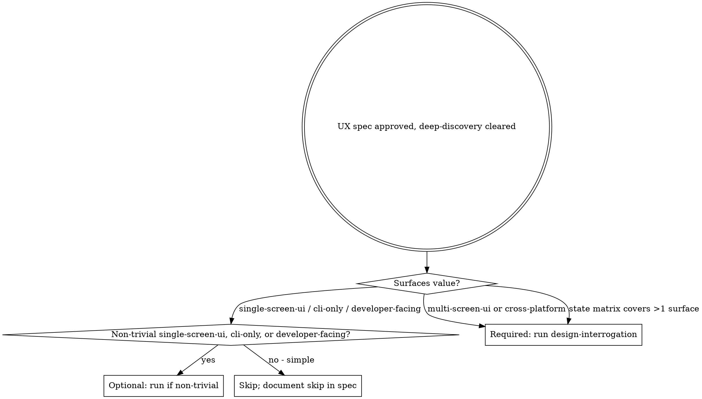
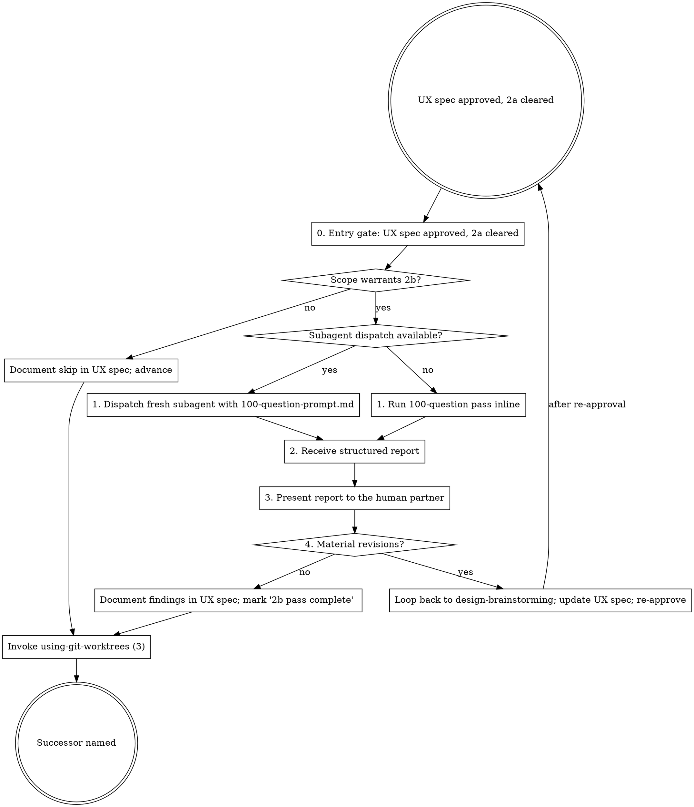

## Announce on entry

> I'm using the design-interrogation skill to pressure-test the approved UX spec with a 100-question interrogation targeted at flows, state completeness, accessibility, voice, and platform appropriateness. Material revisions will loop back to design-brainstorming.

## Purpose

Deep-discovery pressure-tests *what* is being built. Design-interrogation pressure-tests *how it is experienced*: whether every state is actually reachable, whether failure paths recover usefully, whether accessibility targets are realistic on the chosen stack, whether voice holds across surfaces, and whether platform conventions are respected where users will expect them. Agents building a spec are blind to the gaps they carry; a fresh subagent (or the same agent running the full interrogation procedure) is where those gaps surface.

## Precondition

- An approved product spec (`docs/leyline/specs/YYYY-MM-DD-<topic>-design.md`) with `Surfaces` not equal to `none`.
- An approved UX spec (`docs/leyline/design/YYYY-MM-DD-<topic>-ux.md`).
- `deep-discovery` (2a) pass complete on the product spec.

## Hard gate

```
Do NOT run a 100-question pass, document a skip, or advance to any successor
skill until all preconditions are satisfied: (1) the UX spec exists at the
stated path, (2) the human partner has explicitly approved it, AND (3) the
`deep-discovery` pass has cleared the product spec with the verbatim completion
marker recorded. If any precondition fails, STOP. Route (1) and (2) back to
`design-brainstorming`; route (3) back to `deep-discovery`. This applies to
EVERY project with user-facing surfaces.
```

> Violating the letter of the rules is violating the spirit of the rules.

## When to invoke (agent judgment)



Rules of thumb:

- **Required:** `Surfaces: multi-screen-ui` or `Surfaces: cross-platform`. Also required for any UX spec whose state matrix covers more than one surface.
- **Optional for `single-screen-ui`:** run when the state matrix is non-trivial (more than three non-trivial cells, or any permission-denied / offline state). Skip when the state matrix is mostly N/A or covers a single obvious state.
- **Optional for `cli-only` / `developer-facing`:** run when there are multi-stage interactions, non-trivial error paths, or versioning / deprecation concerns.
- **Skipped:** simple `cli-only` with straightforward single-command output; simple `developer-facing` with a narrow API and trivial error surface; `Surfaces: none` (in which case this skill should not have been entered at all).

### Skip discipline

If the agent judges 2b unnecessary, append this line to the UX spec verbatim:

```
design-interrogation skipped - scope: <reason>
```

No silent skipping. "Scope: simple `cli-only` with single command and flat help text" is an acceptable reason. "Scope: we are in a hurry" is not.

## Process



## Checklist

Create one task entry (TodoWrite or harness equivalent) per item.

1. **Dispatch, or run inline only as a fallback.** If the harness supports subagent dispatch, dispatch a fresh subagent with the contents of `100-question-prompt.md`, the absolute path to the UX spec, and the absolute path to the product spec (for cross-reference). Use the prompt verbatim.

   "Supports dispatch" means the primitive exists in the harness. Token pressure, rate limits, and session length are NOT reasons to fall back to inline. The subagent is bias-free by construction; the inline path inherits session bias and produces a lower-confidence report. Fall back to inline only when dispatch is literally unavailable, and say so out loud when you do.
2. **Consume the structured report.** Three sections: **Critical UX Issues**, **UX Strengths**, **Revised UX Proposal**. Record as returned; do not edit.
3. **Present to the human partner.** Show the full report.
4. **Decide: material UX revisions?** A finding is material if a flow, state, voice example, accessibility target, or IA decision in the UX spec cannot be satisfied as written. Cosmetic findings (phrasing, ordering) are not material.
   - **Material:** announce the loop back to `design-brainstorming`. Do not proceed.
   - **Not material:** append findings to the UX spec (or a sibling notes file the UX spec references), mark it complete with the verbatim line below, and advance.

   Verbatim completion-marker (append to the UX spec's front matter or a "Design-interrogation" subsection):

   ```
   Design-interrogation pass complete - round <N> - YYYY-MM-DD
   ```

   If the findings are saved as a separate round file (material or non-material alike), the path is `docs/leyline/design/YYYY-MM-DD-<topic>-design-interrogation-round-<N>.md`. For inline runs, also save the full question-and-answer transcript at `docs/leyline/design/YYYY-MM-DD-<topic>-design-interrogation-round-<N>-transcript.md`.
5. **Transition.** Invoke `using-git-worktrees` (stage 3).

## Focus areas (what the 100 questions probe)

The 100-question pass is adversarial on the UX spec. In the course of the chain, it covers at minimum these UX-specific dimensions:

- **State completeness** - every row in the state matrix is reachable from some flow; every cell is either a concrete description or a justified N/A; surfaces listed in the Surfaces enumeration all appear in the matrix.
- **Flow failure paths** - every flow names at least one failure path; error recovery is designed (not just "show an error"); permission-denied and offline are treated as first-class, not afterthoughts; partial-success (retry, resume) is handled.
- **Accessibility target realism** - can the chosen WCAG level actually be met on the stack the product spec names? Is the keyboard flow implementable with the component library? Is the screen-reader narration described at the right level of granularity?
- **Voice consistency** - the three reference strings (error, success, empty) set a tone; walk representative copy across surfaces and confirm the tone holds. Surprising shifts are findings.
- **Platform conventions** - does the spec honor platform idioms where users will expect them (iOS HIG, Material, native-terminal conventions, browser-default affordances)? Deviations named in the spec are fine; unexamined deviations are findings.
- **Accessibility tree correctness (predicted)** - based on the spec, what roles, labels, and relationships will the final DOM or native accessibility tree expose? Where the spec implies inaccessible structures, flag them.
- **Cross-surface state leakage** - is state scoped correctly between surfaces? Filters, selections, errors, loading indicators - do they persist when they should, reset when they should?
- **Motion and color independence** - does information survive reduced-motion? Does it survive color-blindness?
- **Copy density and scannability** - is there too much text per state? Too little in the empty state? Is the error copy blame-free?

Each question in the 100-question pass must build on the previous answer. Dimensions are covered by chains, not by checklist order.

## Report format (required)

```
## Critical UX Issues
- <finding>: <surface / section / line reference> - <why it matters>

## UX Strengths
- <what the UX spec got right>: <reference> - <one sentence>

## Revised UX Proposal
<A short proposal - not a rewrite - naming the changes the UX spec should adopt to address the Critical UX Issues. Group by surface and section. Under 500 words.>
```

If a section has no entries, write "None." Do not skip.

## Anti-patterns

- **"The UX Spec Is Obviously Right, Skip The Pass"** - UX specs fail silently; the gaps are in the states the author did not imagine. The pass exists to surface those.
- **"We Already Ran Deep-Discovery, Skip 2b"** - 2a covers the product spec. 2b covers the UX spec. Different artifact, different failure modes.
- **"Document The Skip Later"** - the skip goes in the UX spec now, in one sentence, with a reason. Later means never.
- **"The Human Partner Didn't Ask About Offline State"** - the human partner does not know to ask. The pass does.
- **"The Subagent's Critique Is Harsh, I'll Tone It Down"** - the report is the report. Present it unfiltered.
- **"The Finding Is Valid But Not Material"** - if it names a state or flow that cannot be satisfied as written, it is material. Hiding it as cosmetic is rationalization.
- **"The Revision Is Small, I'll Edit The UX Spec And Skip Re-Approval"** - re-approval is cheap. Silent edits on an approved UX spec break the gate.
- **"Subagents Are Available But I'll Run Inline To Save Time"** - subagents are bias-free by construction; inline runs inherit session bias. Dispatch unless the primitive is literally unavailable.
- **"Reframe The Finding As A UX Strength"** - if a finding identifies a state or flow the spec cannot satisfy, it stays in Critical UX Issues. Noting that the spec "acknowledged" the gap does not neutralize it.

## Red flags

| Thought | Reality |
|---------|---------|
| "The UX spec is short, 20 questions will do" | Short specs are where gaps hide; the chain is the value. |
| "The product spec already covers the failure path" | Product spec says what happens. UX spec says how the user experiences what happens. Different. |
| "Accessibility will sort itself out during implementation" | No. The spec's a11y targets have to be achievable; the pass tests that claim. |
| "Voice is subjective, hard to interrogate" | Voice is behavioral. Run sample copy across surfaces and flag discontinuities. |
| "I'll ask about the happy path first" | The happy path is where authors converged; the chain should pressure the edges. |
| "2b is optional for this scope" | "Optional" does not mean "default skip." Optional means the agent judges; if the judgment is skip, the judgment goes in the spec. |

## Forbidden phrases

Do not say:

- "Quick UX sanity check" - 100 questions is not a sanity check.
- "Abbreviated 100-question pass" - 100 is the floor, not the ceiling.
- "Skipping design-interrogation, we already ran deep-discovery" - different artifact, different failure modes.
- "Skipping design-interrogation, the UX is straightforward" - "straightforward" is the rationalization the pass exists to challenge.
- "High-level interrogation" - the chain is the product, not the summary.
- "I'll just hit the key UX dimensions" - dimensions are covered by chains, not by checklist.

## Output artifacts

- Structured report (Critical UX Issues / UX Strengths / Revised UX Proposal) appended to or referenced by the UX spec.
- Round files at `docs/leyline/design/YYYY-MM-DD-<topic>-design-interrogation-round-<N>.md`.
- For inline runs, transcripts at `docs/leyline/design/YYYY-MM-DD-<topic>-design-interrogation-round-<N>-transcript.md`.
- If material revisions surface, the UX spec is updated by `design-brainstorming` and re-approved.

## Supporting files

- `100-question-prompt.md` - the prompt template for the subagent / inline runner.
- `report-template.md` - blank report for inline runs.

## Successor

Always (on clean pass or documented skip):

> Invoking using-git-worktrees (stage 3). Both specs are interrogated (or skip documented). Moving to isolation.

### Missing-successor fallback

If `using-git-worktrees` is not present in this version of the plugin, STOP. Tell the human partner the pipeline is incomplete. Do not improvise; do not skip ahead.

Do not exit without naming and invoking the named successor.
