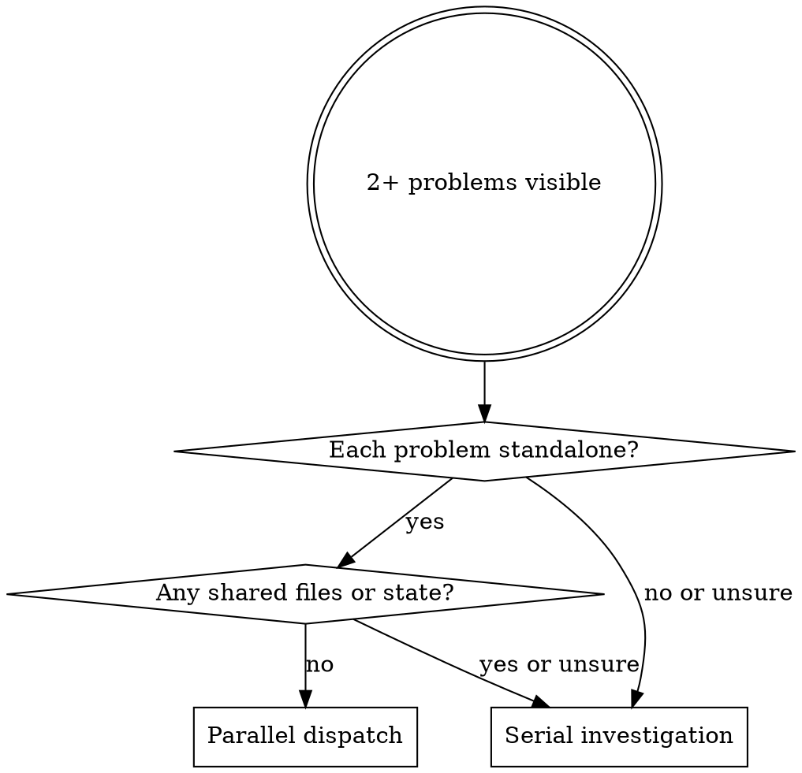

## Announce on entry

> I'm using the dispatching-parallel-agents skill because multiple independent problems surfaced at once. Each gets its own fresh subagent with constructed context. If any of the problems turn out to share state, I will STOP and re-investigate sequentially.

## When to reach for this skill

This is not a pipeline stage. It is a tactical tool used inside stage 5 (Execute), usually during review-pass iteration, when 2+ problems surface that are genuinely independent.

Examples that qualify:

- Three test files failing with different root causes (a deserialization bug, a timezone issue, a flaky network mock).
- Multiple subsystems broken independently after a merge (auth module failing due to a config typo; telemetry module failing due to a broken import; neither caused the other).
- Two reviewer subagents returning findings that do not touch each other's files.

Examples that do NOT qualify (use sequential investigation instead):

- Multiple tests failing after a single change: the change is the common cause.
- A cascade of failures from one subsystem: the cascade is the signal.
- Anything where you need full system state to diagnose.
- Anything where parallel agents would step on each other's files.

## Hard gate

```
Do NOT dispatch parallel subagents unless all preconditions are satisfied:
(1) there are two or more named problems, (2) each problem is understandable
without context from the others, (3) no problem shares state (files,
processes, external resources) with another problem, AND (4) each subagent
dispatched will receive its own constructed context with no reference to the
other problems. If any precondition fails, STOP. Investigate sequentially
instead. This applies to EVERY project; parallelism is a tool for a specific
shape of problem, not a default optimization.
```

> Violating the letter of the rules is violating the spirit of the rules.

## Why parallelism helps, and why it hurts

When problems are truly independent, serial investigation wastes wall-clock time while no single investigation benefits from the others. Parallel subagents with constructed context cut the total time proportionally to the number of problems.

When problems are related - sharing files, state, causal chains - parallel subagents interfere. They may commit conflicting fixes, miss the shared root cause, or produce reports that contradict each other. Sequential investigation catches the shared cause on the first agent's second question. Parallel investigation does not.

The predicate "are these problems independent?" is load-bearing. If you are unsure, they are not independent; default to sequential.

## Decision diagram



## Process

1. **List the problems.** Write each problem as its own line, with a short title and a one-sentence description. If two problems share words in the description, they may share cause - re-check independence.
2. **Pre-dispatch independence check.** For every pair of problems, ask: does the fix for A require reading or writing files that B's fix would touch? Does A's investigation need the output of B's investigation to proceed? If yes to either, the problems are not independent. STOP and investigate sequentially.
3. **Construct per-problem prompts.** Each prompt is the entire context for that subagent: problem title, problem description, relevant spec excerpt, paths the subagent is allowed to read, paths it is allowed to write (often a strict subset), and the expected output format. Do NOT reference "the other problems" or "what the coordinator thinks"; each subagent sees only its own prompt.
4. **Dispatch concurrently.** Issue all the subagent dispatches in a single batch (the harness's equivalent of the Claude Code parallel-tool-calls pattern). Do not interleave work between them.
5. **Consume reports.** Each subagent returns its own report. Read them in order of return; do not try to synthesize across reports mid-stream.
6. **Apply fixes in review order.** Each report's fixes land in the review pass for the task they came from (spec review, quality review, design review, as applicable). Do not merge fixes across problems; each fix belongs to its own task.
7. **Re-check independence post-fix.** If fix A and fix B both modify file X despite the pre-dispatch check saying they wouldn't, the problems were not independent. Roll back, investigate sequentially, and revise the pre-dispatch check.

## Constructed-context rule (reinforced)

Every parallel subagent's prompt stands alone. Never say:

- "You are one of two agents working on this"
- "The other agent is handling X, do not duplicate"
- "Coordinate with the other subagent"

Parallel subagents do not coordinate. The parent agent (you) coordinates; each subagent is ignorant of the others by design, because that ignorance is what guarantees their reports are independent. If coordination is required, the problems were not independent.

## Anti-patterns

- **"Parallel Agents On Cascading Failures"** - a cascade has one root cause; parallel investigation obscures it. Serial first; parallel only once the failures are proven independent.
- **"Parallel Agents On The Same File"** - conflicting commits, lost work. Never.
- **"Parallel Agents With Shared Context"** - if the prompts reference each other or mention "the other agent," you are not running parallel agents; you are running one fragmented agent.
- **"Parallel To Save Time On Two Tasks"** - if the tasks aren't independent problems, serial is usually faster because fixes land once; parallel produces fix-conflict-resolve cycles.
- **"Parallel By Default, Investigate Why Later"** - default is serial. Parallel is reached for, not defaulted to.
- **"Run A Parallel Agent To Verify A Sequential Agent's Work"** - that is a review pass, not parallel investigation. Use `spec-reviewer-prompt.md` / `code-quality-reviewer-prompt.md` instead.

## Red flags

| Thought | Reality |
|---------|---------|
| "These two failures are similar, probably related - parallel anyway?" | If similar, probably related. Serial first. |
| "I'll tell each subagent what the other is doing to avoid overlap" | Then they're not parallel. They're shared-context. Serial first. |
| "Dispatching them in parallel is faster" | Only if they are genuinely independent. If not, it is slower (fix conflicts). |
| "The problems are in different files, so they're independent" | Different files can still share state (env vars, DB rows, imported modules). Check the pre-dispatch independence question explicitly. |
| "The human partner is asking for progress, parallel will show more output faster" | Showing more output is not making more progress. Serial if related. |

## Forbidden phrases

Do not say:

- "Dispatching in parallel to save time"
- "Parallel agents coordinating on X"
- "Sending related work to different subagents"
- "You'll coordinate with the other agent on this"

## Scope

This skill does not produce its own output artifacts. It is called from within `subagent-driven-development` (or rarely, `executing-plans`) when the conditions above are met. After the parallel subagents return, execution returns to the calling skill's per-task loop.

## Successor

No explicit successor. Control returns to the skill that invoked this one (typically `subagent-driven-development`).

## Related

- `../../dev/stages/05-execute.md` - canonical stage definition including the parallel-dispatch guidance
- `../subagent-driven-development/SKILL.md` - primary Stage 5 skill that may call this one
- `../systematic-debugging/SKILL.md` - the disciplined sequential process for investigating failures (planned Stage 6)
- `../../dev/principles/behavior-shaping.md` - why constructed context is the mechanism
