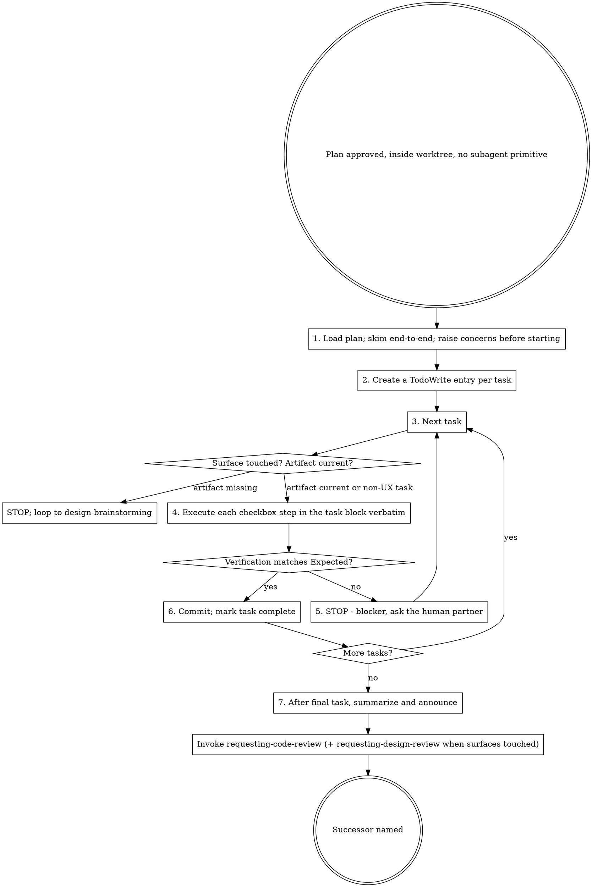

## Announce on entry

> I'm using the executing-plans skill as a fallback because subagent dispatch is unavailable in this harness. I'll execute the plan inline, task-by-task, with human-partner checkpoints. If any precondition fails, I will STOP rather than proceeding on best-effort.

> Leyline works significantly better with subagent dispatch. If your harness has a subagent primitive, interrupt and switch to `subagent-driven-development`. The inline fallback inherits session bias that subagents are bias-free of by construction.

## Hard gate

```
Do NOT run any task step, touch production code, or mark any task complete
until all preconditions are satisfied: (1) an approved plan exists at
docs/leyline/plans/<YYYY-MM-DD>-<feature-name>.md, (2) the current working
directory is inside the worktree recorded in the baseline note, (3) the
harness does NOT support subagent dispatch (if it does, use
subagent-driven-development instead), AND (4) for any task whose "Files:"
block touches a user-facing surface, the UX spec section covering that surface
is current and approved. If any check fails, STOP. Route (1) back to
writing-plans; route (2) back to using-git-worktrees; route (3) to
subagent-driven-development; route (4) back to design-brainstorming. This
applies to EVERY project regardless of perceived simplicity or obviousness.
```

> Violating the letter of the rules is violating the spirit of the rules.

## Core principle

An inline executor is biased by definition - the same session that helped write the plan is now executing it. The bias cannot be removed; it can only be compensated for with discipline: follow every step in the plan verbatim, run every verification, mark completion only on observable evidence, and ask the human partner before resolving any ambiguity. When in doubt, ask; do not guess.

## Precondition check (STOP if not satisfied)

0. **Resolve `<feature-name>`** from the plan filename (same slug Stages 3 and 4 used).
1. **Approved plan present.** `docs/leyline/plans/<YYYY-MM-DD>-<feature-name>.md` exists. If missing, STOP and route to `writing-plans`.
2. **Baseline readable; feature branch active.** Same extraction as `subagent-driven-development`:

   ```
   baseline_path="docs/leyline/plans/<YYYY-MM-DD>-<feature-name>-baseline.md"
   recorded_path=$(grep -E '^- Worktree path:' "$baseline_path" | sed 's/^- Worktree path:[[:space:]]*//')
   recorded_branch=$(grep -E '^- Branch name:' "$baseline_path" | sed 's/^- Branch name:[[:space:]]*//')
   [ -n "$recorded_path" ] && [ -n "$recorded_branch" ] || { echo "malformed baseline note"; exit 1; }

   [ "$(git rev-parse --show-toplevel)" = "$recorded_path" ] || { echo "not in recorded worktree"; exit 1; }
   [ "$(git rev-parse --abbrev-ref HEAD)" = "$recorded_branch" ] || { echo "wrong branch"; exit 1; }
   ```

   If the worktree mismatches, `cd` into the recorded path. If the branch is wrong (for example `main`), STOP; do not commit any task on the wrong branch. Route back to `using-git-worktrees`.

3. **Subagent primitive confirmed absent.** `executing-plans` runs only when the current harness has no subagent primitive. If the primitive exists, STOP and switch to `subagent-driven-development`. Token pressure / rate limits / session length are NOT legitimate reasons to use this fallback.

4. **Product spec approved (verbatim marker).**

   ```
   grep -E '^Product spec approved - round [0-9]+ - [0-9]{4}-[0-9]{2}-[0-9]{2}$' "docs/leyline/specs/<YYYY-MM-DD>-<feature-name>-design.md"
   ```

   Missing marker: STOP and route to `brainstorming`.

5. **Experience gate pre-execution (per-task).** Before beginning any task whose "Files:" block touches a user-facing surface, verify all three conditions:

   - **UX spec file exists:** `test -f docs/leyline/design/<YYYY-MM-DD>-<feature-name>-ux.md`.
   - **UX spec is approved:** the file contains the verbatim approval marker:

     ```
     grep -E '^UX spec approved - round [0-9]+ - [0-9]{4}-[0-9]{2}-[0-9]{2}$' "<path>"
     ```

     Missing marker: STOP and route to `design-brainstorming`.
   - **UX spec is current:** last-modified newer than the plan, or approval round >= plan's referenced round. If not, route to `writing-plans`.

## Process



## Checklist

Create one TodoWrite (or harness equivalent) entry per task. Within each task, follow these steps.

1. **Load the plan.** Read every task block end-to-end before beginning. Raise concerns with the human partner BEFORE touching code:
   - Any task that looks bigger than 5 minutes.
   - Any task without a failing-test step (except those with a declared non-code exception).
   - Any task whose "Files:" block references paths that do not exist.
   - Any task whose verification step does not name an expected output.

   Do not silently correct the plan. If the plan has a critical gap, STOP. Route back to `writing-plans`.

2. **TodoWrite setup.** Create one task entry per plan task. Mark entries in_progress as you enter each task; mark completed only when every step including verification is done.

3. **Per-task execution.** For each task:

   1. **Experience gate.** If the task touches a user-facing surface, confirm the UX artifact section covering the surface is current and approved. If not, STOP and route to `design-brainstorming`.
   2. **Follow the steps exactly.** Each checkbox is an action. Do not reorder, do not skip, do not improvise. For code tasks, the failing-test step is FIRST and must actually produce RED before the implementation step runs.
   3. **Non-code exception.** If the task declares the Exception line verbatim (`Exception: <kind> task - no failing test. Verification: ...`), follow the Exception's verification instead of a failing-test step.
   4. **Run every verification.** Paste the command output into the TodoWrite entry (or a local review log). If the output does not match the Expected line, STOP. Do not proceed to the next step on a mismatched verification.
   5. **For UX tasks:** trigger each state from the state matrix and record the observation. Run the accessibility verification procedure and paste its output. Do the RECONCILE step (side-by-side against the artifact).
   6. **Commit.** Follow the task's commit instruction (or the project's convention). Use a short but specific message.
   7. **Mark complete.** Only after verification passes and the commit lands.

4. **Stop conditions.** STOP and ask the human partner if any of these occur:

   - A blocker: missing dependency, failing test you cannot fix in a few minutes, unclear instruction.
   - A critical plan gap: the plan tells you to modify a file that does not exist, or name a function the spec does not describe.
   - You do not understand an instruction in the plan.
   - A verification fails repeatedly (2 or more attempts).
   - A finding surfaces that is outside the scope of the current task.

   Asking is cheap. Guessing is the dominant failure mode of inline execution.

5. **Final summary.** After the last task is marked complete, summarize what shipped in a structured message to the human partner:

   ```
   Feature: <feature-name>
   Branch: <branch name>
   Tasks: <count>
   Commits: <base-sha>..<head-sha>
   Surfaces touched: <yes / no>
   Test suite: <green / red-authorized / N/A>
   Stop conditions hit (if any): <list>
   ```

   Then transition.

## Anti-patterns

- **"I'll Skip To The Good Part Of The Task Block"** - the steps are ordered for a reason. The failing-test step is first because it anchors everything after.
- **"Silently Correct The Plan Mid-Execution"** - the plan is the plan. If it is wrong, STOP and fix it in `writing-plans` with the human partner's approval. Do not patch as you go.
- **"Guess When The Instruction Is Ambiguous"** - ask. Guessing is indistinguishable from drift until a review catches it.
- **"Skip The Verification Step When I'm Confident"** - confidence is the rationalization that precedes every wrong commit. Run the verification.
- **"Batch Commits Across Multiple Tasks For Speed"** - the commit-per-task structure is what lets the stage-7 reviewer see task-level changes. Do not batch.
- **"Run Verifications After All Tasks, Not During"** - then every failure has many plausible causes. The per-task verification is what keeps causes local.
- **"Use `executing-plans` Because Subagents Are Slow"** - the fallback is for harnesses without the primitive, not for convenience. Use `subagent-driven-development` when the primitive exists.

## Red flags

| Thought | Reality |
|---------|---------|
| "This verification usually passes, skip it" | "Usually" is not "this time". Run it. |
| "I know this file well, I don't need the failing test first" | You know the file well enough to write a fast test. Write it. |
| "The plan's commit message is awkward, I'll rewrite it" | Then update the plan, not the message. Plan is the source of truth. |
| "I'll add one small thing while I'm in the file" | That is scope creep. Finish the task; the "small thing" is a new task. |
| "The human partner is offline, I'll guess" | Then wait. A blocked task stays blocked; a wrongly-guessed task becomes buggy production code. |
| "Task N says modify file X, but file Y is cleaner" | Then update the plan, not your execution. |

## Forbidden phrases

Do not say:

- "Skipping verification; we know it works"
- "Batching these tasks for efficiency"
- "The plan is mostly right, I'll correct as I go"
- "This is a small deviation; it won't matter"
- "Running tasks inline because subagents are slow"

## Output artifacts

- Per-task commits on the feature branch.
- TodoWrite entries marked complete as each task finishes.
- A short final-summary message to the human partner.

## Successor

> Invoking requesting-code-review (stage 7). All tasks executed, verifications passed. Dispatching the stage-7 reviewer for branch-level sign-off.

When any task touched a user-facing surface, additionally:

> Invoking requesting-design-review (stage 7, parallel).

### Missing-successor fallback

If any of the following is missing in this version of the plugin, STOP and name the missing piece:

- `requesting-code-review` - the Stage 7 branch-level reviewer.
- `requesting-design-review` - the Stage 7 branch-level design reviewer (required only when surfaces were touched).
- `systematic-debugging` - the route for unexpected failures hit during inline execution.

Do not improvise past any of them. Do not merge or ship without the stage-7 review.

Do not exit without naming and invoking the named successor.

## Related

- `../../dev/stages/05-execute.md` - canonical stage definition
- `../subagent-driven-development/SKILL.md` - preferred successor when the harness supports subagent dispatch
- `../dispatching-parallel-agents/SKILL.md` - for the rare case where 2+ independent problems surface during inline execution
- `../writing-plans/SKILL.md` - produces the plan this skill consumes
- `../systematic-debugging/SKILL.md` - the process to apply when a verification fails (planned Stage 6)
