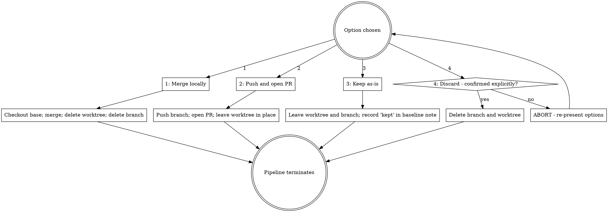

## Announce on entry

> I'm using the finishing-a-development-branch skill to complete this work. I will verify the test suite is green before presenting options, present exactly four integration options (never a fifth), confirm destructive choices explicitly, and clean up the worktree as part of the chosen path. If any precondition fails, I will STOP rather than proceeding on best-effort.

## Hard gate

```
Do NOT present options, merge, push, open a PR, or delete anything until all
preconditions are satisfied: (1) an approved plan exists and every task in it
is checked off, (2) the current working directory is inside the worktree
recorded in the baseline note AND on the feature branch, (3) the branch-level
code review is complete (verbatim marker in the review log), (4) if any task
touched a user-facing surface, the branch-level design review is also complete
(verbatim marker in the review log), (5) every deferred finding has been
acknowledged by the human partner verbatim, AND (6) the test suite passes
fresh in this session. If any check fails, STOP. Route back to the appropriate
upstream skill; do not fabricate a "complete" state. This applies to EVERY
project regardless of perceived simplicity or obviousness.
```

> Violating the letter of the rules is violating the spirit of the rules.

## Core principle

Verify tests → Present options → Execute choice → Clean up. Finish stage does not invent options, does not bypass confirmation on destructive paths, and does not leave stale worktrees behind.

## Precondition check (STOP if not satisfied)

0. **Resolve `<feature-name>`** from the plan filename (same slug used since Stage 3). Also resolve the main-repo root so paths survive worktree removal:

   ```
   main_repo_root=$(realpath "$(git rev-parse --git-common-dir)/..")
   baseline_path="$main_repo_root/docs/leyline/plans/<YYYY-MM-DD>-<feature-name>-baseline.md"
   plan_path="$main_repo_root/docs/leyline/plans/<YYYY-MM-DD>-<feature-name>.md"
   review_log_path="$main_repo_root/docs/leyline/plans/<YYYY-MM-DD>-<feature-name>-review-log.md"
   ```

   The baseline note lives in the main repo, not in the worktree, so Option 4 (discard) can preserve it after the worktree is removed. All Leyline pipeline artifacts referenced by downstream stages resolve through `$main_repo_root`.

1. **Plan complete.** Grep for any unchecked boxes in the plan:

   ```
   unchecked=$(grep -cE '^- \[ \]' "$plan_path")
   [ "$unchecked" -eq 0 ] || { grep -nE '^- \[ \]' "$plan_path"; echo "$unchecked unchecked tasks"; exit 1; }
   ```

   Any non-zero count: STOP and route to the Execute skill with the unchecked line numbers printed.

2. **Inside the worktree on the feature branch.**

   ```
   recorded_path=$(grep -E '^- Worktree path:' "$baseline_path" | sed 's/^- Worktree path:[[:space:]]*//')
   recorded_branch=$(grep -E '^- Branch name:' "$baseline_path" | sed 's/^- Branch name:[[:space:]]*//')
   [ "$(git rev-parse --show-toplevel)" = "$recorded_path" ] || { echo "wrong worktree"; exit 1; }
   [ "$(git rev-parse --abbrev-ref HEAD)" = "$recorded_branch" ] || { echo "wrong branch"; exit 1; }
   ```

3. **Code review complete marker.** Grep the review log:

   ```
   grep -E '^Code review complete - round [0-9]+ - [0-9]{4}-[0-9]{2}-[0-9]{2}$' "$review_log_path"
   ```

   Missing: STOP and route to `receiving-code-review`. Additionally, verify no new code-review findings were received after the marker's line (a marker written while findings remained open is invalid):

   ```
   last_marker_line=$(grep -nE '^Code review complete - round' "$review_log_path" | tail -n 1 | cut -d: -f1)
   post_marker_findings=$(tail -n +$((last_marker_line + 1)) "$review_log_path" | grep -cE '^- F[0-9]+ ')
   [ "$post_marker_findings" -eq 0 ] || { echo "findings after marker; marker invalid"; exit 1; }
   ```

4. **Design review complete marker (surface-touching features only).** Determine whether any task touched a surface by greping the plan header:

   ```
   surfaces=$(grep -E '^\*\*Surfaces:\*\*' "$plan_path" | sed 's/^\*\*Surfaces:\*\*[[:space:]]*//')
   ```

   If `$surfaces` is anything other than `none`, grep for the marker:

   ```
   grep -E '^Design review complete - round [0-9]+ - [0-9]{4}-[0-9]{2}-[0-9]{2}$' "$review_log_path"
   ```

   Missing: STOP and route to `receiving-design-review`. Also run the same post-marker findings check (with `^- D[0-9]+ `) to invalidate stale markers. If `$surfaces` is `none`, this check is N/A; proceed.

5. **Deferred findings acknowledged.** If the review log has a `## Deferred findings` section, count entries and verify each has a verbatim human-partner acknowledgement:

   ```
   deferred_count=$(awk '/^## Deferred findings/,/^## /' "$review_log_path" | grep -cE '^- [FD][0-9]+:')
   acked_count=$(awk '/^## Deferred findings/,/^## /' "$review_log_path" | grep -cE '^- [FD][0-9]+:.* - Acknowledged by human partner on [0-9]{4}-[0-9]{2}-[0-9]{2}$')
   [ "$deferred_count" -eq "$acked_count" ] || { echo "$((deferred_count - acked_count)) unacked deferred findings"; exit 1; }
   ```

   Any mismatch: STOP and present the unacked entries to the human partner. Do NOT append the acknowledgement line yourself; wait for the human partner to type it (or a synonym like "acknowledged" or "approved"), then transcribe their response into the line. Appending the ack on your own authority is a violation of the gate.

   If no `## Deferred findings` section exists, this check is N/A.

6. **Test suite passes fresh.** Run the project's test command in the current session (not from memory, not from the last run); match the `verification-before-completion` iron law. Prefer the CURRENT discovery (CLAUDE.md / Makefile / package.json) over the baseline note's recorded command; the project's test setup may have changed since Stage 3. If the current discovery differs from the recorded command, say so out loud and confirm with the human partner before proceeding. Paste the FULL command output alongside the claim. If the baseline note carries `baseline-red-authorized - scope: <reason>`, narrow the "pass" requirement to tests outside the authorized-failing scope and document the exclusion in the finish announcement.

## Step 1 - Verify tests

Run the project's canonical test command - the one recorded in the baseline note or discovered via the Stage 3 test-discovery order (`CLAUDE.md` / `Makefile` / `package.json` / language-specific).

If tests fail:

```
Tests failing (<N> failures). Must fix before completing:

[paste the failing test output]

Cannot proceed with merge, PR, keep, or discard until tests pass.
```

Stop. Do NOT present options. If the failure is a regression the reviews missed, loop back to Stage 5 / 6 (`systematic-debugging` then implementer). If the failure is environmental, surface it to the human partner.

If tests pass:

```
Tests pass. Full command output:
[paste the complete stdout + stderr, not a summary]

Ready to present integration options.
```

Continue to step 2.

## Step 2 - Determine base branch

The base branch is recorded in the baseline note. Extract it:

```
base_ref=$(grep -E '^- Base ref and commit SHA:' "$baseline_path" | sed 's/^- Base ref and commit SHA:[[:space:]]*//' | awk '{print $1}')
git rev-parse --verify "$base_ref" >/dev/null 2>&1 || base_ref=""
```

If the baseline note does not record it OR the recorded ref no longer resolves (branch was renamed since Stage 3), fall back to discovery:

```
git symbolic-ref --short refs/remotes/origin/HEAD 2>/dev/null | sed 's#^origin/##'
# or, if missing:
git config --get init.defaultBranch || echo main
```

Confirm with the human partner if the base is ambiguous:

> This branch was created from `<base_ref>`. Is that the right integration target?

Do not assume `main` without evidence.

## Step 3 - Present the four options

Present EXACTLY these four options. Do not offer a fifth. Do not combine options.

```
Implementation complete. What would you like to do?

1. Merge back to <base_ref> locally
2. Push and create a Pull Request
3. Keep the branch as-is (I'll handle it later)
4. Discard this work
```

Wait for the human partner's choice. Do not advance on an unclear answer.

## Step 4 - Execute the chosen path



### Option 1: Merge locally

Option 1 is LOCAL-ONLY. Do not push the merge commit to any remote. If the work should be published, the human partner will push manually or re-enter Stage 8 and choose Option 2 semantics.

1. Switch to the base branch inside the main repo:

   ```
   git -C "$main_repo_root" checkout <base_ref>
   ```

2. Pull to make sure the base is current (only if the project has a remote tracking branch for the base):

   ```
   git -C "$main_repo_root" pull --ff-only
   ```

3. Merge the feature branch. Prefer the project's commit-message convention (check `CONTRIBUTING.md`, `CLAUDE.md`, or recent `git log --merges -n 20` for local style). If no convention is found, default to `Merge <feature-name>`:

   ```
   git -C "$main_repo_root" merge --no-ff <branch> -m "<merge message>"
   ```

   Use `--no-ff` unless the project convention explicitly prefers fast-forward.

4. **Record the merge in the baseline note BEFORE removing the worktree.** The baseline note lives in the main repo at `$baseline_path` (outside the worktree per the Stage 3 convention), so appending is safe whether or not the worktree still exists:

   ```
   head_sha=$(git -C "$main_repo_root" rev-parse HEAD)
   printf '\nMerged - %s - %s\n' "$(date +%Y-%m-%d)" "$head_sha" >> "$baseline_path"
   ```

5. Delete the worktree and branch:

   ```
   git -C "$main_repo_root" worktree remove "$recorded_path"
   git -C "$main_repo_root" branch -d "$recorded_branch"
   ```

   If `git branch -d` refuses because the branch has commits not reachable from the merge target, STOP and ask the human partner whether to force-delete or to abort. Do not use `-D` silently.

6. Announce:

   > Feature `<feature-name>` merged to `<base_ref>` locally (not pushed). Worktree and branch removed. Pipeline terminates.

### Option 2: Push and open a PR

1. Discover the remote. Do NOT assume `origin`:

   ```
   remotes=$(git remote)
   remote_count=$(echo "$remotes" | wc -l)
   ```

   If `remote_count` is 0, STOP and surface to the human partner. If it is 1, use that remote. If it is greater than 1, present the list and ask which is the push target (fork workflows commonly have `origin` and `upstream` with different intents).

2. Push the branch:

   ```
   git push --set-upstream <remote> <branch>
   ```

3. Construct the PR body at a predictable path:

   ```
   pr_body_path="$main_repo_root/.git/leyline-pr-body-<feature-name>.md"
   ```

   The `.git/` directory is automatically ignored by git, so this file does not pollute status. Write the body:

   ```
   # <feature-name>

   ## Summary
   <one paragraph pulled verbatim from the plan's Goal field>

   ## Test plan
   ```
   <paste the test-suite output from step 1>
   ```

   ## Spec references
   - Product spec: <path>
   - UX spec: <path or "none">
   - Baseline note: <path>
   - Review log: <path>
   ```

4. Open the PR. Use the harness's available tooling:

   - **If `gh` is available:** `gh pr create --base <base_ref> --head <branch> --title "<feature-name>" --body-file "$pr_body_path"`. Remove `$pr_body_path` after the command succeeds.
   - **Otherwise, construct the compare URL per the host** and instruct the human partner to open the PR manually. Remote URL transformation:

     ```
     remote_url=$(git remote get-url <remote>)
     # github.com:
     # git@github.com:owner/repo.git -> https://github.com/owner/repo/compare/<base_ref>...<branch>?expand=1
     # https://github.com/owner/repo.git -> https://github.com/owner/repo/compare/<base_ref>...<branch>?expand=1
     # gitlab.com:
     # git@gitlab.com:owner/repo.git -> https://gitlab.com/owner/repo/-/merge_requests/new?merge_request%5Bsource_branch%5D=<branch>
     # bitbucket.org / custom Git servers: print the raw remote URL and tell the human partner to open the corresponding compare / pull-request page.
     ```

     Print the constructed URL and the PR body inline so the human partner can copy both.

5. **Leave the worktree in place** until the PR is merged. PR feedback may require more commits on the branch; destroying the worktree removes the context.

6. Announce:

   > Feature `<feature-name>` pushed to `<remote>/<branch>`; PR opened at `<URL>` (or PR URL printed for manual creation). Worktree preserved until PR is merged. Pipeline terminates.

### Option 3: Keep as-is

1. Leave the worktree and branch in place. Do not delete, do not modify.
2. Append a `Kept - YYYY-MM-DD` line to the baseline note (`$baseline_path` in the main repo) so future sessions can identify the branch as "in progress, deliberately kept."
3. Announce:

   > Feature `<feature-name>` kept as-is; worktree at `<recorded_path>` and branch `<recorded_branch>` preserved. Pipeline terminates.
   >
   > To resume later, invoke `using-leyline` with a message describing the state you want to return to (continue execution, resume review, or finish integration). `using-leyline`'s entry table routes to the appropriate downstream skill (`subagent-driven-development` if execution incomplete; `requesting-code-review` if review incomplete; this skill if ready to integrate).

### Option 4: Discard

Destructive. Confirm explicitly before executing.

1. Ask the human partner:

   > Confirm: discard feature `<feature-name>`? This deletes the worktree at `<recorded_path>` and the branch `<branch>`. Uncommitted changes on the branch are lost. Type `discard` to confirm, or anything else to abort.

2. If the response is not literally `discard`, abort and re-present the four options.

3. **Record the discard BEFORE executing destructive commands.** Append to the baseline note (which lives in the main repo, not the worktree):

   ```
   printf '\nDiscarded - %s - reason: %s\n' "$(date +%Y-%m-%d)" "<reason from human partner>" >> "$baseline_path"
   ```

4. Check for a remote copy of the branch before the local delete:

   ```
   for remote in $(git remote); do
     git ls-remote --heads "$remote" "$recorded_branch" | grep -q . && remotes_with_branch+=("$remote")
   done
   ```

   If any remote has the branch, ask the human partner whether to delete the remote branch too (`git push <remote> --delete <branch>`). Do not silently delete remote branches; that is out of scope for this skill unless the human partner explicitly authorizes.

5. Execute the destructive commands:

   ```
   git -C "$main_repo_root" worktree remove --force "$recorded_path"
   git -C "$main_repo_root" branch -D "$recorded_branch"
   ```

6. Announce:

   > Feature `<feature-name>` discarded. Worktree and branch deleted. Baseline note preserved at `<baseline_path>` for audit. Remote branch handling: <deleted / left for human partner / none existed>. Pipeline terminates.

## Destructive-action rules

- Option 4 (discard) deletes work. Confirm explicitly before executing. Never discard without confirmation.
- Option 1 (merge locally) deletes the worktree after a successful merge. This is not destructive to the work (the commits are on the base branch), but it is irreversible in the sense that the worktree context is gone. The merge commit itself is the source of truth thereafter.
- Force-pushes, rebases that rewrite public history, and branch deletions without confirmation are OUT OF SCOPE for this skill. If the human partner asks for those, route to manual execution outside the pipeline.

## Anti-patterns

- **"Skip The Test Verification; The Reviews Already Ran"** - reviews run against a specific diff; verification here catches drift between review-time and merge-time. Run the tests.
- **"Offer A Fifth Option Because The Human Partner Is Undecided"** - four options. Offer a rephrase, not a fifth path.
- **"Execute Option 4 Without Explicit Confirmation"** - "discard" means delete work. Explicit confirmation is non-negotiable.
- **"Write The Merged / Discarded Line After Removing The Worktree"** - the baseline note lives in the main repo, not in the worktree. Append BEFORE destructive commands so the audit trail lands in a path that survives.
- **"Accept A Stale Round-1 Marker While Round-2 Findings Are Open"** - the marker's round number doesn't gate Stage 8 on its own; the post-marker findings check does. Run the check.
- **"Append The Ack Line For Deferred Findings On The Human Partner's Behalf"** - the ack is evidence of explicit human-partner action. Appending it yourself breaks precondition 5. Wait for the human partner's response; transcribe their words.
- **"Leave A Stale Worktree After A Local Merge"** - merge locally + don't clean up = worktree pollution. The baseline note is the paper trail; the worktree is not.
- **"Push The Merge Commit From Option 1"** - Option 1 is local-only. If the human partner wants it published, they re-enter Stage 8 and choose Option 2 semantics.
- **"Assume `origin` As The Remote For Option 2"** - run `git remote` first. Fork workflows have multiple.
- **"Force-Push Over A Rejected PR"** - out of scope; escalate.
- **"Decide The Base Branch Without Asking"** - the baseline note records the base. Validate with `git rev-parse --verify`; if ambiguous or stale, ask.
- **"Merge Without Verifying The Completion Markers"** - the markers are the evidence Stage 7 actually cleared. Their absence is a Stage 7 skip, not a Stage 8 shortcut.

## Red flags

| Thought | Reality |
|---------|---------|
| "Tests passed last session; probably still green" | "Probably" is extrapolation. Run fresh. |
| "The human partner implied discard; just do it" | Implied is not confirmed. Ask explicitly. |
| "Merge commit message is obvious" | Use `<feature-name>` in the message; do not improvise. |
| "No deferred findings, skip the ack check" | Exactly; the check is N/A in that case. Confirm the section is empty before skipping. |
| "The PR body is fine without spec references" | The references are the audit trail. Include them. |
| "Skip the worktree cleanup; it's harmless" | Stale worktrees accumulate; future sessions pick wrong one. Clean up. |

## Forbidden phrases

Do not say:

- "Tests probably pass; merging"
- "I'll discard without asking; faster"
- "Offering a fifth option; they couldn't decide"
- "Force-pushing over the rejected PR"
- "Leaving the worktree; will clean up next session"
- "Assuming `main` as the base"
- "Assuming `origin` as the remote"
- "Merging without the completion markers; they're just paperwork"
- "Removing the worktree first; the baseline note update can wait"
- "Pushing the merge commit; that's what happens next anyway"
- "Marking deferred findings acknowledged since it's standard"

## Output artifacts

- For merge: a merge commit on the base branch; worktree and branch deleted; `Merged - YYYY-MM-DD - <sha>` line appended to the baseline note.
- For push+PR: the feature branch pushed to `origin`; a PR opened with spec-references body; worktree preserved.
- For keep: worktree and branch untouched; `Kept - YYYY-MM-DD` line appended to the baseline note.
- For discard: worktree and branch deleted; baseline note preserved with `Discarded - YYYY-MM-DD - reason: ...` line.

## Successor

None. Pipeline terminates here.

## Related

- `../../dev/stages/08-finish.md` - canonical stage definition
- `../using-git-worktrees/SKILL.md` - predecessor that created the worktree; baseline note is the handoff
- `../receiving-code-review/SKILL.md`, `../receiving-design-review/SKILL.md` - produce the completion markers this skill greps for
- `../verification-before-completion/SKILL.md` - the iron law governing the step-1 test run
- `../using-leyline/SKILL.md` - the entry skill; a new feature starts a fresh pipeline
