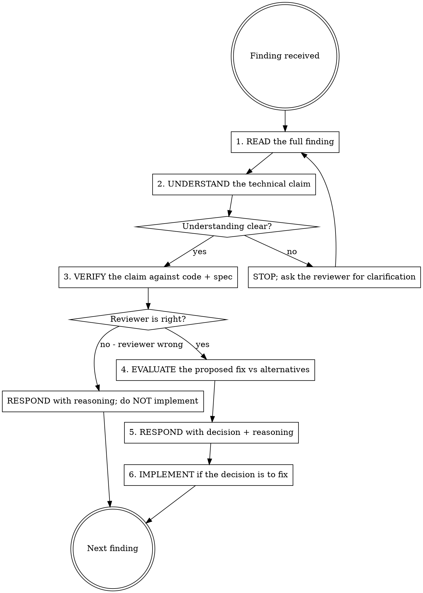

## Announce on entry

> I'm using the receiving-code-review skill. I will not implement any finding until I have read, understood, verified, evaluated, and responded to it explicitly. Agreement without verification is performative.

## Core principle

Verify before implementing. Ask before assuming. Technical correctness over social comfort.

A reviewer can be wrong. A reviewer can be right but unclear. A reviewer can be right and clear but suggest a fix worse than the problem. None of these conditions are rare; the discipline is to treat every finding as a hypothesis that needs verification before it becomes code.

The dominant failure mode is performative agreement: "You're absolutely right! Let me implement that now." The reviewer feels respected, the author feels cooperative, the code ships with the suggestion applied - and nobody verified that the suggestion actually improves the code or that the finding was correct.

## Hard gate

```
Do NOT implement any review finding until all preconditions are satisfied:
(1) the finding has been READ in full (not skimmed), (2) its technical claim
has been UNDERSTOOD in plain English, (3) the claim has been VERIFIED against
the code and the spec (not taken on the reviewer's authority), (4) the
proposed fix has been EVALUATED against alternatives, AND (5) a RESPONSE has
been recorded. If any step has not happened for a finding, that finding is
not ready to implement. This applies to EVERY review from EVERY reviewer
regardless of seniority, tool, or time pressure.
```

> Violating the letter of the rules is violating the spirit of the rules.

## The six-step response pattern

Applied to each finding one at a time. Do not batch findings.



### 1. READ

Read the full finding. Not the first line. Not the suggested code. The full text, including the reviewer's reasoning. Agents skim reviews under pressure; this step exists to block skimming.

### 2. UNDERSTAND

Restate the technical claim in your own plain English. "The reviewer is saying that the `normalize_input` function mutates its argument and the caller at `handlers.py:42` expects an immutable input." If you cannot restate the claim, you do not understand it.

If understanding is not clear, STOP. Ask the reviewer for clarification before proceeding. Do not implement a finding you cannot restate.

### 3. VERIFY

Check the claim against the actual code and the actual spec. Run the failing scenario the reviewer describes. Open the file the reviewer names. Read the spec section the reviewer cites.

A reviewer can be wrong about the code. A reviewer can be right about the code but wrong about the spec. Verification is where you discover which.

### 4. EVALUATE

If the claim is verified, evaluate the reviewer's proposed fix against alternatives:

- Does the fix address the root cause or a symptom?
- Does the fix introduce complexity that a different fix does not?
- Does the fix conflict with other design decisions already approved?
- Is there a smaller fix that addresses the finding?

"The reviewer's fix" is one option; "the fix that best resolves the finding" is the decision.

### 5. RESPOND

Record the decision explicitly before implementing. Three valid responses:

- **Accept and implement.** State what you are implementing and why.
- **Push back.** State why you disagree with the finding or the fix. For Critical findings, push-back is NOT a one-way record: either (a) re-dispatch the same reviewer agent with original inputs plus your push-back reasoning spliced in, and record the reviewer's response; OR (b) escalate to the human partner and record their decision verbatim. For Important findings, re-dispatch is recommended; at minimum cite specific spec sections or code that support the push-back. For Suggestions, push-back is a one-way record.
- **Defer.** State why the finding is valid but not urgent (Suggestion severity; out of scope for this PR; tracked in a follow-up). Follow-ups MUST produce a tracking artifact. When the project has no issue tracker, the tracking artifact is a new entry in a `## Deferred findings` section of the review log with explicit follow-up action and named owner (usually the human partner). The human partner must acknowledge every deferred finding before Stage 8 merges.

### 6. IMPLEMENT

Only if the decision in step 5 is "accept and implement." Implement with the discipline of all upstream skills: failing test first (TDD), fresh verification at completion (verification-before-completion), surface discipline if UX-touching (design-driven-development + accessibility-verification).

If the VERIFY step uncovered a bug, invoke `systematic-debugging` BEFORE any fix. A reviewer catching a real defect is a caught bug; fixing by guess bypasses iron-law-2.

### Re-run sibling review after cross-concern fixes

If an accepted fix changes files that touch a user-facing surface (even when this is a code-review finding, not a design-review one), the in-flight design review may be stale. After implementing the fix, re-dispatch `requesting-design-review` against the new HEAD. Do not advance to Stage 8 while one review is fresh and the sibling is stale.

Symmetrically, accepted design-review fixes that change non-surface code re-dispatch `requesting-code-review`.

## Forbidden phrases

These phrases are performative-agreement tells. If you notice yourself writing one, STOP: you have not completed the six steps.

- "You're absolutely right!"
- "Great point!"
- "Excellent feedback!"
- "Let me implement that now" (before verification)
- "I'll just apply the suggestion"
- "Sure, changing it" (without reasoning)
- "Good catch" (as a standalone response, without the six steps)

You can be warm. You can acknowledge good findings. But warmth does not bypass the six steps, and neither does politeness.

## Checklist

For each finding:

1. Read it fully.
2. Restate the technical claim in plain English.
3. If unclear, stop and ask.
4. Verify against code and spec.
5. If the claim is wrong, push back with reasoning.
6. If the claim is right, evaluate the fix against alternatives.
7. Respond with the decision and reasoning.
8. If the decision is to fix, implement with the normal discipline.

Next finding.

## Anti-patterns

- **"Append The Ack Line Because It's Routine"** - the `Acknowledged by human partner on YYYY-MM-DD` suffix on a deferred finding is evidence of an explicit human-partner action. Appending it yourself turns Stage 8's precondition 5 into fiction. Wait for the human partner's response; transcribe their words; do not assume.
- **"Write The Completion Marker While A Critical Finding Is Open"** - the marker declares the review cycle cleared. Writing it with open findings is dishonesty, not efficiency. The pre-write mechanical verification grep exists to block this.
- **"Implement Everything The Reviewer Said"** - "everything" is a skip of step 3 and 4. Verify and evaluate per finding.
- **"Agree, Then Implement Whatever I Was Going To Do Anyway"** - performative agreement plus implementation drift.
- **"The Reviewer Is Senior; Trust Them"** - seniority is not evidence. Verify.
- **"The Finding Is Minor; Implement It Without Thinking"** - minor findings accumulate into codebases that reviewers trained the author to write. Apply the six steps; if the finding survives, implement.
- **"Push Back By Implementing Anyway With A Comment"** - push-back is response, not implementation. Implement after resolution.
- **"Defer Everything Non-Critical To A Follow-Up"** - "non-critical" is the word performative agreement hides behind. Evaluate each finding.

## Red flags

| Thought | Reality |
|---------|---------|
| "I was going to do this anyway" | Then verify and evaluate; don't skip the steps because you arrived at the same place. |
| "The fix is obvious; skip evaluation" | Obvious fixes often have non-obvious side effects. Evaluate. |
| "The reviewer is probably right" | "Probably" is not verification. Check. |
| "Minor issue; don't push back" | If you disagree, say so. Pushback is a respect for the reviewer. |
| "I'll ask after implementing" | Implement after asking. Ordering matters. |
| "I agreed and shipped" | Agreement without evidence is performance. |

## Output artifacts

- Per-finding response record in the review log under the same `## Branch-level code review` section as the dispatched report. Use the agent's pre-numbered `F<n>` from the report; do not renumber.

   ```
   ### Response F<n>
   - Claim (restated): <plain English>
   - Verification: <what you checked, what you found>
   - Decision: <accept / push-back / defer-with-tracking>
   - Reasoning: <one or two sentences>
   - Re-dispatch or escalation (push-back on Critical only): <reviewer's re-dispatched response OR human-partner decision, recorded verbatim>
   - Sibling review re-dispatch (if fix crossed concerns): <commit sha of sibling review that re-ran, or "N/A">
   - Implementation: <commit sha / "N/A (push-back)" / tracking entry path>
   ```

- A `## Deferred findings` section aggregating every deferred finding for human-partner acknowledgement before Stage 8:

   ```
   ## Deferred findings
   - F<n>: <one-line summary> - Owner: <human partner or future task> - Follow-up action: <specific>
   ```

- Commits implementing accepted findings, with commit messages referencing the finding: `review F<n>: <summary>`.

## Successor

After every Critical and Important finding has a decision recorded AND every "accept" finding is implemented AND verified AND every deferred finding is acknowledged by the human partner (verbatim acknowledgement in the `## Deferred findings` section), verify mechanically before writing the marker:

```
# Count unresolved F-findings (no Response entry)
findings=$(grep -cE '^- F[0-9]+ ' "$review_log_path")
responses=$(grep -cE '^### Response F[0-9]+' "$review_log_path")
[ "$findings" -eq "$responses" ] || { echo "unresolved findings; do not write marker"; exit 1; }

# Every accept has a non-"N/A (push-back)" / non-empty Implementation line
# Every deferred F has the "Acknowledged by human partner on YYYY-MM-DD" suffix in the Deferred findings section (count match per Stage 8 precondition 5)

# Increment round:
existing_rounds=$(grep -cE '^Code review complete - round [0-9]+' "$review_log_path")
next_round=$((existing_rounds + 1))
printf '\nCode review complete - round %d - %s\n' "$next_round" "$(date +%Y-%m-%d)" >> "$review_log_path"
```

**Marker invalidation rule.** If ANY new F-finding is written to the review log after the marker's line (e.g., from a sibling re-dispatch, a spec-update loop, a cross-concern fix re-triggering the review), the marker is stale and must be invalidated. Before invalidating, confirm the new findings are real (not stale duplicates); then delete the marker line and re-enter the response cycle. Re-emit the marker with an incremented round after the new findings are resolved.

Marker format (append-only):

```
Code review complete - round <N> - YYYY-MM-DD
```

Then:

> All Critical and Important findings resolved. Proceeding to finishing-a-development-branch (stage 8), OR, if surfaces were touched and the parallel design review is still open, waiting on receiving-design-review before advancing.

### Missing-successor fallback

If `finishing-a-development-branch` is missing in this version of the plugin, STOP. Tell the human partner the pipeline is incomplete. Do not merge without the Stage 8 discipline.

Do not exit without naming and invoking the named successor.

## Related

- `../../dev/stages/07-review.md` - canonical stage definition
- `../requesting-code-review/SKILL.md` - the sibling skill that dispatched the review
- `../receiving-design-review/SKILL.md` - the parallel receive skill when surfaces were touched
- `../../agents/code-reviewer.md` - the subagent whose report this skill consumes
- `../systematic-debugging/SKILL.md` - the process to apply when verification in step 3 uncovers a bug the reviewer caught
