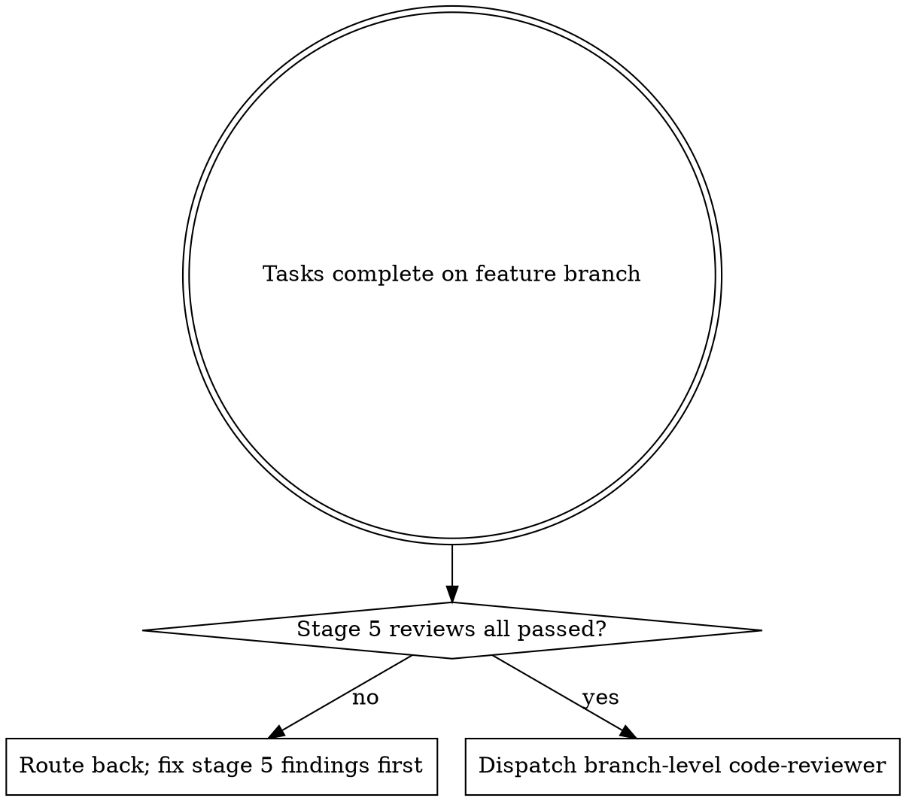

## Announce on entry

> I'm using the requesting-code-review skill to dispatch the code-reviewer subagent with constructed context. I will not merge or mark the feature complete until Critical and Important findings are resolved.

## Hard gate

```
Do NOT merge, mark complete, or advance to finishing-a-development-branch
until all preconditions are satisfied: (1) the implementation is committed on
the feature branch with BASE_SHA and HEAD_SHA captured, (2) the plan and spec
excerpts the reviewer needs are available as file paths or pasted context,
(3) the `agents/code-reviewer.md` definition exists in this version of the
plugin, AND (4) any per-task review logs from stage 5 are present for the
reviewer to consult. If any check fails, STOP. Route (1) back to the calling
Execute skill; route (3) to whoever ships the agent definitions. This applies
to EVERY project regardless of perceived simplicity or obviousness.
```

> Violating the letter of the rules is violating the spirit of the rules.

## Core principle

Review early, review often. A reviewer looking at a small change returns specific findings. A reviewer looking at a 2000-line feature returns generic findings. The plugin's stage-5 per-task quality review is the "early and often" pattern; this stage-7 skill is the branch-level pass that catches cross-task interactions, not the first review of the code.

## When to use



This skill is strictly branch-level. Per-task quality review runs via `skills/subagent-driven-development/code-quality-reviewer-prompt.md` which dispatches the same underlying `agents/code-reviewer.md` with `{MODE}=per-task`; do NOT invoke `requesting-code-review` from the per-task loop. The skill body below is branch-level and will STOP on per-task precondition failures.

## Precondition check (STOP if not satisfied)

0. **Resolve `<feature-name>`** from the plan filename.
1. **Tasks complete.** Every task in the plan at `docs/leyline/plans/<YYYY-MM-DD>-<feature-name>.md` is checked off and the review log at `docs/leyline/plans/<YYYY-MM-DD>-<feature-name>-review-log.md` has entries for each task. If tasks remain, STOP and route back to the calling Execute skill.
2. **Capture SHAs.**

   ```
   base_sha=$(grep -E '^- Base ref and commit SHA:' "docs/leyline/plans/<YYYY-MM-DD>-<feature-name>-baseline.md" | sed 's/.*: *//')
   head_sha=$(git rev-parse HEAD)
   [ -n "$base_sha" ] && [ -n "$head_sha" ] || { echo "malformed inputs"; exit 1; }
   ```

3. **Agent definition present.** `test -f agents/code-reviewer.md`. If missing, STOP; do not fabricate a review by dispatching the subagent without its definition.

## Dispatch procedure

1. **Construct the inputs** per the agent's expected-inputs list:
   - `{MODE}` - literal `branch-level`.
   - `{WHAT_WAS_IMPLEMENTED}` - a one-paragraph description pulled from the plan's Goal + Architecture fields.
   - `{PLAN_OR_REQUIREMENTS}` - plan path, product spec path, UX spec path (if applicable), AND review log path.
   - `{BASE_SHA}` / `{HEAD_SHA}` / `{DESCRIPTION}`.
2. **Dispatch `agents/code-reviewer.md`** with those inputs. Do not paraphrase or summarize the plan; the agent reads it.
3. **Branch-level large-diff handling.** If the agent returns a "split needed" report (per-task mode only) it is dispatch-mismatched; re-dispatch with `{MODE}=branch-level`. At branch level the agent partitions its own review by file group inside a single dispatch; the caller does not split.
4. **Receive the structured report.** The agent returns pre-numbered `F1..Fn` findings across the six review blocks plus an iron-law sweep. Record the full report verbatim; do not soften, do not filter, do not renumber.
5. **Hand off to `receiving-code-review`** with the full report.

## Parallel dispatch

When any task in the plan touched a user-facing surface, the caller MUST dispatch `requesting-code-review` AND `requesting-design-review` concurrently, not sequentially. Sequential dispatch leaks the first skill's report (and the receive loop's context) into the second reviewer's framing. Concrete orchestration:

1. The upstream Execute skill (`subagent-driven-development` or `executing-plans`) invokes `dispatching-parallel-agents` with two problem packets:
   - Packet A: `requesting-code-review` constructed context.
   - Packet B: `requesting-design-review` constructed context.
2. `dispatching-parallel-agents` confirms the four independence preconditions hold (different files touched, no shared state, no coordination required, each packet standalone). They always hold for code vs design review on the same branch: code-reviewer reviews all changed files; design-reviewer reviews the subset touching surfaces; the two do not write anything, so there is no file-write contention.
3. Both skills run their dispatch steps in parallel batches (Claude Code: multiple tool-call content blocks in one message).
4. Both reports return independently; each is handed to its own `receiving-*` skill.

When no task touched a surface, only `requesting-code-review` runs. `dispatching-parallel-agents` is not invoked.

## Checklist

1. Run the precondition check.
2. Construct the inputs.
3. Dispatch the subagent.
4. Record the full report verbatim.
5. If surfaces were touched, confirm `requesting-design-review` was dispatched in parallel (or dispatch it now).
6. Invoke `receiving-code-review` with the report.

## Anti-patterns

- **"Skip The Branch-Level Review; Per-Task Reviews Covered It"** - per-task reviews see one task at a time. Cross-task interactions (shared state, unintended coupling, inconsistent voice, repeated bug patterns) are invisible at per-task scope.
- **"Summarize The Plan For The Reviewer"** - the reviewer reads the plan file. Summaries introduce the author's framing.
- **"Dispatch Without The SHAs"** - the reviewer cannot see the diff. Every finding becomes generic.
- **"Filter The Report Before Handing Off"** - the receiving skill owns triage. Pass the full report.
- **"Dispatch Both Reviewers Sequentially To Save Tokens"** - parallel dispatch is the design. Sequential review leaks the first report's findings into the second reviewer's context.
- **"The Human Partner Said The Review Is Optional"** - ask them to record the override verbatim in the review log; the iron laws the reviewer checks still hold.

## Red flags

| Thought | Reality |
|---------|---------|
| "Small feature, skip branch review" | Branch review sees what per-task review cannot. |
| "Fabricate the inputs since the agent file is missing" | A review against a missing agent is fiction. STOP. |
| "Share context between the two reviewers for efficiency" | Parallel design requires isolation. Do not share. |
| "Summarize the plan for the reviewer" | The reviewer reads the plan. Do not mediate. |

## Forbidden phrases

Do not say:

- "Skipping the branch review; per-task covered it"
- "Soft-filtering the report before handing it off"
- "Dispatching sequentially to save time"
- "Small change; one reviewer is enough"

## Output artifacts

- The dispatched agent's structured report, pasted into the review log under a `## Branch-level code review` section.
- A handoff to `receiving-code-review` with the full report as input.

## Successor

> Invoking receiving-code-review with the full report. Findings will be triaged there; Critical and Important must resolve before stage 8.

### Missing-successor fallback

If `receiving-code-review` is missing in this version of the plugin, STOP. Do not implement findings directly from the report without the receive-skill's discipline; performative-agreement failures happen exactly when the receive-skill is skipped.

Do not exit without naming and invoking the named successor.

## Related

- `../../dev/stages/07-review.md` - canonical stage definition
- `../../agents/code-reviewer.md` - the dispatched subagent
- `../receiving-code-review/SKILL.md` - the response-discipline successor
- `../requesting-design-review/SKILL.md` - the parallel branch when surfaces were touched
- `../subagent-driven-development/SKILL.md` - calls this skill per-task via `code-quality-reviewer-prompt.md`
