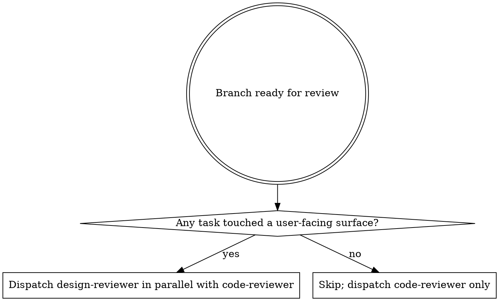

## Announce on entry

> I'm using the requesting-design-review skill to dispatch the design-reviewer subagent in parallel with the code review. I will not merge or mark the feature complete until Critical and Important UX / a11y findings are resolved.

## Hard gate

```
Do NOT merge, mark complete, or advance to finishing-a-development-branch
until all preconditions are satisfied: (1) at least one task in the branch
touched a user-facing surface per the UX spec's Surfaces enumeration,
(2) the UX spec exists and carries its approval marker, (3) per-task a11y
evidence is present in the review log, (4) the `agents/design-reviewer.md`
definition exists in this version of the plugin, AND (5) BASE_SHA and HEAD_SHA
are captured. If any check fails, STOP. Route (2) back to design-brainstorming;
route (3) back to the Execute skill that should have produced the evidence.
This applies to EVERY surface-touching project regardless of perceived
simplicity or obviousness.
```

> Violating the letter of the rules is violating the spirit of the rules.

## When to use

Dispatched for any branch that touched a user-facing surface. "User-facing surface" is defined in `../../dev/reference/surface-types.md`; see `design-driven-development/SKILL.md` for the implementation-time definition.



## Precondition check (STOP if not satisfied)

0. **Resolve `<feature-name>`** from the plan filename.
1. **Surface-touching task exists.** Scan the plan for any task block tagged as a UX task (or whose "Files:" block touches a surface). If none, this skill does not run; dispatch only `requesting-code-review`.
2. **UX spec approved.** Grep for the verbatim marker at `docs/leyline/design/<YYYY-MM-DD>-<feature-name>-ux.md`:

   ```
   grep -E '^UX spec approved - round [0-9]+ - [0-9]{4}-[0-9]{2}-[0-9]{2}$' "<path>"
   ```

   If missing, STOP and route to `design-brainstorming`.
3. **Per-task a11y evidence present.** For every UX task in the plan, the review log at `docs/leyline/plans/<YYYY-MM-DD>-<feature-name>-review-log.md` contains an A11y verification output paste per `subagent-driven-development/implementer-prompt.md`. If any UX task's entry is missing a11y evidence, STOP and route back to the Execute skill to re-run that task's a11y step; do not dispatch the design-reviewer against absent evidence.
4. **Agent definition present.** `test -f agents/design-reviewer.md`. If missing, STOP.
5. **Capture SHAs.** `base_sha` from the baseline note; `head_sha` from `git rev-parse HEAD`.

## Dispatch procedure

1. **Construct the inputs** per the agent's expected-inputs list:
   - `{MODE}` - literal `branch-level`.
   - `{UX_SPEC}` - path to the UX artifact at `docs/leyline/design/<YYYY-MM-DD>-<feature-name>-ux.md`.
   - `{SURFACES_IMPLEMENTED}` - list of surfaces touched, derived from the plan's UX task blocks. Use surface names verbatim from the UX spec's Surfaces enumeration.
   - `{ACCESSIBILITY_EVIDENCE}` - path to the review log file.
   - `{BASE_SHA}` / `{HEAD_SHA}` / `{DESCRIPTION}`.
2. **Dispatch `agents/design-reviewer.md`** with those inputs. The agent is harness-aware; it records the methodology in its report.
3. **Parallel dispatch with code review.** Parallel orchestration is owned by the upstream Execute skill via `dispatching-parallel-agents`, not by this skill. See `requesting-code-review/SKILL.md` parallel-dispatch section for the concrete mechanism. If you reach this skill without a sibling `requesting-code-review` dispatched concurrently, STOP and route to the Execute skill to re-enter Stage 7 via `dispatching-parallel-agents`.
4. **Receive the structured report.** The agent returns pre-numbered `D1..Dn` findings across six review blocks plus an iron-law sweep. Record verbatim; do not soften, filter, or renumber.
5. **Hand off to `receiving-design-review`** with the full report.

## Checklist

1. Run the precondition check.
2. Construct the inputs (UX_SPEC, SURFACES_IMPLEMENTED, ACCESSIBILITY_EVIDENCE, SHAs, DESCRIPTION).
3. Dispatch in parallel with `requesting-code-review` (if surfaces touched).
4. Record the full report verbatim.
5. Invoke `receiving-design-review`.

## Anti-patterns

- **"Surfaces Are Small; Skip The Design Review"** - small surfaces fail worst. See `design-driven-development/SKILL.md` Anti-patterns.
- **"Dispatch The Design-Reviewer Without A11y Evidence"** - the agent has no evidence to consult; its a11y block becomes speculation.
- **"Summarize The A11y Evidence Instead Of Passing The Log"** - the agent reads the log. Summaries introduce the author's framing.
- **"Run Design Review After Code Review, Not In Parallel"** - sequential review leaks the first report into the second reviewer's context. Parallel is the design.
- **"Let The Code Reviewer Cover UX Findings"** - code review and design review catch different classes of issue. One does not substitute for the other.

## Red flags

| Thought | Reality |
|---------|---------|
| "No a11y tool was available; the evidence is sparse" | Sparse evidence is still evidence. Pass it. Agent will adapt. |
| "The UX spec is outdated; dispatch anyway" | Outdated spec is a finding; do not dispatch. Loop to design-brainstorming. |
| "Share context between the two reviewers for efficiency" | Parallel design requires isolation. Do not share. |
| "Skip the design review; nothing UI-y changed" | "Nothing UI-y" is often wrong (error messages, log format, CLI output all qualify). Check the UX spec. |

## Forbidden phrases

Do not say:

- "Skipping design review; small UI change"
- "Code review will catch the UX issues"
- "Dispatching sequentially; parallel is unnecessary"
- "Summarizing the a11y log for the reviewer"

## Output artifacts

- The dispatched agent's structured report, pasted into the review log under a `## Branch-level design review` section.
- A handoff to `receiving-design-review` with the full report as input.

## Successor

> Invoking receiving-design-review with the full report. Findings will be triaged there; Critical and Important must resolve before stage 8.

### Missing-successor fallback

If `receiving-design-review` is missing, STOP. Do not implement findings directly.

Do not exit without naming and invoking the named successor.

## Related

- `../../dev/stages/07-review.md` - canonical stage definition
- `../../agents/design-reviewer.md` - the dispatched subagent
- `../receiving-design-review/SKILL.md` - the response-discipline successor
- `../requesting-code-review/SKILL.md` - the parallel branch (always dispatched alongside for surface-touching features)
- `../dispatching-parallel-agents/SKILL.md` - the parallel-dispatch rationale
- `../../dev/reference/surface-types.md` - what triggers this skill
- `../../dev/reference/recommended-optional-tools.md` - optional a11y and design tools the reviewer may use
