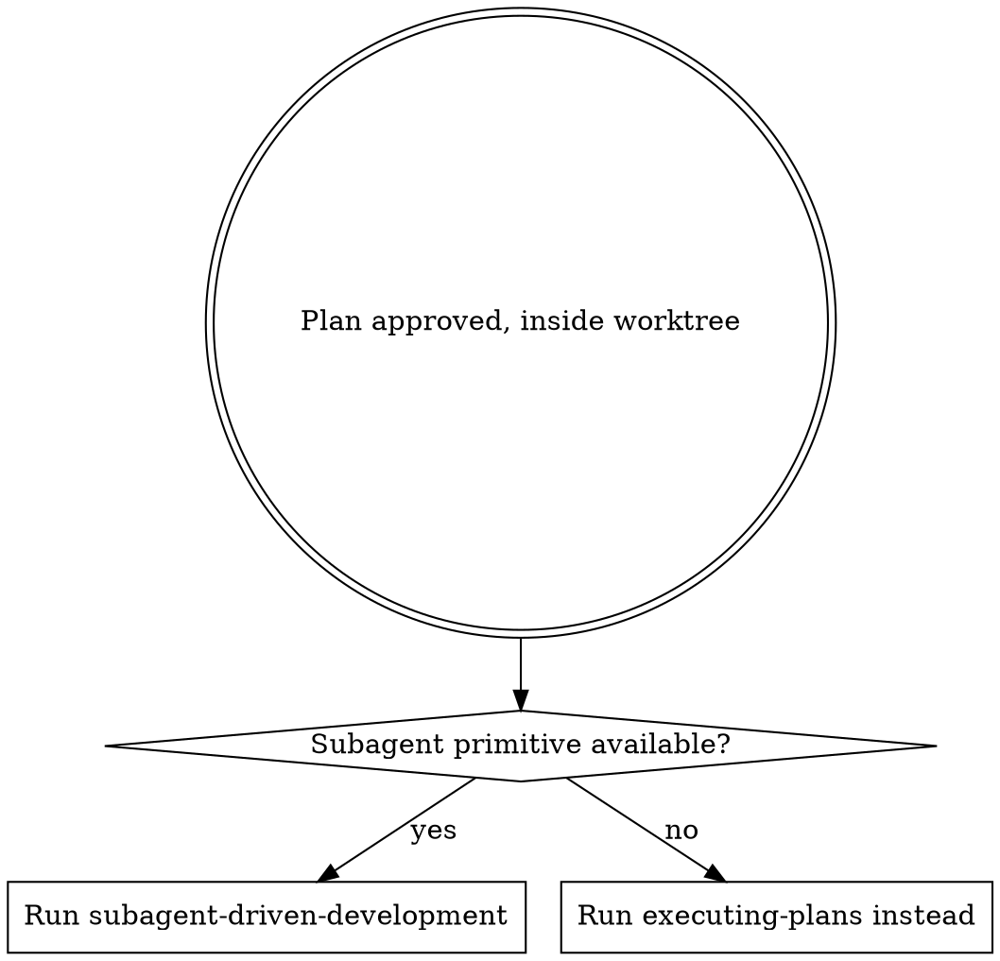
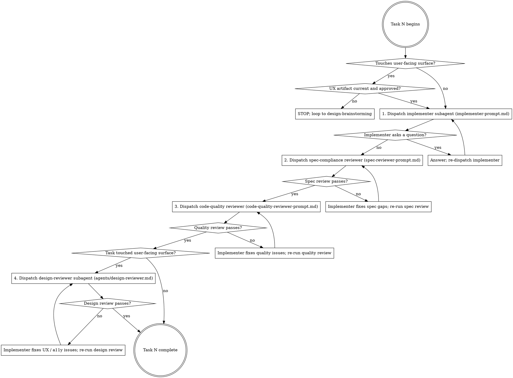

## Announce on entry

> I'm using the subagent-driven-development skill to execute the approved plan task-by-task. Each task goes to a fresh subagent with constructed context; reviews run as subagents too. If any precondition fails, I will STOP rather than proceeding on best-effort.

## Hard gate

```
Do NOT dispatch an implementer, run a review pass, or mark any task complete
until all preconditions are satisfied: (1) an approved plan exists at
docs/leyline/plans/<YYYY-MM-DD>-<feature-name>.md, (2) the current working
directory is inside the worktree recorded in the baseline note,
(3) the harness supports subagent dispatch, AND (4) for any task whose
"Files:" block touches a user-facing surface, the UX spec section covering
that surface is current and approved. If any check fails, STOP. Route (1)
back to writing-plans; route (2) back to using-git-worktrees; if (3) fails,
route to executing-plans; route (4) back to design-brainstorming. This applies
to EVERY project regardless of perceived simplicity or obviousness.
```

> Violating the letter of the rules is violating the spirit of the rules.

## Core principle

Each task is delegated to a fresh subagent with precisely constructed context. Subagents never inherit the parent session's history. This keeps their focus tight and preserves the parent's context for coordination. The per-task loop is implementer + two review passes (spec, code quality), plus a third review (design) when the task touches a user-facing surface. No task advances until every applicable review passes.

## Why subagents

The parent session is biased. It helped write the plan; it helped write the spec; it will rationalize partial compliance. A fresh subagent does not know any of that. It has only the constructed prompt: the task, the spec excerpt, the baseline, the files it is allowed to touch. Its findings are bias-free by construction. Token pressure, rate limits, and session length are NOT legitimate reasons to run tasks inline in the parent session - use `executing-plans` when the subagent primitive is literally unavailable, and say so out loud.

## Precondition check (STOP if not satisfied)

0. **Resolve `<feature-name>`** from the plan filename (same slug Stages 3 and 4 used).
1. **Approved plan present.** `docs/leyline/plans/<YYYY-MM-DD>-<feature-name>.md` exists and was committed by `writing-plans`. If missing, STOP and route to `writing-plans`.
2. **Baseline note readable; feature branch active.** Extract the worktree path AND branch from `docs/leyline/plans/<YYYY-MM-DD>-<feature-name>-baseline.md`:

   ```
   baseline_path="docs/leyline/plans/<YYYY-MM-DD>-<feature-name>-baseline.md"
   recorded_path=$(grep -E '^- Worktree path:' "$baseline_path" | sed 's/^- Worktree path:[[:space:]]*//')
   recorded_branch=$(grep -E '^- Branch name:' "$baseline_path" | sed 's/^- Branch name:[[:space:]]*//')
   [ -n "$recorded_path" ] && [ -n "$recorded_branch" ] || { echo "malformed baseline note"; exit 1; }

   [ "$(git rev-parse --show-toplevel)" = "$recorded_path" ] || { echo "not in recorded worktree"; exit 1; }
   [ "$(git rev-parse --abbrev-ref HEAD)" = "$recorded_branch" ] || { echo "wrong branch"; exit 1; }
   ```

   If the worktree path mismatches, `cd` into the recorded path. If the branch is wrong (for example `main`), STOP; do not commit any task on the wrong branch. Route back to `using-git-worktrees` to re-verify the branch was created.

3. **Subagent primitive available.** The harness must expose a dispatch primitive (`Task` tool in Claude Code, equivalents in Codex / OpenCode / Copilot CLI / Gemini CLI - see `../using-leyline/references/codex-tools.md` and `../using-leyline/references/copilot-tools.md`). If not, STOP and route to `executing-plans`. Token pressure and rate limits are NOT legitimate reasons to route to `executing-plans`; the primitive must be literally absent.

4. **Reviewer-agent definitions present.** This skill dispatches `agents/code-reviewer.md` (per-task quality pass) and, when surfaces are touched, `agents/design-reviewer.md`. If either file is missing in this version of the plugin and the relevant review pass would run, STOP. Route to whoever is responsible for Stage 7 (the stage that ships those agents). Do not silently skip a review pass because its agent definition is absent; the review pass returning "no findings" against a non-existent agent is fiction, not evidence.

5. **Experience gate pre-dispatch (per-task).** Before dispatching the implementer for any task whose "Files:" block touches a user-facing surface, verify all three conditions:

   - **UX spec file exists:** `test -f docs/leyline/design/<YYYY-MM-DD>-<feature-name>-ux.md`.
   - **UX spec is approved:** the file contains the verbatim approval marker written by `design-brainstorming`:

     ```
     grep -E '^UX spec approved - round [0-9]+ - [0-9]{4}-[0-9]{2}-[0-9]{2}$' "<path>"
     ```

     If the marker is missing, the UX spec was never approved in a way downstream stages can verify. STOP and route back to `design-brainstorming` to produce the marker.
   - **UX spec is current:** its last-modified timestamp is newer than the plan file's timestamp, OR the spec's latest approval round is >= the plan's referenced approval round. If the plan references an older approval round than the spec carries, the plan is out of date; route back to `writing-plans`.

   If any condition fails, STOP. Do not dispatch. This is the operational enforcement of `NO USER-FACING SURFACE WITHOUT AN APPROVED DESIGN ARTIFACT FIRST`.

6. **Product spec also approved.** For every task (not only surface-touching), verify the product spec carries its approval marker:

   ```
   grep -E '^Product spec approved - round [0-9]+ - [0-9]{4}-[0-9]{2}-[0-9]{2}$' "docs/leyline/specs/<YYYY-MM-DD>-<feature-name>-design.md"
   ```

   Missing marker: STOP and route to `brainstorming`.

## When to use



Prefer subagents. The inline-fallback path (`executing-plans`) exists only for harnesses without the primitive.

## The per-task loop



## Checklist (per task)

Create one TodoWrite (or harness equivalent) entry per task. Mark the entry `in_progress` when you begin step 1; mark it `completed` only after step 7.

1. **Experience gate.** If the task's "Files:" block touches a user-facing surface, run the three checks in precondition 5 (file exists, approval marker present, spec is current). If any fails, STOP and route back to `design-brainstorming`. Do not dispatch.
2. **Validate the implementer report before reviews.** When the implementer returns, confirm every required field is present and non-empty: Files changed, Failing-test output (code tasks only), Post-implementation test output (code tasks only), UX state observations (UX tasks only), A11y verification output (UX tasks only), Commits, Deviations. If any required field is missing, re-dispatch the implementer rather than advancing.
3. **Dispatch implementer.** Use `implementer-prompt.md` as the full subagent prompt. Substitute the task number, task block, baseline note path, plan path, and relevant spec excerpts. If the subagent asks a question, stash any partial edits (`git stash -u -m "mid-flight: task <N>"`), then answer the question and re-dispatch. On re-dispatch, include the answer and the exact instruction "discard any prior partial edits; start the task from the committed baseline."
4. **Dispatch spec-compliance reviewer.** Use `spec-reviewer-prompt.md`. If the reviewer finds spec gaps, the implementer fixes them in a new dispatch. After the fix dispatches, re-run BOTH the spec-compliance reviewer AND any prior review pass that had previously passed - a fix can regress earlier checks.
5. **Dispatch code-quality reviewer.** Use `code-quality-reviewer-prompt.md`, which in turn dispatches the canonical `code-reviewer` agent (`agents/code-reviewer.md`). If the reviewer flags Critical or Important findings, the implementer fixes them. After the fix, re-run the spec-compliance reviewer AND the quality reviewer again - a quality fix can regress spec compliance. Suggestions alone do not block.
6. **Dispatch design-reviewer (surface-touching tasks only).** Use `design-quality-reviewer-prompt.md`, which wraps `agents/design-reviewer.md` with `{MODE}=per-task` inputs and produces a "Blocks task completion: yes/no" triage analogous to the code-quality wrapper. The reviewer inspects available harness tools (browser automation, design-tool MCPs, a11y scanners, snapshot tools) and uses them when present; falls back to structural review when absent. It carries the iron-law-5 check: for any UX task, the implementer's pasted a11y evidence must be concrete (tool output, keyboard-walk narration, screen-reader snapshot) and show zero Critical violations. "Looks fine on my machine" is a finding. If the wrapper returns "Blocks: yes", the implementer fixes. After the fix, re-run the spec-compliance reviewer, the quality reviewer, AND the design-quality reviewer again.
7. **Record review trail; mark the task complete.** Append the three (or four) reviewer reports verbatim to `docs/leyline/plans/<YYYY-MM-DD>-<feature-name>-review-log.md` under a `## Task <N>` subsection. Stage 7 reads this file to resolve `{ACCESSIBILITY_EVIDENCE}` and to skip reviews that have already passed at the per-task level. Mark the TodoWrite entry complete only after every applicable review passes AND the review-log entry is committed.

### Conflict-resolution rule

If the spec reviewer and the quality reviewer return contradictory guidance (for example, quality says "inline this function," spec says "the spec names the function by that identifier"), the spec reviewer wins by default because the spec is the human-partner-approved source of truth. Surface the conflict in the review-log entry. If the spec reviewer's position is wrong (the spec itself has the bug), STOP and route back to `brainstorming` to fix the spec; do not override the spec reviewer by hand.

### Re-dispatch discipline on questions

When an implementer asks a question mid-task:

1. Run `git stash -u -m "mid-flight: task <N> question"` inside the worktree to park any partial edits.
2. Answer the question.
3. Re-dispatch the implementer with the answer spliced into the prompt and the explicit instruction: "Discard any prior partial edits; start from the committed baseline for this task."
4. If the re-dispatched implementer asks a second question, repeat. If a third question arrives on the same task, STOP; the task is underspecified. Route back to `writing-plans` to revise.

### Large-diff handling

If the cumulative diff for a task exceeds ~300 lines or the quality reviewer's prompt would exceed the harness's safe prompt budget, split the review by file group. Prepare a list of the files changed; group them (by directory, by subsystem, or by size) into chunks of under ~300 lines each; dispatch one `code-quality-reviewer-prompt.md` per chunk with the chunk's files as `<BASE_SHA>..<HEAD_SHA> -- <paths>`. Consolidate findings in the review-log entry as a single section.

## After all tasks complete

The branch-level final reviews are Stage 7's job, not Stage 5's. Running them here would duplicate the same agent against the same range back-to-back. After the last task is marked complete:

1. Summarize what shipped in a short structured message to the human partner:

   ```
   Feature: <feature-name>
   Branch: <branch name>
   Tasks: <count>
   Commits: <base-sha>..<head-sha>
   Surfaces touched: <yes / no>
   Test suite: <green / red-authorized / N/A>
   Review log: docs/leyline/plans/<YYYY-MM-DD>-<feature-name>-review-log.md
   ```

2. Invoke the Stage 7 successor(s):
   - **No surfaces touched this feature:** invoke `requesting-code-review` directly; one-dispatch path.
   - **Any task touched a surface:** dispatch `requesting-code-review` AND `requesting-design-review` CONCURRENTLY via `dispatching-parallel-agents`. Pass two problem packets:
     - Packet A: branch-level `requesting-code-review` constructed context.
     - Packet B: branch-level `requesting-design-review` constructed context.
     The two reviews touch different files (code-reviewer reads all changed files; design-reviewer reads only surface-related paths), share no state (neither writes), and require no coordination - so the four independence preconditions for parallel dispatch hold by construction. Sequential dispatch leaks the first report's framing into the second reviewer's context and is forbidden; do not invoke the two successors one after the other.

## Constructed-context rule

Every subagent dispatch receives constructed context only. The subagent must be able to do its job with only the prompt text; it does not inherit the parent's conversation, TodoWrite list, or earlier dispatches' outputs. Never write "as we discussed" in a subagent prompt. Never write "continue from the last subagent's work" - instead, paste the last subagent's output verbatim into the new prompt and explicitly say which parts to continue from.

## STOP conditions

STOP the per-task loop and ask the human partner - do not guess - if any of these occur:

- A blocker: the implementer cannot proceed without missing context, a missing dependency, or a clarification that is outside the task block.
- A plan gap: the task block references a file that does not exist, a function the spec does not describe, or a state-matrix cell the UX spec does not cover.
- An instruction you do not understand.
- A reviewer rejection that cannot be resolved in two re-dispatch cycles (implementer fixes, reviewer still rejects, implementer fixes again, reviewer still rejects).
- A finding that is outside the scope of the current task (route to a separate task rather than widening the current one).
- Reviewer agents disagreeing in ways the conflict-resolution rule above cannot resolve (the spec is itself the source of the disagreement).

Ask. Asking is cheap; guessing is the dominant failure mode.

## Routing implementer failures

When the implementer's test run fails in a way the task block did not predict (unexpected exception, different failure mode, infrastructure error), do not re-dispatch blindly with "try again." The implementer has hit a genuine debugging problem. Route it:

- Invoke `systematic-debugging` (stage 6a.2) with the failure output, the task block, and the baseline. Let it perform root-cause investigation before any fix dispatches.
- If `systematic-debugging` is not yet shipped in this version of the plugin, STOP and surface to the human partner; do not let the implementer guess at a fix.

## Supporting files

- `implementer-prompt.md` - template for the implementer subagent (one task, exact files, TDD discipline).
- `spec-reviewer-prompt.md` - template for the spec-compliance reviewer.
- `code-quality-reviewer-prompt.md` - template for the code-quality reviewer; dispatches the `code-reviewer` agent from `agents/code-reviewer.md`.
- `design-quality-reviewer-prompt.md` - template for the per-task design reviewer; dispatches the `design-reviewer` agent from `agents/design-reviewer.md` when a task touches a user-facing surface.

## Anti-patterns

- **"Reuse A Subagent Across Tasks To Save Time"** - context pollution. Every task gets a fresh dispatch. No exceptions.
- **"Inherit Parent Context Into The Subagent"** - subagents receive constructed context only. Parent-session history leaks bias.
- **"Skip The Spec Review, Quality Review Will Catch It"** - different concerns. Spec review asks "does the code do what the plan said to do?" Quality review asks "is the code good?" Both required.
- **"Skip The Design Review, The Quality Review Was Enough"** - design review is harness-aware and runs a11y tools when present. Quality review does not. Surface-touching tasks get both.
- **"Mark The Task Complete Before Reviews Pass"** - marking complete on a failing review is marking a lie.
- **"Fall Back To `executing-plans` Because Subagents Are Slow"** - slow is the cost of bias-free review. Use the fallback only when the primitive is literally unavailable.
- **"Answer The Subagent Mid-Flight"** - re-dispatch with the answer instead. Mid-flight patches produce partial subagent state.
- **"Skip The Final Reviews, Per-Task Reviews Already Ran"** - per-task reviews see one task at a time. The final reviews see the whole change; they catch interactions that per-task reviews cannot.

## Red flags

| Thought | Reality |
|---------|---------|
| "This task is small, skip the spec review" | Small tasks are where drift hides. Run it. |
| "The reviewer will probably approve, skip to the next task" | "Probably approve" is not "approved". Run it and wait. |
| "I'll tell the subagent what the last one found" | No. Paste the output; do not summarize. |
| "The subagent got the wrong answer, let me just fix it myself" | Dispatch a corrected subagent; do not take over the task. |
| "The human partner is watching, skip the cosmetics" | The cosmetics catch real bugs in practice. Run the review. |
| "One failing test in the quality review is unrelated" | Prove it in the re-dispatch. Do not handwave past it. |
| "Design review is overkill for this surface" | Design review is required when the surface is touched. Overkill is a rationalization. |

## Forbidden phrases

Do not say:

- "Skipping the spec review for this task"
- "Skipping the quality review; looks fine"
- "Skipping the design review; the change is small"
- "Running this task inline, subagents are slow"
- "I'll handle the implementer's question directly and continue"
- "The final review is optional on a clean branch"
- "Marking the task complete; reviewer can catch up later"

## Output artifacts

- Per-task commits on the feature branch with the plan's task-numbered messages.
- A recorded review trail (captured subagent outputs for each task) committed alongside the code, or saved to `docs/leyline/plans/<YYYY-MM-DD>-<feature-name>-review-log.md`.
- A clean branch at the end of execution with every task's review traces captured.

## Successor

> Invoking requesting-code-review (stage 7). All tasks executed, per-task and final reviews passed. Dispatching the stage-7 reviewer for branch-level sign-off.

When any task touched a user-facing surface, additionally:

> Invoking requesting-design-review (stage 7, parallel).

### Missing-successor fallback

If any of the following is missing in this version of the plugin, STOP and name the missing piece:

- `requesting-code-review` - the Stage 7 branch-level reviewer.
- `requesting-design-review` - the Stage 7 branch-level design reviewer (required only when surfaces were touched).
- `agents/code-reviewer.md` - the per-task quality reviewer this skill dispatches.
- `agents/design-reviewer.md` - the per-task design reviewer this skill dispatches (required only when surfaces were touched).
- `systematic-debugging` - the route for unexpected implementer failures.

Do not improvise past any of them. Do not merge or ship without the stage-7 review. Do not silently skip a review pass because its agent definition is absent. A review whose agent is missing is fiction, not evidence.

Do not exit without naming and invoking the named successor.

## Related

- `../../dev/stages/05-execute.md` - canonical stage definition
- `../executing-plans/SKILL.md` - fallback when subagent dispatch is unavailable
- `../dispatching-parallel-agents/SKILL.md` - when 2+ independent problems surface during execution. Call from the per-task loop when an implementer failure splits into independent sub-failures, or when multiple reviewers return independent findings that fix different files.
- `../../agents/code-reviewer.md` - code-review subagent definition (planned Stage 7)
- `../../agents/design-reviewer.md` - design-review subagent definition (planned Stage 7)
- `../writing-plans/SKILL.md` - produces the plan this skill consumes
- `../test-driven-development/SKILL.md` - the discipline embedded in every code task
- `../verification-before-completion/SKILL.md` - the iron law the spec reviewer's verification step enforces
- `../systematic-debugging/SKILL.md` - the route for unexpected implementer failures
- `../design-driven-development/SKILL.md` - the Experience-gate iron law enforced pre-dispatch
- `../accessibility-verification/SKILL.md` - a11y evidence in the design-review pass
