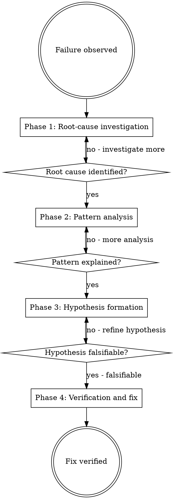

## Announce on entry

> I'm using the systematic-debugging skill. I will not propose a fix until I have completed root-cause investigation. The error message is data; read it before guessing.

## Iron Law

```
NO FIXES WITHOUT ROOT CAUSE INVESTIGATION FIRST
```

> Violating the letter of the rules is violating the spirit of the rules.

## Why the iron law

The dominant failure mode in debugging is "quick fix" guessing. Each guess modifies the code; each modification changes the system state; each state change shifts the bug's signature. After three guesses, the original symptoms are gone, the original cause is buried under three patches, and the team believes "we fixed it" because the test is green. The bug comes back three months later, harder to find.

Systematic debugging is slower on the first failure and dramatically faster across repeat failures. It catches real causes, not apparent fixes.

## When to apply

Any of the following triggers systematic-debugging:

- A test fails.
- Code produces unexpected output (not in spec, not in docs, not in prior observations).
- A build breaks.
- An integration between two subsystems misbehaves.
- Performance regressed.
- A previous fix did not hold (the same or related failure reappeared).

**Especially apply when** time pressure is high, "just one more thing" seems obvious, or two or more previous fixes did not hold.

## The four phases

Phases run in order. Each must complete before the next begins. No phase can be skipped.



### Phase 1 - Root-cause investigation

Before anything else:

1. **Read the error message.** All of it. The first line is a summary; the stack trace is the story; the last line often names the concrete cause. Agents under time pressure skim and guess; the discipline is to read.
2. **Read it again.** Agents frequently misread error messages on the first pass. The second pass catches the misreading.
3. **Reproduce consistently.** A failure that happens "sometimes" is not yet a debuggable problem. Find the minimal steps that reproduce it every time. If you cannot reproduce, the first task is building a reproducer, not proposing a fix.
4. **Capture the stack trace.** Save it to a note. Every subsequent phase refers back to it.
5. **Identify what the error message actually says.** Translate jargon into plain English: "this function was called with None where a string was expected." The plain-English version is the gate.

Exit phase 1 only when you can state the root cause in one sentence of plain English. "Something broke in the API" is not a root cause. "`normalize_input` received `None` from `handle_request` because the upstream parser returns None for empty payloads instead of an empty string" is a root cause.

### Phase 2 - Pattern analysis

With the root cause named:

1. **What changed?** The last code change is the leading suspect. Check `git log -p HEAD~5..HEAD`. Check recent dependency bumps. Check CI config changes. The change is rarely unrelated.
2. **What was the system state?** Environment variables, feature flags, data migrations in flight, running processes. Was the failure state-dependent?
3. **Does the pattern explain the whole observation?** If there are two failure modes ("sometimes times out, sometimes returns 500"), a pattern that only explains one is incomplete. Keep analyzing until the pattern covers every observed symptom.

Exit phase 2 when you can explain every observed symptom with one pattern.

### Phase 3 - Hypothesis formation

Translate the pattern into a falsifiable hypothesis:

1. **State the hypothesis as "if X were true, Y would follow."** Example: "If the upstream parser returns None for empty payloads, the `normalize_input` call will fail in production when a client sends an empty POST body."
2. **Name what would prove it right.** A specific test, a specific log line, a specific database state.
3. **Name what would prove it wrong.** The hypothesis must be falsifiable; a hypothesis that cannot be disproven is not useful. "It's probably a race condition" is not falsifiable; "if we serialize the two coroutines, the error disappears" is.

Exit phase 3 with a written hypothesis and its falsification criterion.

### Phase 4 - Verification and fix

Only now:

1. **Run the test that proves the hypothesis.** If the hypothesis is wrong, phases 1-3 were wrong; go back. Do not propose a fix for a wrong hypothesis.
2. **Write the failing test for the fix** (RED-GREEN-REFACTOR from `test-driven-development`). The test should fail because of the root cause, not because of incidental infrastructure.
3. **Apply the minimal fix** that addresses the root cause, not the symptom.
4. **Verify** that the fix turns the failing test green AND that no other tests regressed. If other tests regress, the fix is wrong or incomplete.
5. **Document** the root cause and the fix. Two destinations, both required:

   - **Review log.** Append a structured entry to `docs/leyline/plans/<YYYY-MM-DD>-<feature-name>-review-log.md` under the current task's subsection:

     ```
     ### Systematic-debugging record - task <N>
     - Root cause (one sentence, plain English): <...>
     - Falsifying test: <path / command>
     - Hypothesis: <the falsifiable "if X, then Y">
     - Fix: <minimal change that addresses the root cause>
     - Regression coverage: <the test that reproduces the bug and passes after the fix>
     ```

     Stage 7's code-reviewer greps for `Systematic-debugging record` entries to verify phase 1 occurred; an absent or placeholder entry is a Stage-7 finding.

   - **Commit message.** A short summary in the body of the commit that names the root cause in plain English. The full record lives in the review log.

   Later debugging sessions reference these notes; do not leave them ambient.

## Checklist

Create a task-level entry; inside, step-level entries per phase are useful.

1. Announce: "Starting root-cause investigation."
2. Phase 1: read, re-read, reproduce, capture trace, state root cause in plain English.
3. Phase 2: `what changed?`, `what was the state?`, confirm pattern covers all symptoms.
4. Phase 3: write the hypothesis; write the falsification criterion.
5. Phase 4: verify the hypothesis; write the failing test; apply the minimal fix; verify GREEN; confirm no regressions; document.

## Claim-to-evidence gate

Do not claim "bug fixed" until:

- The failing test that reproduced the bug is now green.
- The full test suite is green (no regressions).
- The root cause is documented.
- The fix targets the root cause (not the symptom).

Matching the `verification-before-completion` iron law: evidence before claims.

## Anti-patterns

- **"Just One Quick Fix"** - the dominant rationalization. The quick fix is always a symptom patch; the bug stays. Run phase 1.
- **"The Error Message Is Wrong / Weird / Unclear"** - read it again. Error messages are usually correct and specific; the problem is that the reader skipped.
- **"Previous Fix Didn't Hold; Let's Try Another Change"** - no. The previous fix was for a wrong cause. Phase 1 again; go deeper this time.
- **"I'll Investigate After I Ship A Fix"** - the fix IS the investigation's output. Do not invert them.
- **"The Test Is Flaky"** - sometimes true, usually not. Flakiness is a class of root cause (timing, shared state, nondeterminism); it deserves phase 1.
- **"I Have A Hunch"** - write the hunch as a falsifiable hypothesis in phase 3; prove or disprove it in phase 4. Unverified hunches are guesses.
- **"This Is Too Urgent For Systematic Debugging"** - urgent is when systematic debugging matters most. Quick fixes under pressure are when wrong fixes ship.

## Red flags

| Thought | Reality |
|---------|---------|
| "The error message seems clear, I know the fix" | Then phase 1 takes 60 seconds. Do it. |
| "This has to be a race condition" | Phrase it as a falsifiable hypothesis. Otherwise it is a guess. |
| "The test that failed is unrelated to my change" | Prove it in phase 2. Ad-hoc "unrelated" is the sound of a cause being missed. |
| "Let me try reverting the last commit and see" | That is a guess dressed as investigation. Form the hypothesis first. |
| "I've been debugging for an hour, I should just fix it" | An hour is phase 1 and phase 2. Finish phases 3 and 4 properly. |
| "The fix makes the test pass; done" | Does it address the root cause, or the symptom? Prove it. |

## Forbidden phrases

Do not say:

- "I'll just try this and see"
- "Quick fix for now"
- "The error message is weird; let me just change this and see"
- "Probably a race condition; adding a sleep"
- "It's unrelated; moving on"
- "We'll investigate the root cause later"

## Returns to caller

This is an overlay. After phase 4 is complete and the fix is verified, control returns to the caller (typically `subagent-driven-development` or `executing-plans`). No explicit successor.

## Related

- `../../dev/principles/iron-laws.md` - catalogues this iron law
- `../../dev/stages/06-discipline.md` - canonical overlay definition
- `../test-driven-development/SKILL.md` - the RED-GREEN-REFACTOR cycle invoked inside phase 4
- `../verification-before-completion/SKILL.md` - the fresh-evidence gate that phase 4's verification must satisfy
