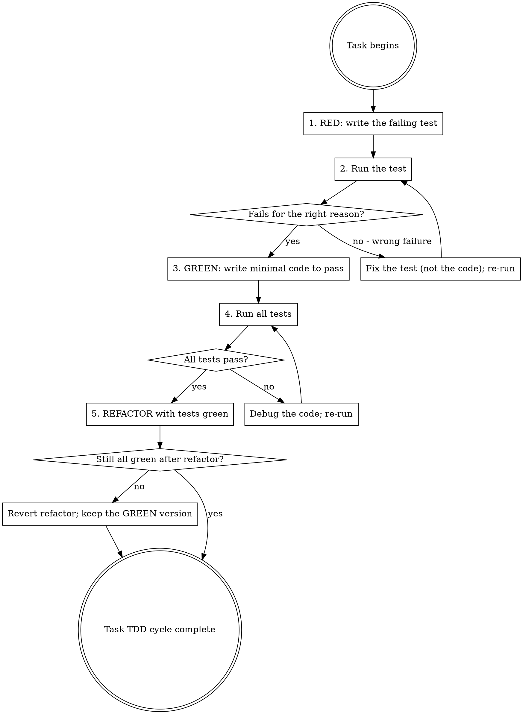

## Announce on entry

> I'm using the test-driven-development skill. The failing test is first. I will not write production code until the test fails for the right reason.

## Iron Law

```
NO PRODUCTION CODE WITHOUT A FAILING TEST FIRST
```

> Violating the letter of the rules is violating the spirit of the rules.

## Why the iron law

Tests written after the code are tests written in the shape of the code, not in the shape of the requirement. They pass the first time they run because the code they are testing was just written to match the author's mental model of the requirement. RED-GREEN-REFACTOR reverses the sequence so the test is the specification and the code has to earn the pass.

## Applies to

- New features (always)
- Bug fixes (the failing test reproduces the bug; GREEN proves the bug is fixed)
- Refactors (existing tests must stay green; new behavior requires new tests)
- Behavior changes (the test names the new behavior; old behavior is either deprecated or re-specified)

## Exceptions (ask the human partner, then declare verbatim)

Only these are valid exceptions, and the human partner must be asked before taking them:

- **Throwaway prototypes** - one-session exploratory code that will be deleted before the next commit.
- **Generated code** - output of a code generator where the generator itself is tested.
- **Configuration files** - infrastructure, CI, linter config, formatter config; verification is running the config.
- **Doc-only, CHANGELOG, dependency bumps, formatting-only changes** - see the `writing-plans` non-code-task exception.

After the human partner agrees the task qualifies, the exception MUST be declared verbatim in the task block per the Stage 4 convention:

```
Exception: <throwaway | generated | configuration | doc-only | CHANGELOG | dependency-bump | formatting> task - no failing test. Verification: <command and expected output>.
```

An agent that skips the failing-test step WITHOUT writing this line in the task block is violating the iron law; the spec-reviewer greps for the line and will flag the task. Asking the human partner and then writing code is not the same as declaring the exception.

"This is a quick fix" is NOT an exception. "It's urgent" is NOT an exception. "I'll add the test after" is NOT an exception. The iron law carries no time-pressure escape.

## RED-GREEN-REFACTOR cycle



## The five steps, verbatim

1. **RED - write a failing test.** The test names the behavior the code must produce. It compiles, it runs, and it fails.
2. **Verify it fails for the right reason.** "Test failed" is not enough. The failure reason must be what the task block (or your spec excerpt) predicts - an assertion mismatch, a missing-function import error, a concrete exception. A test that fails because of a typo in the test itself is not a RED; fix the test and re-run.
3. **GREEN - write the minimal code to pass.** Minimal means "the smallest change that produces the assertion pass." No refactoring yet. No generalizing yet. Make it pass.
4. **Verify all tests pass.** Not just the new one - the whole suite. If any previously-green test is now red, that is the new target; do not advance.
5. **REFACTOR with tests green.** Clean up the code; clean up the test; extract helpers; rename. After every refactor, re-run the suite. If a refactor turns any test red, revert it; the refactor is wrong, not the test.

## Checklist

Create one task-level entry for each code task. Within the task, step-level entries (one per RED/GREEN/REFACTOR step) are optional but useful.

1. Announce: "Writing the failing test first."
2. Write the test.
3. Run the test and capture the output. Confirm the failure reason is what you expected.
4. Write the minimal production code.
5. Run the test suite. Confirm GREEN.
6. Refactor if warranted. Re-run the suite after every refactor.
7. Commit once the suite is green post-refactor.

## Remedy if violated

If production code was written before a failing test (or if you realize mid-task that a test was never run RED), the remedy is:

1. **Delete the production code.** Do not adapt it while writing tests. Do not look at it while writing tests. Delete it.
2. Write the failing test from the task block and the spec.
3. Watch it fail for the right reason.
4. Implement fresh.

"Delete the code" is not a suggestion. Code that was written without a failing test first carries the author's model of what it should do, not the specification's. Salvaging it by retrofitting tests produces tests that pass around the bugs the code already has.

## Anti-patterns

See `testing-anti-patterns.md` for the full list. The summary:

- **"I'll Add The Test After I See It Works"** - the iron law's direct violation.
- **"Just This Once, The Code Is Small"** - iron laws do not scale to code size.
- **"I'll Write The Test Based On The Code"** - reverses RED-GREEN; the test no longer specifies, it photocopies.
- **"The Test Failed, Good Enough"** - no. Failed for the right reason. A test that fails because of a typo is not a RED.
- **"The Test Can't Fail, But It Passes"** - a test structurally incapable of failing (`assert True`, `assert result is not None` where the function always returns non-None) is not a test. The iron law requires a test that CAN fail; see `testing-anti-patterns.md` "Test That Can't Fail."
- **"The Refactor Turned Tests Red, But The New Tests Are Better"** - revert the refactor. Green first; evolve tests separately with their own RED-GREEN.
- **"The Human Partner Said Tests Are Optional For This"** - ask explicitly whether this falls under the exception list (throwaway / generated / config / non-code). If yes, write the verbatim Exception line in the task block. If not, the iron law holds.

## Red flags

| Thought | Reality |
|---------|---------|
| "I already know how this will work; skip the test" | Knowing how it will work is exactly when the test is easiest to write. Write it. |
| "The test is obvious from the function name" | Then writing it costs 60 seconds. Write it. |
| "My test failed with a NameError; that counts as RED" | Only if the task block predicted NameError. Otherwise fix the test. |
| "I refactored and broke five tests but the feature is better" | Five broken tests means the refactor is wrong. Revert. |
| "Time is short; the test can wait" | Tests wait; bugs do not. |
| "This is configuration, no test needed" | Running the config counts as verification. Declare the exception; don't skip silently. |

## Forbidden phrases

Do not say:

- "Writing the code first, test after"
- "I'll circle back and add tests"
- "Just this once, skipping the failing-test step"
- "The test failed with an import error, close enough"
- "I refactored and will fix the tests next"

## Returns to caller

This is an overlay, not a pipeline stage. After the RED-GREEN-REFACTOR cycle completes for a task, control returns to the caller (typically `subagent-driven-development` or `executing-plans`). No explicit successor.

## Related

- `../../dev/principles/iron-laws.md` - where this iron law is catalogued
- `../../dev/stages/06-discipline.md` - canonical overlay definition
- `../systematic-debugging/SKILL.md` - what to reach for when the "right reason" test fails differently than expected
- `../verification-before-completion/SKILL.md` - the fresh-evidence gate that complements this one at completion time
- `../design-driven-development/SKILL.md` - the sibling overlay that runs in parallel during BUILD for surface-touching tasks
- `../writing-plans/SKILL.md` - where the `Exception:` task-block convention is defined
- `testing-anti-patterns.md` - full catalogue of bad tests this skill rebuts
