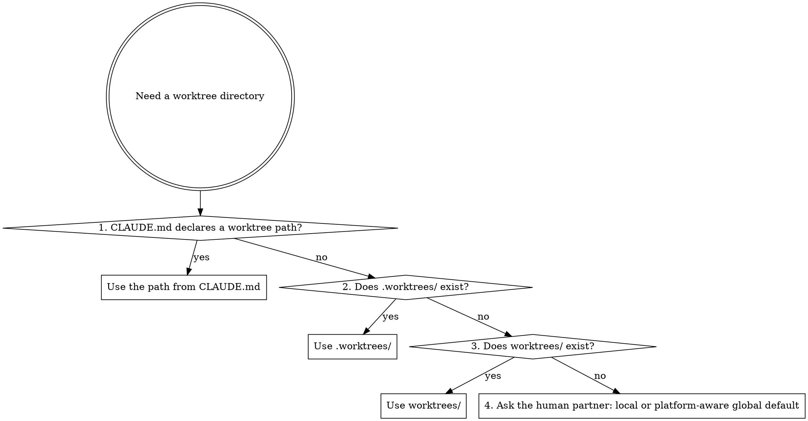
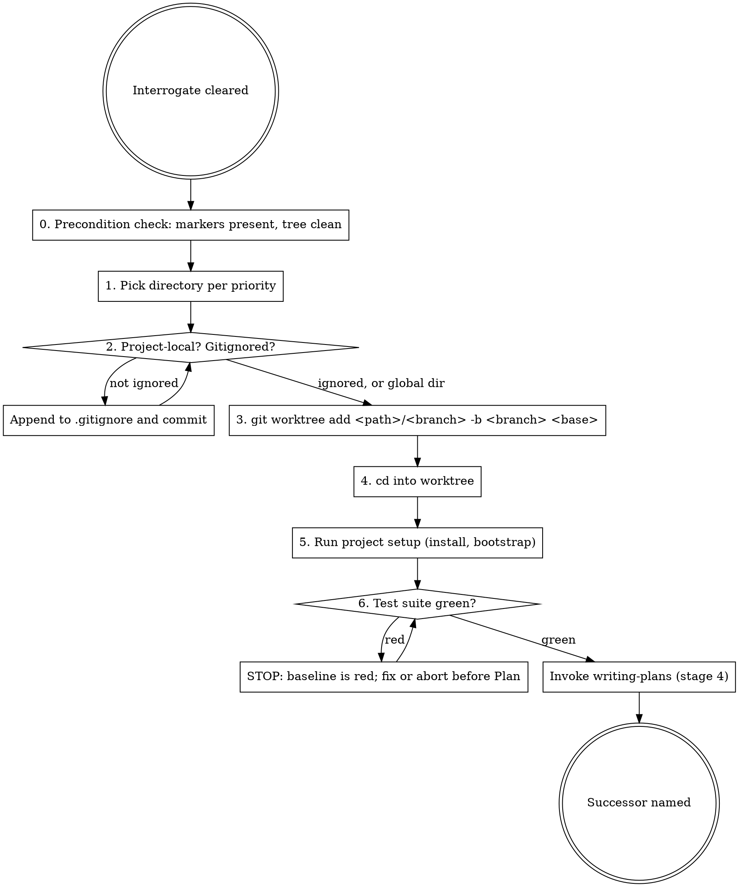

## Announce on entry

> I'm using the using-git-worktrees skill to set up an isolated workspace. I will not run the implementation plan until the worktree is created, set up, and the test baseline is green. If any precondition fails, I will STOP rather than proceeding on best-effort.

## Hard gate

```
Do NOT create a worktree, run any setup command, or advance to any successor
skill until all preconditions are satisfied: (1) deep-discovery (2a) has
recorded its verbatim completion marker on the product spec, (2) if the
Surfaces value warranted it, design-interrogation (2b) has recorded its marker
on the UX spec or the spec contains a verbatim `design-interrogation skipped -
scope: <reason>` line, AND (3) the current working tree (submodules included)
is clean. If any check fails, STOP. Route (1) and (2) back to the appropriate
Interrogate co-skill; stash, commit, or ask about (3) before proceeding. This
applies to EVERY project regardless of perceived simplicity or obviousness.
```

> Violating the letter of the rules is violating the spirit of the rules.

## Why isolation matters

An isolated worktree on a new branch is what lets test failures, build breakage, and regression signals belong to the work being attempted, not to pre-existing state in the shared workspace. Implementation without isolation is implementation where every failure has two possible causes; the green baseline before work starts is what removes the second cause.

## Core principle

Systematic directory selection + safety verification + green baseline = reliable isolation. All three are required. A worktree that bleeds into the parent repo, or a worktree created on top of red tests, is worse than no worktree at all because it creates the illusion of isolation while hiding the source of later failures.

## Precondition check (STOP if not satisfied)

Before any other step:

0. **Resolve `<feature-name>`.** `<feature-name>` is the slug after the `YYYY-MM-DD-` prefix and before `-design` or `-ux` in a spec filename; it is shared across the product spec, UX spec, baseline note, and plan filenames, so it must be stable from Stage 3 through Stage 8. Discover it by listing `docs/leyline/specs/*-design.md`, picking the most recent (or the one the human partner has named in this session), and extracting the slug with:

   ```
   ls -t docs/leyline/specs/*-design.md | head -n 1
   # => docs/leyline/specs/2026-04-17-dashboard-filters-design.md
   #    <feature-name> = dashboard-filters
   ```

   If multiple recent files exist and it is unclear which applies to this session, ask the human partner. Do not guess.

   If zero `*-design.md` files exist under `docs/leyline/specs/`, STOP. The product spec is missing entirely. Route back to `brainstorming`, not `deep-discovery` - you cannot interrogate what does not exist.

1. **Product spec marker.** Grep the product spec at `docs/leyline/specs/<YYYY-MM-DD>-<feature-name>-design.md` with an explicit regex:

   ```
   grep -E '^Deep-discovery pass complete - round [0-9]+ - [0-9]{4}-[0-9]{2}-[0-9]{2}$' "docs/leyline/specs/<filename>"
   ```

   - **Marker present:** proceed to step 2.
   - **Marker absent but file exists:** STOP. Route back to `deep-discovery`.
   - **File absent:** STOP. Route back to `brainstorming` (handled in step 0 above, but re-check here in case the file was moved between steps).

2. **UX spec marker or skip line.** If `Surfaces` in the product spec is anything other than `none`, grep the UX spec at `docs/leyline/design/<YYYY-MM-DD>-<feature-name>-ux.md`:

   ```
   grep -E '^(Design-interrogation pass complete - round [0-9]+ - [0-9]{4}-[0-9]{2}-[0-9]{2}|design-interrogation skipped - scope: .+)$' "docs/leyline/design/<filename>"
   ```

   - **Marker or skip line present:** proceed to step 3.
   - **Neither present but file exists:** STOP. Route back to `design-interrogation`.
   - **File absent but `Surfaces` not `none`:** STOP. Route back to `design-brainstorming` - the UX spec has not been authored.

3. **Working tree clean (including submodules).** Run:

   ```
   git status --porcelain --ignore-submodules=none
   ```

   It must return empty output. If there are uncommitted changes in the main tree or any submodule, STOP and ask the human partner whether to stash, commit, or abort. Do not decide silently; uncommitted changes may be in-progress work that must not be lost.

4. **Nested-worktree detection.** If the current working directory is already inside a worktree (`git rev-parse --git-common-dir` differs from `git rev-parse --git-dir`), say so out loud and ask the human partner whether to:
   - `cd` to the root repo before creating the new worktree (usually correct)
   - stack a worktree off the current feature branch (rarely correct; usually indicates confused pipeline state)

   Do not create a nested worktree silently.

## Directory selection - priority order

Explicit human-partner configuration beats incidental folder presence. If the human partner has written a preference into `CLAUDE.md`, that preference wins even when `.worktrees/` also happens to exist in the repo.



Priority is fixed:

1. **`CLAUDE.md` preference** - grep with:

   ```
   grep -iE 'worktree.*(director|folder|location|path|dir)' CLAUDE.md
   ```

   Also scan for a `## Worktrees` or `## Worktree directory` heading and read its body. If a path is declared by any of these, use it without asking. Explicit human-partner configuration trumps folder-existence heuristics.
2. **`.worktrees/`** - project-local, hidden directory. Preferred local default.
3. **`worktrees/`** - project-local, non-hidden alternative.
4. **Ask the human partner** - present exactly two options:
   - Local: `.worktrees/` (project-local, hidden).
   - Global: a platform-aware path.
     - Linux / other POSIX: `~/.config/leyline/worktrees/<project-name>/`
     - macOS: `~/Library/Application Support/leyline/worktrees/<project-name>/`
     - Windows: `%LOCALAPPDATA%\leyline\worktrees\<project-name>\`

   Wait for the answer. Do not assume the XDG Linux path on non-Linux systems.

## Safety verification

For project-local directories (`.worktrees` or `worktrees`), the directory MUST be gitignored before a worktree is created. A non-ignored worktree directory leaks untracked files into the parent repo and generates noise on every `git status`.

Verify with:

```
git check-ignore -q .worktrees || echo "NOT IGNORED"
```

If the check prints `NOT IGNORED`:

1. Append `.worktrees/` (or `worktrees/`, whichever applies) to `.gitignore`.
2. Commit the `.gitignore` change on the parent branch before creating the worktree.
3. Re-run the check. It must pass.

Do not create the worktree until the check passes.

**Protected-branch handling.** If the parent branch is protected (commits require a PR), the gitignore fix cannot be committed directly. STOP and ask the human partner:

- Commit the gitignore change on a throwaway branch, open a PR, and wait for merge before creating the worktree; OR
- Use a global directory instead, where the gitignore check does not apply.

Do not commit to a protected branch and do not create the worktree without a passing gitignore check.

For global directories (platform-aware paths above), this step is N/A.

## Branch naming

Derive the branch name from the spec filename:

1. Start with the filename: `YYYY-MM-DD-<feature-name>-design.md`.
2. Strip the `YYYY-MM-DD-` prefix.
3. Strip the `-design.md` suffix.
4. Lowercase any uppercase characters: `tr '[:upper:]' '[:lower:]'`.
5. Replace any character that is not `[a-z0-9/-]` with `-`.
6. Prepend a kind prefix per the table below.
7. Validate with `git check-ref-format --branch <result>`. If validation fails, STOP and ask the human partner for a valid name.

| Surfaces | Branch prefix |
|----------|---------------|
| `none` | `feat/` (or `fix/` if the spec is a fix) |
| `developer-facing` | `feat/` |
| `cli-only` | `feat/` |
| `single-screen-ui` / `multi-screen-ui` / `cross-platform` | `feat/` |

Example: spec `docs/leyline/specs/2026-04-17-dashboard-filters-design.md` becomes branch `feat/dashboard-filters`. If the human partner has asked for a different branch name, use theirs; do not override.

## Process



## Checklist

Create one task entry (TodoWrite or harness equivalent) per item.

1. **Precondition check.** Run the five precondition checks above (topic resolution, product-spec marker, UX-spec marker or skip line, working tree clean including submodules, nested-worktree detection). STOP if any fails.
2. **Pick the directory.** Walk the priority order until you reach a directory. Record the path.
3. **Verify gitignore** for project-local directories. Fix and commit if needed. Handle protected branches per the Safety verification section. Do not proceed until `git check-ignore -q <dir>` succeeds.
4. **Pick the branch name.** Apply the seven-step derivation above; validate with `git check-ref-format --branch`. If the human partner has named the branch explicitly, use theirs.
5. **Resolve the base ref.** Use this order:

   ```
   git symbolic-ref --short refs/remotes/origin/HEAD   # -> origin/main or origin/master
   ```

   Strip the leading `origin/`. If the command errors (no `origin`, or unusual repo state), fall back to the configured default branch (`git config --get init.defaultBranch`, default to `main`). If the current HEAD is detached (`git symbolic-ref -q HEAD` returns non-zero), STOP and ask the human partner; do not branch off a detached HEAD silently. If the human partner specified a different base, use theirs.
6. **Create the worktree.**
   ```
   git worktree add <worktree-dir>/<branch> -b <branch> <base-ref>
   ```
7. **Enter the worktree.** `cd <worktree-dir>/<branch>`. All subsequent commands run here.
8. **Discover and run project setup.** Check in this order and run the first that applies:
   1. `CLAUDE.md` or `AGENTS.md` or `README.md` bootstrap instructions (grep for `bootstrap`, `setup`, `install`).
   2. `Makefile` targets `bootstrap`, `setup`, or `install`.
   3. `package.json` scripts `postinstall` / `bootstrap` (after `npm install` / `pnpm install` / `yarn install`).
   4. Python: `pip install -e .[dev]` if `pyproject.toml` has a `[project.optional-dependencies].dev` group; otherwise `pip install -r requirements-dev.txt` or `requirements.txt`.
   5. If none of the above apply, ask the human partner. Do not guess.

   If setup fails for any reason (dependency, environment, submodule init, LFS fetch, credentials), STOP. Setup failures are not distinguishable from feature regressions; resolve or escalate before proceeding to baseline.
9. **Discover and run the test suite.** Check in this order and run the first that applies:
   1. `CLAUDE.md` or `AGENTS.md` "test" section.
   2. `Makefile` target `test`.
   3. `package.json` `scripts.test` (run via the project's package manager).
   4. `pytest` / `tox` / `nox` / `cargo test` / `go test ./...` per detected language ecosystem.
   5. If no test command is discoverable, ask the human partner. If the project has no tests, record that verbatim in the baseline note and proceed with explicit human-partner acknowledgment that no baseline check is possible.

   If any test fails, the baseline is RED. STOP. Do not proceed to Plan on a red baseline; you cannot later distinguish feature regressions from pre-existing breakage. If the human partner authorizes proceeding anyway, append this verbatim line to the baseline note below:

   ```
   baseline-red-authorized - scope: <reason> - failing-tests: <count> - YYYY-MM-DD
   ```
10. **Record the baseline in the MAIN REPO, not the worktree.** Resolve the main-repo root and write to its `docs/leyline/plans/` directory:

    ```
    main_repo_root=$(realpath "$(git rev-parse --git-common-dir)/..")
    baseline_path="$main_repo_root/docs/leyline/plans/YYYY-MM-DD-<feature-name>-baseline.md"
    mkdir -p "$(dirname "$baseline_path")"
    ```

    The baseline note must live OUTSIDE the worktree so it survives worktree removal (Stage 8 Option 4 discard deletes the worktree; the baseline note is the audit trail that must persist). The baseline note is NOT committed to any branch; it is working-copy state that lives in the main repo's filesystem for cross-stage reads.

    Contents:
    - Worktree path
    - Branch name
    - Base ref and commit SHA
    - Test command and result (green, or red with the verbatim authorization line above)
    - Setup commands run

    This file is the handoff to Stage 4 (`writing-plans`), Stage 5 (Execute), Stage 7 (Review), and Stage 8 (`finishing-a-development-branch`). All downstream stages resolve `$baseline_path` through the same `main_repo_root` computation. Do not save the baseline "to the plan" - the plan does not yet exist, and the plan lives inside the worktree while the baseline lives outside it.
11. **Transition.** Announce and invoke `writing-plans` (stage 4). The plan will be written from inside the worktree.

## Anti-patterns

- **"Create Worktree Without Gitignore Check"** - leaks the worktree into the parent repo and surfaces as untracked files on every `git status`. A sixty-second check saves hours.
- **"Skip The Baseline Test, We'll Know Later"** - later you cannot distinguish your regressions from pre-existing breakage. The baseline test is the anchor.
- **"Red Baseline, Proceed Anyway"** - every subsequent test failure has two plausible causes. Debugging takes 3x longer. Fix the baseline or abort.
- **"Run Plan In The Original Workspace Because The Worktree Takes Effort"** - the effort is the value. The worktree is what makes the failures diagnosable.
- **"Uncommitted Changes Are Fine, I'll Work Around Them"** - the uncommitted changes may be work from a prior session. Stash or commit; do not assume.
- **"Pick The First Directory That Shows Up, Even Without Priority Order"** - the priority order exists so two agents on two days pick the same directory. Ad-hoc selection guarantees drift.
- **"Global Directory Is Easier, Default To That"** - project-local is preferred; global is the fallback when the human partner explicitly chooses it.

## Red flags

| Thought | Reality |
|---------|---------|
| "The tests will probably pass, skip the run" | "Probably" is how red baselines happen. Run them. |
| "This one failing test is unrelated" | Prove it, or abort. Unrelated failures at baseline hide relation later. |
| "The worktree dir already has a branch; reuse it" | Worktrees are per-branch; reusing a worktree means hopping branches and re-running setup. Create a new one. |
| "I'll set up the worktree after writing the plan" | No. The plan is written inside the worktree so it can reference the baseline. |
| "git worktree is flaky, I'll just branch in place" | Branching in place is the failure mode this skill exists to prevent. Use the worktree. |
| "The human partner didn't specify a directory, I'll just pick" | The priority order is the specification. Follow it. |

## Forbidden phrases

Do not say:

- "Skipping the baseline test, we're in a hurry"
- "Baseline is red but probably unrelated"
- "I'll create the worktree later"
- "Working in the main workspace is fine for this"

## Output artifacts

- A git worktree on a new branch, checked out, set up, with a recorded green baseline.
- A baseline note at `docs/leyline/plans/YYYY-MM-DD-<feature-name>-baseline.md` capturing worktree path, branch, base ref, base commit SHA, setup commands, and the test-command result.
- Stage 8 (`finishing-a-development-branch`) reads the baseline note to resolve worktree path, branch, and base ref when it cleans up.

## Successor

Always:

> Invoking writing-plans (stage 4). The worktree is clean and the test baseline is green. Plan writing happens inside this worktree.

### Missing-successor fallback

If `writing-plans` is not present in this version of the plugin, STOP. Tell the human partner the pipeline is incomplete and which skill is missing. Do not improvise; do not start implementing without a plan.

Do not exit without naming and invoking the named successor.

## Related

- `../../dev/stages/03-isolate.md` - canonical stage definition
- `../deep-discovery/SKILL.md` - 2a completion marker that gate 1 checks
- `../design-interrogation/SKILL.md` - 2b completion or skip marker that gate 2 checks
- `../writing-plans/SKILL.md` - the successor, run inside the worktree
- `../finishing-a-development-branch/SKILL.md` - cleans up this worktree at stage 8
