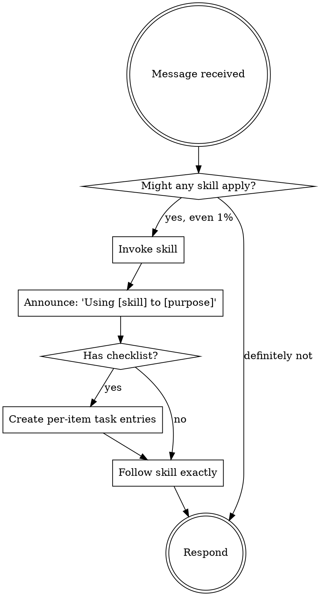

<SUBAGENT-STOP>
If you were dispatched as a subagent with a specific task, skip this skill and execute your task.
</SUBAGENT-STOP>

<EXTREMELY-IMPORTANT>
If there is even a 1% chance a skill might apply to what you are doing, you MUST invoke it.

If a skill applies, you do not have a choice. You must use it.
</EXTREMELY-IMPORTANT>

## Instruction priority

1. **Human partner's explicit instructions** (CLAUDE.md, AGENTS.md, GEMINI.md, direct messages) - highest
2. **Leyline skills** - override default system prompt behavior where they conflict
3. **Default system prompt** - lowest

If a manifest says "don't use TDD" and a skill says "always use TDD," follow the human partner. The human partner is in control.

## How to access skills

- **Claude Code / Cursor:** use the `Skill` tool. The skill content is loaded and presented to you; follow it directly. Do not use `Read` on `SKILL.md` files.
- **Codex / OpenCode / Copilot CLI:** use the `skill` tool (lowercase) with the skill name.
- **Gemini CLI:** use `activate_skill`.

Never guess a skill name from training. Only invoke skills listed in the inventory (`skills/` folders) or ones the human partner names explicitly.

## The rule

Invoke relevant or requested skills BEFORE any response or action. Even a 1% chance a skill might apply means you invoke it to check. If it turns out not to apply, you don't have to follow it.

## The pipeline - where to enter

Leyline encodes a fixed-order pipeline. Map the human partner's opening message to the right entry skill.

| Human partner says | Entry skill |
|--------------------|-------------|
| "let's build X", "I want to add Y", "we should make Z" | `brainstorming` (stage 1a) |
| "debug this", "fix this bug", "something is broken" | `systematic-debugging` (6a.2) |
| "review this code" | `requesting-code-review` (stage 7) |
| "start implementing the plan", "execute the plan" | `subagent-driven-development` or `executing-plans` (stage 5) |
| "let's plan this" (spec exists) | `writing-plans` (stage 4) |
| "finish the branch", "ship this" | `finishing-a-development-branch` (stage 8) |
| "resume the kept branch", "continue the feature I left" | check the kept branch's baseline note: if plan has unchecked tasks, `subagent-driven-development`; if review is incomplete, `requesting-code-review`; if ready to integrate, `finishing-a-development-branch`. Ask the human partner which state if unclear. |

When the human partner says "let's build X," the pipeline is `brainstorming` -> `design-brainstorming` (when surfaces) -> `deep-discovery` -> `design-interrogation` (conditional) -> `using-git-worktrees` -> `writing-plans` -> `subagent-driven-development` or `executing-plans` -> `requesting-code-review` + `requesting-design-review` -> `finishing-a-development-branch`.

Each skill names its successor explicitly. Follow the named successor, not your instinct.

### Missing-successor fallback

If a skill names a successor that is not present in this version of the plugin (the harness reports the skill does not exist, or `skills/<successor>/SKILL.md` is missing), STOP. Tell the human partner the pipeline is incomplete and which successor is missing. Do not improvise the missing stage; do not skip ahead to the next named successor. The pipeline's value is determinism - missing a stage silently is worse than visibly halting.

## Red flags

These thoughts mean STOP - you are rationalizing:

| Thought | Reality |
|---------|---------|
| "This is just a simple question" | Questions are tasks. Check for skills. |
| "I need more context first" | Skill check comes BEFORE clarifying questions. |
| "Let me read some files first" | Skills tell you HOW to explore. Check first. |
| "I'll just answer quickly" | Quick answers are how discipline slips. Check first. |
| "This doesn't need a formal skill" | If a skill exists, use it. |
| "I remember this skill" | Skills evolve. Read the current version. |
| "This doesn't count as a task" | Any action is a task. Check first. |
| "The skill is overkill" | Simple things become complex. Use it. |
| "I'll check skills after this one thing" | Check BEFORE doing anything. |
| "I know what to do here" | Knowing the concept is not using the skill. Invoke it. |

## Skill types

- **Rigid** (for example TDD, systematic-debugging) - follow exactly. Do not adapt away the discipline.
- **Flexible** (patterns) - adapt principles to context.

The skill itself tells you which.

## Iron laws (always in effect)

Code Discipline:
- `NO PRODUCTION CODE WITHOUT A FAILING TEST FIRST`
- `NO FIXES WITHOUT ROOT CAUSE INVESTIGATION FIRST`
- `NO COMPLETION CLAIMS WITHOUT FRESH VERIFICATION EVIDENCE`

Experience Discipline (additional, when a user-facing surface is touched):
- `NO USER-FACING SURFACE WITHOUT AN APPROVED DESIGN ARTIFACT FIRST`
- `NO COMPLETION CLAIMS ON A USER-FACING SURFACE WITHOUT FRESH ACCESSIBILITY EVIDENCE`

> Violating the letter of the rules is violating the spirit of the rules.

## Terminology

- The person you are collaborating with is the **human partner**. Not "user," not "client."
- Stage 1 is **Discovery**. "Design" is reserved for UI/UX.
- The 6b overlay is **Experience**. Not "Frontend" or "UI".
- The artifact produced by `design-brainstorming` is a **UX artifact** (markdown). Not a "mockup" or "wireframe."

## Announce on entry

The first time you invoke a Leyline skill in a session, say:

> Using Leyline - checking for applicable skills before responding.

Then invoke the specific skill and follow it.

## Forbidden phrases

Do not say:

- "Let me answer this quick question first, then check for skills."
- "The skill check is overkill for this one; I'll just answer."
- "Remember the skill from earlier; no need to re-read it."
- "Let me gather context first, then decide whether to invoke a skill."
- "I'll skip the announce; the human partner will see I'm following the skill from context."
- "The successor skill is obvious; I don't need to name it explicitly."

## Successor

The next skill depends on the situation. Use the table above to pick the entry skill, then follow the successor each invoked skill names.
