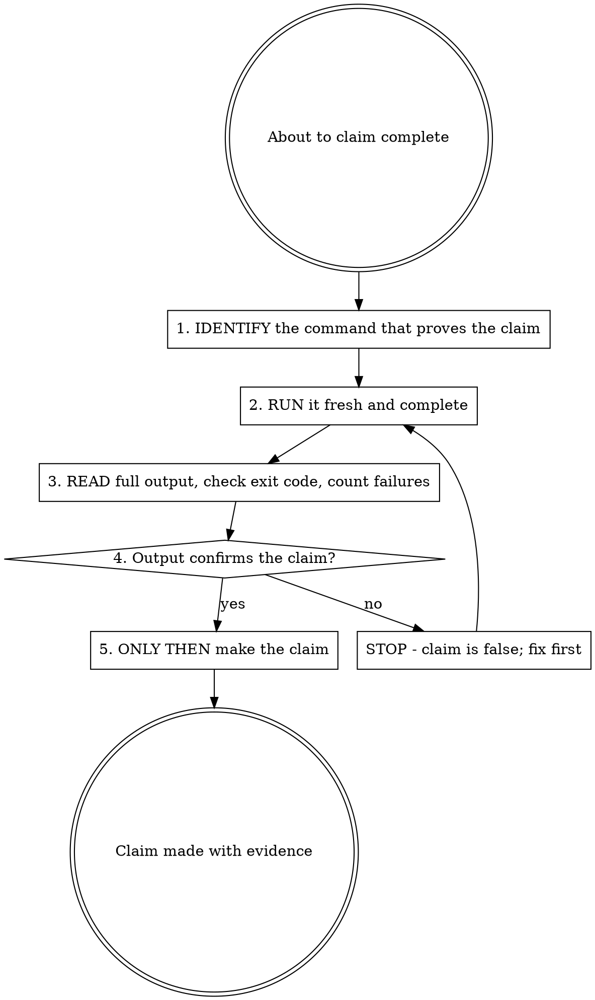

## Announce on entry

> I'm using the verification-before-completion skill. I will not claim the work is done until I have run the verification command fresh in this message and read its output.

## Iron Law

```
NO COMPLETION CLAIMS WITHOUT FRESH VERIFICATION EVIDENCE
```

> Violating the letter of the rules is violating the spirit of the rules.

## Why the iron law

Most "it's done" messages are lies - not deliberate lies, but lies of extrapolation. The agent ran the test an hour ago, changed three files since, assumes the test would still pass. Or ran a partial build, not the full build. Or the linter in one directory, not the whole repo. The pattern is always the same: an earlier observation is extrapolated past the next change.

This iron law makes extrapolation a violation. Evidence must be fresh - run in the current message - and complete - the whole command, the whole output, the exit code read.

## The "fresh" rule

"Fresh" means: the verification command was run AFTER the last change to the code being verified, AND it was run in the current message (not earlier in the session, not earlier in the day). If you cannot paste the command output from this message, you cannot claim it passes.

Session state is not evidence. Memory is not evidence. A passing test from three messages ago is not evidence for the current code.

## The gate



### 1. IDENTIFY

Write down, explicitly, which command proves the claim. "Tests pass" requires `pytest` / `npm test` / `cargo test` / the project's specific test command. "Build succeeds" requires the build command. "Linter clean" requires the linter command. "Type-check passes" requires the type-check command.

If the claim is broad ("this feature works"), decompose into specific verifiable sub-claims.

### 2. RUN

Run the command in the current message. Not from memory. Not from a CI run. Not from a previous session. Now, here, with the code at its current state.

If the command is long-running, say so out loud and wait; do not shortcut to "it was passing before." If the command cannot be run in the current environment, say so out loud and escalate; do not silently extrapolate from an incomplete run.

### 3. READ

Read the full output. Not the first few lines. Not the last line. The full output, including:

- The exit code (non-zero is failure even when stdout looks okay).
- Warning counts (many commands report warnings that do not change the exit code but matter for the claim).
- The number of tests run vs expected (zero tests run is failure, not success).
- Any skipped / filtered / ignored items (skipping tests and claiming "all pass" is a violation of the iron law).

### 4. VERIFY

The output confirms the claim if and only if:

- Exit code matches the claim (0 for "succeeded").
- The number of tests run matches the number expected (no silent filtering).
- Warnings and errors fall within declared tolerance (if any - default is zero).
- The observed output plainly states what the claim plainly states.

If any of these fails, the claim is false. STOP. Fix the code and re-run, or narrow the claim to what the evidence actually supports.

### 5. CLAIM

Only now state the claim. Paste the verifying output alongside the claim so the reader can check. "Tests pass" alone is not a claim; "tests pass (paste: `27 passed, 0 failed`)" is.

## Claim-to-evidence mapping

| Claim | Requires | Not sufficient |
|-------|----------|----------------|
| Tests pass | Test command output in this message: 0 failures, exit code 0, expected count ran | Previous run, "should pass," "was passing" |
| Linter clean | Linter output in this message: 0 errors, 0 warnings (unless declared tolerance) | Partial check, extrapolation from a subset |
| Build succeeds | Build command output in this message: exit code 0 | Linter passing, "logs look good" |
| Type-check passes | Type-checker output in this message: 0 errors | Compiler succeeds, "types look right" |
| Bug fixed | Test originally reproducing the bug now passes; full suite green; no regressions | "Code changed, assumed fixed" |
| Regression test works | Red-green cycle verified: test failed before the fix, passes after | Test passes once (might have always passed) |
| Agent completed | VCS diff shows the expected changes; tests green; commit landed | Agent says "success" in a report |
| Requirements met | Line-by-line checklist against the spec; each item evidenced | Tests passing (tests do not cover every requirement) |
| Merged | `git log` shows the merge commit on the target branch | PR opened; "merge button pressed" |
| Deployed | Target environment shows the new build; smoke tests passed | Deploy command exited 0 ("but I don't see it in prod") |
| Documented | The doc file exists, has the new content, and is committed | "I'll update the docs next" |

When the claim is not on this table, construct the row: what evidence, what is not sufficient. Do not claim without constructing the row.

## Checklist

For every completion claim:

1. Identify the command.
2. Run it fresh.
3. Read the full output.
4. Verify against the claim.
5. Paste the evidence alongside the claim.

If the claim cannot pass 1-4, narrow the claim or do not make it.

## Anti-patterns

- **"Tests Were Passing Earlier"** - earlier is not now. Run fresh.
- **"Should Pass Based On The Code"** - "should" is extrapolation. Run fresh.
- **"The Partial Output Looked Good"** - read the full output, including exit code.
- **"I'll Verify After The Commit"** - then the commit claim is false. Verify first.
- **"The CI Will Catch Anything I Missed"** - CI is a fallback, not the gate. The gate is here.
- **"The Linter Is Too Noisy, It's Fine"** - if the claim is "linter clean," the output is "0 errors, 0 warnings." Noise is failure.
- **"Zero Tests Ran, But Nothing Failed, So Pass"** - zero tests ran is failure, not success.

## Red flags

| Thought | Reality |
|---------|---------|
| "I ran the tests earlier, they passed" | Earlier code, not current code. Run fresh. |
| "The build is slow, I'll skip it and commit" | Commit claim requires build-succeeds evidence. Run the build. |
| "I know this lint rule, I don't need to run it" | Run it. The knowledge is not the evidence. |
| "The test output is long, I'll just check the last line" | Failures can be in the middle. Read the full output. |
| "Exit code 1 but the feature works" | Exit code 1 is failure. Reconcile the output with the claim or narrow the claim. |
| "I'll claim done; CI will re-verify" | The claim is here; so is the evidence. |

## Forbidden phrases

Do not say:

- "Tests should pass"
- "The build should be fine"
- "Linter is probably clean"
- "I'll verify in the next message"
- "Running the full suite is overkill"
- "The output was too long; it's probably fine"

## Returns to caller

This is an overlay. It fires at every completion claim inside a larger skill (a task, a review pass, a branch summary). After the gate completes, control returns to the caller. No explicit successor.

## Related

- `../../dev/principles/iron-laws.md` - catalogues this iron law
- `../../dev/stages/06-discipline.md` - canonical overlay definition
- `../test-driven-development/SKILL.md` - the RED-GREEN-REFACTOR discipline this gate verifies
- `../systematic-debugging/SKILL.md` - phase 4's fix verification passes through this gate
- `../accessibility-verification/SKILL.md` - the Experience-Discipline analog of this iron law
