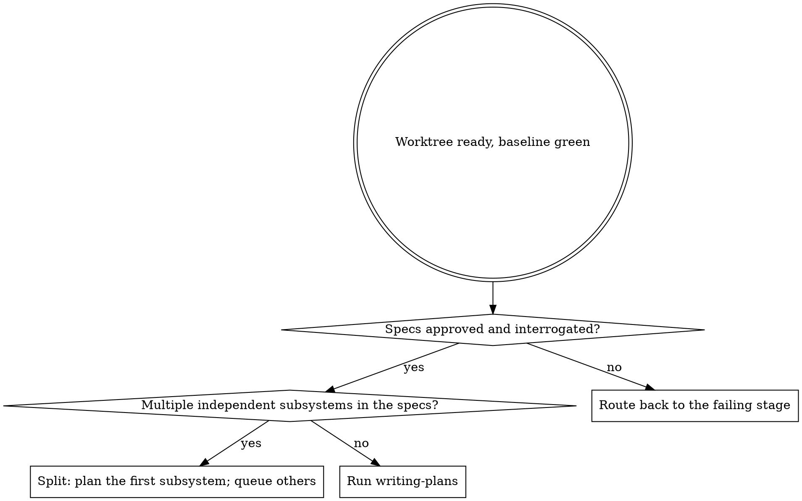
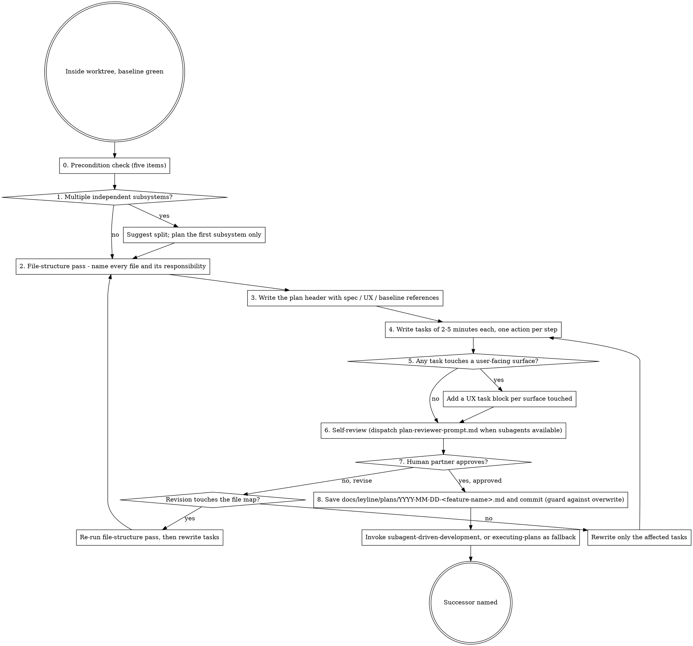

## Announce on entry

> I'm using the writing-plans skill to turn the approved specs into an implementation plan of 2-to-5-minute tasks with exact file paths, complete code, and verification. If any precondition fails, I will STOP rather than proceeding on best-effort.

## Hard gate

```
Do NOT write tasks, scaffold files, or touch production code until all five
preconditions are satisfied: (1) <feature-name> has been resolved from the
spec filename, (2) the product spec has been cleared by deep-discovery
(verbatim completion marker present), (3) if Surfaces warranted it, the UX
spec has been cleared by design-interrogation (marker present) or the spec
carries a verbatim skip line, (4) a worktree exists with a recorded green
baseline at docs/leyline/plans/YYYY-MM-DD-<feature-name>-baseline.md (produced
by stage 3), AND (5) the current working directory is inside that worktree.
If any check fails, STOP. Route (2) and (3) back to the relevant Interrogate
co-skill; route (4) and (5) back to using-git-worktrees; re-run (1) against
the spec filename before proceeding. This applies to EVERY project regardless
of perceived simplicity or obviousness.
```

> Violating the letter of the rules is violating the spirit of the rules.

## Core principle

A plan is code that an enthusiastic junior engineer with poor taste, no judgement, no project context, and an aversion to testing can execute correctly. If a task assumes context the executor does not have, the plan is not a plan; it is a set of wishes. Every task names exact files, includes complete code (not outlines), and has a verification step whose result is observable.

## Audience assumption (load-bearing)

Write every task for an enthusiastic junior engineer with:

- **Poor taste** - needs exact code, not "implement this in the idiomatic way."
- **No judgement** - needs explicit file paths and verification, not "you know what to do."
- **No project context** - needs the spec cross-referenced by path, not "as we discussed."
- **An aversion to testing** - needs the failing-test step made mandatory and first, not optional and eventually.

If your task survives an executor who matches this description, it is a plan. If it does not, it is a sketch.

## Precondition check (STOP if not satisfied)

Before any other step:

0. **Resolve `<feature-name>`.** The plan filename follows `docs/leyline/plans/YYYY-MM-DD-<feature-name>.md`. `<feature-name>` is the slug shared across the product spec, UX spec, baseline note, and plan filenames; Stage 3 resolved the same value when it wrote the baseline, and Stage 8 will read it when it cleans up. Derive it by scanning `docs/leyline/specs/*-design.md`, picking the file that corresponds to this session (most recent, or the one the human partner named), and extracting the slug between the date prefix and the `-design.md` suffix. If multiple recent files exist and it is unclear which applies to this session, ask the human partner. Do not guess.

1. **Product spec marker present.** Grep the product spec at `docs/leyline/specs/<YYYY-MM-DD>-<feature-name>-design.md`:

   ```
   grep -E '^Deep-discovery pass complete - round [0-9]+ - [0-9]{4}-[0-9]{2}-[0-9]{2}$' "<path>"
   ```

   If the file is missing: STOP, route to `brainstorming`. If the marker is missing but the file exists: STOP, route to `deep-discovery`.

2. **UX spec marker or skip line (if applicable).** If `Surfaces` in the product spec is not `none`, grep the UX spec at `docs/leyline/design/<YYYY-MM-DD>-<feature-name>-ux.md`:

   ```
   grep -E '^(Design-interrogation pass complete - round [0-9]+ - [0-9]{4}-[0-9]{2}-[0-9]{2}|design-interrogation skipped - scope: .+)$' "<path>"
   ```

   File missing: STOP, route to `design-brainstorming`. Markers missing: STOP, route to `design-interrogation`.

3. **Baseline note exists.** Check for `docs/leyline/plans/<YYYY-MM-DD>-<feature-name>-baseline.md`. If missing, STOP. The worktree has not been set up with a recorded baseline; route back to `using-git-worktrees`.

4. **Inside the worktree.** Extract the worktree path from the baseline note and compare it to the current working tree's toplevel:

   ```
   baseline_path="docs/leyline/plans/<YYYY-MM-DD>-<feature-name>-baseline.md"
   recorded=$(grep -E '^- Worktree path:' "$baseline_path" | sed 's/^- Worktree path:[[:space:]]*//')
   current=$(git rev-parse --show-toplevel)
   [ "$recorded" = "$current" ] && echo OK || echo MISMATCH
   ```

   If the baseline has no `- Worktree path:` line (malformed), STOP and route back to `using-git-worktrees` to re-emit a proper baseline note. If the line exists but does not match the current tree, STOP. `cd` into the recorded worktree before continuing; do not write the plan from the root repo or from a different worktree.

## When to use



## Scope check

If the spec covers multiple independent subsystems (different data models, different lifecycles, different audiences, different deploy surfaces), the brainstorming step should already have split them. If it did not, STOP and suggest splitting into separate plans - one per subsystem - each producing working, testable software on its own.

A plan that spans independent subsystems cannot be executed task-by-task with confidence; debugging crosses subsystem boundaries and the review discipline cannot stay local. Split.

## File-structure pass

Before defining any task, map out which files will be created or modified and what each is responsible for. Write this as a "Files" section in the plan.

- **Units with clear boundaries and well-defined interfaces.** If you cannot name the interface, the boundary is wrong.
- **One clear responsibility per file.** A file that does two things is a task bundle, not a unit.
- **Files that change together live together.** Split by responsibility, not by technical layer (no mixing `routes/`, `handlers/`, `services/` just for the sake of layering).
- **In existing codebases, follow established patterns.** Do not unilaterally restructure. A split is reasonable only when a modified file has grown unwieldy.

The file map is the backbone of the plan. If the file map is wrong, every task is wrong.

## Task granularity rules

Each task is 2-5 minutes of work. One action per step:

1. "Write the failing test"
2. "Run it to make sure it fails"
3. "Implement the minimal code to make the test pass"
4. "Run the tests and make sure they pass"
5. "Commit"

Rules:

- A task larger than 5 minutes gets split.
- A task with two responsibilities gets split.
- A task without a failing-test step is not TDD; it is implementation-first. Rewrite it.
- A task without a verification step is a wish; add the verification.
- A task that assumes context the executor does not have is a sketch; add the context to the plan.

**Heuristic for 5 minutes (external estimation).** You cannot time yourself; use these proxies:

- The implementation code block is under ~20 lines of non-trivial code.
- The task touches one production file (and its paired test file, if any). Touching two production files is usually two tasks.
- The verification command is one line. If verification needs a setup step plus the check, split the setup into its own task.
- There is one decision point in the task. If the executor has to pick between options mid-task, the task needs the decision pre-resolved in the plan.

Any single proxy tripping is not conclusive; all three tripping together (big code, multiple files, multi-step verification) is a firm signal to split.

**Non-code-task exception.** Doc-only updates, CHANGELOG entries, config-only / CI-only changes, dependency bumps, and formatting-only PRs are exempt from the failing-test step but NOT from a verification step. Verification for these is running the config, rendering the doc, re-running the failing scenario to confirm resolution, or running the formatter and committing its output. When a task takes the exception, the task block must declare it verbatim:

```
Exception: <config-only | doc-only | CHANGELOG | dependency-bump | formatting> task - no failing test. Verification: <command and expected output>.
```

Without the declaration, the TDD iron law applies.

## Required plan header

```markdown
# [Feature Name] Implementation Plan

> **For agentic workers:** REQUIRED SUB-SKILL: Use `leyline:subagent-driven-development` (recommended) or `leyline:executing-plans` to implement this plan task-by-task. Steps use checkbox (`- [ ]`) syntax for tracking.

**Goal:** [One sentence describing what this builds]

**Architecture:** [2-3 sentences about approach]

**Tech Stack:** [Key technologies/libraries. List a version number only when the task's code depends on syntax or API specific to a major/minor (for example "Python 3.11 - required for `ExceptionGroup`", "React 19 - required for `use()`"). Do not list versions for libraries whose relevant API is stable across recent majors.]

**Spec references:**
- Product spec: `docs/leyline/specs/YYYY-MM-DD-<feature-name>-design.md` (optionally `Product spec round <N>` to pin the plan to a specific approval round)
- UX spec: `docs/leyline/design/YYYY-MM-DD-<feature-name>-ux.md` (omit if Surfaces = none; optionally `UX spec round <N>` to pin)
- Baseline: `docs/leyline/plans/YYYY-MM-DD-<feature-name>-baseline.md`

**Surfaces:** [copy the value from the product spec verbatim]

**Files:**
- Create: `path/to/new-file.ext`
- Modify: `path/to/existing-file.ext`
- Test: `tests/path/to/test-file.ext`

---
```

## Task block template (code)

````markdown
### Task N: [Component Name]

**Files:**
- Create: `exact/path/to/file.py`
- Modify: `exact/path/to/existing.py`  (near `existing_function`; line ranges like `:123-145` are advisory and go stale after the first edit)
- Test: `tests/exact/path/to/test.py`

- [ ] **Step 1: Write the failing test**

```python
def test_normalize_lowers_and_strips():
    from mymodule.normalize import normalize_input
    assert normalize_input("  Hello  ") == "hello"
```

- [ ] **Step 2: Run the test, confirm failure**

```
pytest tests/mymodule/test_normalize.py::test_normalize_lowers_and_strips
# Expected: 1 failing test; failure reason is ImportError (normalize_input not defined yet)
```

- [ ] **Step 3: Implement minimal code**

```python
def normalize_input(raw: str) -> str:
    # Complete implementation, no ellipses or TODOs.
    return raw.strip().lower()
```

- [ ] **Step 4: Run tests, confirm pass**

```
pytest tests/mymodule/test_normalize.py::test_normalize_lowers_and_strips -v
# Expected: 1 passing test
```

- [ ] **Step 5: Commit**

```
git add <paths> && git commit -m "<message>"
```

The commit message follows the project's existing convention (check `CONTRIBUTING.md`, `CLAUDE.md`, and recent `git log` for the local style). If the project has no convention, use `<Task N>: <component> - <one-line summary>`.

Every code block in a task MUST be complete runnable code, not an outline. Literal `...`, `# TODO`, `pass  # implement`, "follow the pattern in <file>", "similar to <example>", or "mirrors the <thing> shape" are findings that fail the plan-reviewer COMPLETE CODE check.
````

## UX task block template

When a task touches a user-facing surface (see `../../dev/reference/surface-types.md`), add a UX task block alongside the code task block(s). Every surface touched gets one, even if only to confirm no states changed.

````markdown
### Task N: [Surface Name] - UX Task

**Surface:** <name from the UX spec's state matrix>
**Artifact reference:** `docs/leyline/design/YYYY-MM-DD-<feature-name>-ux.md#<section>`

- [ ] **Step 1:** Confirm the artifact section is current (matches current intent; DRAW step of DRAW-BUILD-RECONCILE)
- [ ] **Step 2:** Implement the surface per the artifact (BUILD step)
- [ ] **Step 3:** Trigger each state from the state matrix and observe. Copy each state-matrix cell verbatim from the UX spec. If a cell is `N/A - <reason>`, write `- <State>: N/A - <reason>` here and skip the trigger/observation fields for that state. For reduced-template Surfaces (`developer-facing`, `cli-only`), only the states that appear in the UX spec's state matrix for that surface belong here; the six UI states below are not an obligation.
  - Empty: <how to trigger; expected observation> (or `N/A - <reason>`)
  - Loading: <how to trigger; expected observation> (or `N/A - <reason>`)
  - Error: <how to trigger; expected observation> (or `N/A - <reason>`)
  - Success: <how to trigger; expected observation> (or `N/A - <reason>`)
  - Permission-denied: <how to trigger; expected observation> (or `N/A - <reason>`)
  - Offline: <how to trigger; expected observation> (or `N/A - <reason>`)
- [ ] **Step 4:** Run the accessibility verification procedure (keyboard walk, screen-reader narration, contrast check, motion preference) and paste the output
- [ ] **Step 5:** Side-by-side reconciliation against the artifact (RECONCILE step). If divergence exists, choose one: (a) fix the code to match the artifact; OR (b) update the UX artifact AND loop back to `design-brainstorming` for the human partner's re-approval before continuing. Silent drift is forbidden.
- [ ] **Step 6:** Commit
````

This block is governed by the Experience Discipline overlay (stage 6b), specifically `design-driven-development` (DRAW-BUILD-RECONCILE) and `accessibility-verification` (evidence-before-claim).

## Process



## Checklist

Create one task entry (TodoWrite or harness equivalent) per item.

1. **Precondition check.** Run the five precondition checks. STOP if any fails.
2. **Scope check.** If the specs cover multiple independent subsystems, stop and propose splitting. Plan the first subsystem only; queue the others for future sessions.
3. **File-structure pass.** List every file the plan will create or modify, with a one-line responsibility per file. This list is the plan's backbone.
4. **Plan header.** Write the required header (goal, architecture, tech stack, spec references, Surfaces, Files). Every field filled; no "TBD" or "see above".
5. **Write tasks.** For each responsibility in the file map, write one or more task blocks. Every task is 2-5 minutes with exact paths, complete code (not outlines), and a verification step whose expected output is named.
6. **UX task blocks.** For every user-facing surface touched by the plan (per the UX spec's state matrix), add a UX task block alongside the code task block(s). Every state in the matrix gets a trigger and an expected observation.
7. **Self-review.** Read the plan once from top to bottom. Confirm:
   - Every task is 2-5 minutes (use the granularity heuristics).
   - Every task names exact paths.
   - Every task has complete code or a complete verification step (not an outline).
   - Every code task has a failing-test step before the implementation step, OR declares the non-code-task exception verbatim.
   - Every surface has a UX task block with state-matrix cells copied verbatim (including `N/A - <reason>`).
   - No task assumes project context the executor does not have.

   If the harness supports subagent dispatch, dispatch a fresh subagent with `plan-reviewer-prompt.md`. Token pressure, rate limits, and session length are NOT legitimate fallback reasons; dispatch unless the subagent primitive is literally unavailable in the current harness.
8. **Human partner reviews the plan.** Present the written plan. Wait for explicit approval. If sections are rejected, revise and re-present; do not advance until approval is explicit.
9. **Save and commit.** Before writing, check whether `docs/leyline/plans/<YYYY-MM-DD>-<feature-name>.md` already exists. If it does, STOP and ask the human partner whether to overwrite (abandoning prior plan history), rename (new `<feature-name>` or a `-v2` suffix), or resume (re-read the existing plan and continue execution). Do not silently overwrite; a resumed session may have prior human-partner approval encoded in the existing file. Once the action is confirmed, write the plan and commit it inside the worktree. The plan is now the source of truth for Execute.
10. **Transition.** Announce and invoke the successor. Preferred: `subagent-driven-development`. Fallback (only when subagent dispatch is unavailable in the current harness): `executing-plans`.

## Anti-patterns

- **"Tasks Bigger Than 5 Minutes Are Fine"** - 5 minutes is the ceiling because it is what a fresh executor can hold in their head. Larger tasks get executed on auto-pilot with assumptions.
- **"Paths Are Obvious, Skip Them"** - "obvious" to the author is fog to the executor. Exact paths, every time.
- **"Outline The Code, The Executor Will Fill It In"** - an outline is a sketch. The plan's audience has poor taste; give them complete code.
- **"Tests Can Be Added After"** - the failing-test step is first for a reason. Writing it after the implementation rationalizes whatever was built.
- **"Bundle Multiple Responsibilities Per Task"** - a task with two responsibilities fails in two places and reviews in two directions. Split.
- **"The Human Partner Is Busy, Skip Approval"** - unapproved plans drift during execution. Fifteen minutes of review beats two hours of rework.
- **"This Surface Is Tiny, Skip The UX Task Block"** - small surfaces fail worst because defaults leak through. The UX task block is cheap; skip it only for surfaces explicitly marked non-interactive in the UX spec.
- **"Assumptions Are Context, The Executor Will Figure Them Out"** - write the assumption into the plan, or resolve it by asking the human partner. Do not ship an implicit assumption.
- **"Write Plan Now, Commit Later"** - the plan is committed inside the worktree at save time. Uncommitted plans drift.

## Red flags

| Thought | Reality |
|---------|---------|
| "The executor will know what this means" | The executor is an enthusiastic junior with no project context. They will not. |
| "Step 3 says 'implement' - I don't need to write the code" | You do. The plan is code for the executor. Outlines produce outlines. |
| "The test will be obvious from the function name" | It will not. Write the test, run it, watch it fail. |
| "5-minute limit is a guideline" | It is a limit. Larger tasks are where shortcuts hide. |
| "I'll skip the UX task block since it's just one state" | One state skipped is one state shipped as a framework default. |
| "The plan is mostly right, the human partner can approve as I write" | No. Present the finished plan. Partial approval drifts. |
| "This architecture note covers the whole plan" | Architecture notes are fog; tasks are compass. Write the tasks. |
| "The spec says X, the executor will read the spec" | The plan references the spec; do not rely on the executor reading it. Quote what matters. |

## Forbidden phrases

Do not say:

- "Partial plan is fine, we'll fill in the rest during execution"
- "The tasks will become clear as we implement"
- "Let me sketch the plan, we'll firm up details later"
- "Outline is enough, the executor will know"
- "Skipping UX tasks because the product spec covers it"

## Output artifacts

- **Required:** `docs/leyline/plans/<YYYY-MM-DD>-<feature-name>.md` committed inside the worktree.
- The plan references the product spec, UX spec (if applicable), and baseline note by path.
- Every task has exact paths, complete code, and a verification step.

## Supporting files

- `plan-reviewer-prompt.md` - subagent prompt template for self-review at step 7.

## Successor

Preferred:

> Invoking subagent-driven-development (stage 5). The plan is approved and committed; executing task-by-task with a fresh subagent per task plus two or three review passes.

Fallback (only when the current harness does not support subagent dispatch):

> Invoking executing-plans (stage 5). The plan is approved and committed; subagent dispatch is unavailable in this harness, so executing batched with human-partner checkpoints.

Token pressure, rate limits, session length, and agent preference are NOT legitimate reasons to fall back to `executing-plans`. Use it only when the subagent dispatch primitive is literally unavailable in the current harness.

### Missing-successor fallback

If any of the following skills is missing in this version of the plugin, STOP and report which: `subagent-driven-development`, `executing-plans`, `design-driven-development` (when the plan contains UX task blocks), `accessibility-verification` (when the plan contains UX task blocks). Do not improvise; do not begin implementation on an un-executed plan; do not ship UX task blocks whose overlay skills are absent.

Do not exit without naming and invoking the named successor.

## Related

- `../../dev/stages/04-plan.md` - canonical stage definition
- `../using-git-worktrees/SKILL.md` - predecessor; produces the baseline note this skill consumes
- `../brainstorming/SKILL.md`, `../design-brainstorming/SKILL.md` - produce the specs this plan references
- `../subagent-driven-development/SKILL.md` - preferred successor
- `../executing-plans/SKILL.md` - fallback successor
- `../test-driven-development/SKILL.md` - the failing-test-first discipline embedded in every code task
- `../design-driven-development/SKILL.md` - the DRAW-BUILD-RECONCILE discipline embedded in every UX task
