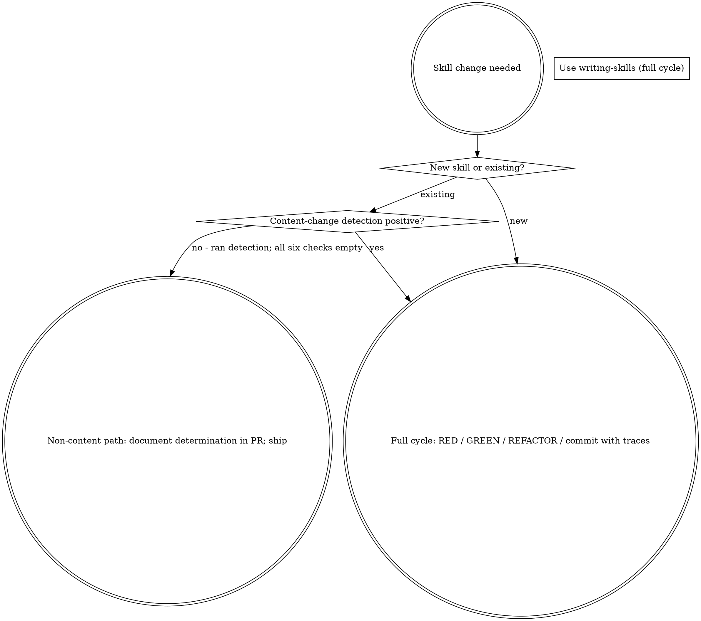
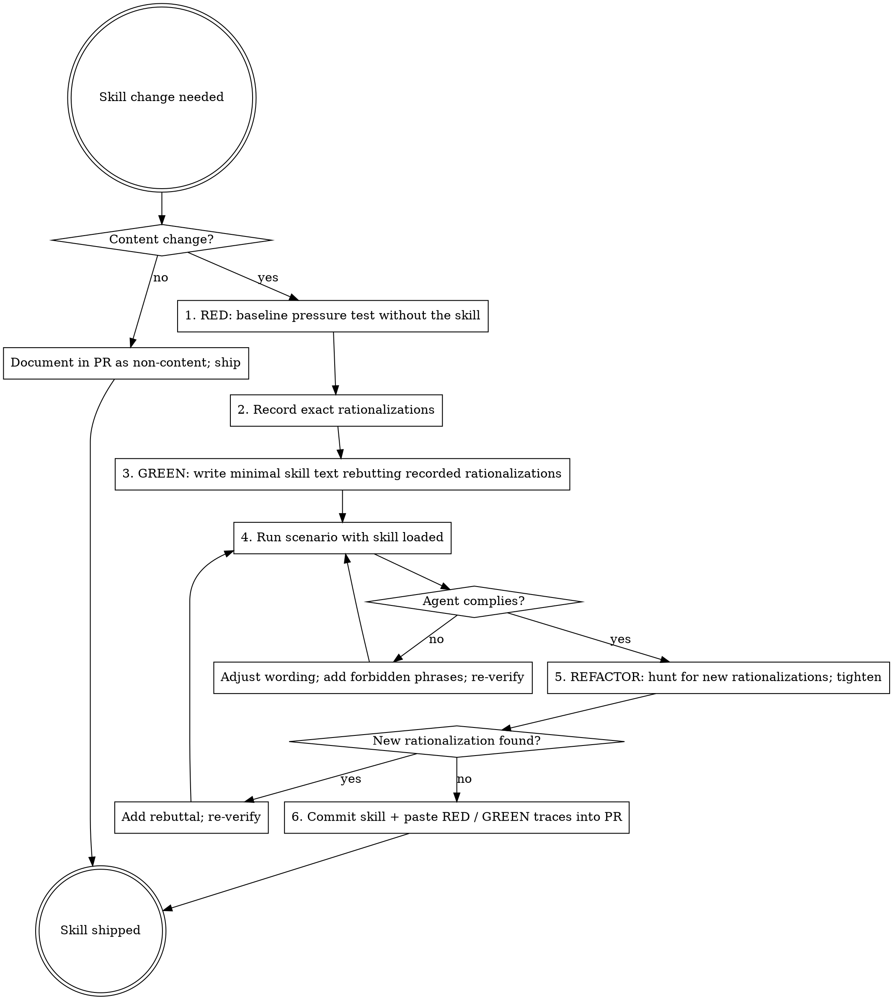

## Announce on entry

> I'm using the writing-skills skill. Skills are behavior-shaping code, not documentation. I will baseline with a pressure test, write the minimal rebuttal text, verify compliance, refactor against new rationalizations, and only then commit. If the content-change detection or the pressure-test trace cannot be produced, I will STOP rather than committing a skill change without evidence.

## Iron Law

```
NO SKILL CONTENT CHANGE WITHOUT BEFORE-AND-AFTER PRESSURE-TEST EVIDENCE
```

> Violating the letter of the rules is violating the spirit of the rules.

## Core principle

Skills are code that shapes agent behavior. Prose quality is irrelevant; behavioral compliance is the bar. If you cannot produce a baseline pressure test showing a fresh agent rationalizing around the discipline you are trying to install, you do not yet know what the skill should say. Write the test first; write the skill second; verify the test passes; hunt for new rationalizations; repeat.

The plugin's contributor rules make this non-negotiable: modifying an existing skill's behavior-shaping text without before-and-after pressure-test evidence is banned. This skill is how you produce the evidence.

## Hard gate / preconditions (STOP if not satisfied)

Before committing any content change to any `SKILL.md`, `testing-anti-patterns.md`, or agent-definition file:

1. **Content-change detection** - run the detection procedure below. If the change matches a content-change signal, the pressure-test cycle is required. If the change is genuinely non-content (cross-reference, typo in a non-match-surface location, frontmatter update not touching the description), document the determination in the PR and skip.
2. **RED trace captured** - baseline scenario run without the skill. Trace pasted into the PR and saved under `tests/<group>/<scenario-name>.md` Outcome section.
3. **GREEN trace captured** - same scenario re-run with the skill loaded. Compliance observed; forbidden phrases absent; iron-law / hard-gate blocks fire correctly.
4. **Refactor rounds run** - at least one variation of the scenario tested (pressure-shift or rationalization-invention). Loopholes found are closed; re-verified.
5. **Meta-skill self-test** - if the change touches `skills/writing-skills/` itself, run the cycle ON writing-skills (baseline a contributor-pressure scenario; verify the skill resists the "skip the pressure test" pressure). This skill's rules apply to itself.

If any precondition fails, STOP. Do not ship the change.

### Content-change detection procedure

Run each of these commands against the PR's diff; any non-empty result signals a content change:

```
# New or removed iron laws, hard gates, or preemption sentences
git diff HEAD -- '**/SKILL.md' | grep -E '^[+-].*(NO .* WITHOUT|Violating the letter|Do NOT)'

# New, removed, or reordered anti-pattern titles (changing the match surface)
git diff HEAD -- '**/SKILL.md' | grep -E '^[+-].*\*\*".*"\*\*'

# New or removed forbidden phrases
git diff HEAD -- '**/SKILL.md' | grep -E '^[+-].*^- "[^"]+"$'

# Announce-on-entry text changes
git diff HEAD -- '**/SKILL.md' | grep -B2 -A2 '^## Announce on entry' | grep -E '^[+-]'

# Red Flags table cell changes (either column)
git diff HEAD -- '**/SKILL.md' | grep -E '^[+-].*\|.*\|.*\|'

# Frontmatter description field changes
git diff HEAD -- '**/SKILL.md' | grep -E '^[+-]description:'
```

Empty across all six: non-content change, skip the pressure-test cycle. Non-empty on any: content change, the iron law applies.

Edge cases explicitly enumerated:

- **Typo fix inside a forbidden phrase, Red Flag entry, or anti-pattern name:** CONTENT CHANGE. The phrase's match surface changed.
- **Reordering Red Flag rows or forbidden phrases:** CONTENT CHANGE (ordering affects how the agent reads the table).
- **Renaming an anti-pattern:** CONTENT CHANGE.
- **Cross-reference path update with no text change:** non-content.
- **Grammar fix inside the Core principle or process prose (not touching forbidden phrases, anti-patterns, or the iron law):** non-content, but err toward pressure test if unsure.
- **Frontmatter `description` wording change:** CONTENT CHANGE (activates the skill; routing-affecting).
- **Frontmatter `name` change:** CONTENT CHANGE (breaks callers; out of scope for a routine PR).

## When to use



Content-change detection is MECHANICAL (see Hard gate, above). Judgment-only "this feels like a typo" is insufficient; run the six grep commands.

If you are unsure whether a change is content or non-content, it is content. Err toward the pressure test.

## TDD-for-prose mapping

| TDD concept | Skill creation |
|-------------|----------------|
| Test case | Pressure scenario dispatched to a fresh subagent |
| Production code | `SKILL.md` body |
| Test fails (RED) | The subagent rationalizes around the discipline without the skill present |
| Test passes (GREEN) | The subagent complies with the discipline when the skill is loaded |
| Refactor | Close loopholes while maintaining compliance |
| Write test first | Baseline pressure scenario BEFORE writing any skill text |
| Watch it fail | Record the exact phrases and rationalizations the subagent uses |
| Minimal code | Write the minimal SKILL.md text that rebuts those phrases |
| Watch it pass | Re-run the scenario with the skill loaded; confirm compliance |
| Refactor cycle | Look for new rationalizations the agent invents now that the obvious paths are blocked; tighten the text; re-verify |

## Required background

You must understand `test-driven-development` (iron law 1) before using `writing-skills`. RED-GREEN-REFACTOR defines the cycle; this skill adapts it to prose. If you are unfamiliar, read `../test-driven-development/SKILL.md` first.

## When NOT to create a skill

Do not create a skill for:

- **One-off solutions** - a technique used once, specific to one project.
- **Standard practices documented elsewhere** - if the Anthropic docs or a canonical reference already teach it, link to that instead.
- **Project-specific conventions** - those belong in the project's `CLAUDE.md`, not in a cross-project skill.
- **Mechanical constraints** - if a regex, validator, or linter can enforce it, automate the check; do not write prose.
- **Personal preferences that don't generalize** - a skill that only helps one contributor is a personal-skill (lives under `~/.claude/skills/`), not a plugin skill.

Create a skill only when: (a) the technique is not intuitively obvious; (b) it will be referenced across projects; (c) the pattern is general enough to apply broadly; (d) others would benefit from the same discipline.

## Skill types

- **Technique** - a concrete method with steps (example in this plugin: `using-git-worktrees`).
- **Pattern** - a way of thinking about a problem (example in this plugin: `dispatching-parallel-agents`).
- **Reference** - API docs, syntax guides, tool documentation (example in this plugin: `persuasion-principles.md` under `skills/writing-skills/`).
- **Subagent-prompt template** - a constructed-context prompt for a fresh subagent dispatched by a pipeline-stage skill (example in this plugin: `skills/subagent-driven-development/implementer-prompt.md`).

The SKILL.md says which type; the pressure-test scenarios vary accordingly.

## Process



## Checklist

1. **RED - baseline the scenario.** Write a pressure test (see `testing-skills-with-subagents.md`). Dispatch a fresh subagent with the scenario but WITHOUT the skill loaded. Record:
   - The tool calls the subagent made.
   - The exact phrases it used to rationalize around the discipline you want.
   - Whether it complied or not.

   If it complied without the skill, the skill is not needed for this scenario; pick a harder scenario or write a different skill.

2. **Record the rationalizations verbatim.** These go into the skill's Forbidden-phrases list, Red-flags table, and named anti-patterns. Do not paraphrase; copy them character-for-character.

3. **GREEN - write the minimal skill text that rebuts those rationalizations.** Start with:
   - Frontmatter (name, description - "Use when..." per `../../dev/reference/skill-file-format.md`).
   - Announce-on-entry sentence (commits to STOP behavior).
   - Iron law (if applicable) in a fenced code block.
   - "Violating the letter..." preemption sentence immediately after.
   - The minimum body that names the rationalizations from step 2 and rebuts each.

4. **Re-run the scenario with the skill loaded.** The agent must comply. If it does not:
   - The skill is not strong enough; tighten the wording.
   - Add specific forbidden phrases matching the agent's new rationalizations.
   - Re-verify.

5. **REFACTOR - hunt for new rationalizations.** Once the obvious paths are blocked, agents invent new ones. Run variations of the scenario (different framings, different pressure sources, different tool sets). Record the new rationalizations; add to the skill; re-verify.

6. **Commit the skill AND the pressure-test evidence.** The PR must include:
   - The RED trace (baseline without the skill).
   - The GREEN trace (scenario with the skill, showing compliance).
   - A one-sentence write-up of what rationalization the new text plugs.

   PRs without these traces are closed unreviewed per `.github/PULL_REQUEST_TEMPLATE.md`.

## Supporting files

- `anthropic-best-practices.md` - official skill-authoring conventions, mapped to Leyline's opinionated extensions.
- `persuasion-principles.md` - notes on how skill language actually influences agent behavior (what shapes of text produce compliance vs what shapes produce rationalization).
- `graphviz-conventions.dot` - DOT shape/edge conventions used in in-skill diagrams (doublecircle for start/end, diamond for decision, box for action).
- `testing-skills-with-subagents.md` - the pressure-testing methodology in detail, with scenario templates.
- `examples/` - worked examples of skills produced by this process, with their RED/GREEN traces.

## Mandatory body sections

Every Leyline skill must have these sections, in this order, unless the skill type explicitly exempts one:

1. **Frontmatter** - `name`, `description` starting with "Use when..." (under 1024 bytes total).
2. **Announce on entry** - the literal sentence the agent emits on invocation, committing to STOP on precondition failure.
3. **Iron law** (if applicable) - fenced code block.
4. **"Violating the letter..." preemption** - immediately after the iron law.
5. **Core principle** - one paragraph naming what this skill exists to prevent.
6. **Hard gate / preconditions** - mechanical checks the agent must run. Use grep templates where possible; do not leave checks as prose unless they are genuinely unrunnable mechanically.
7. **Process** - a DOT diagram showing decision points and action boxes. Numbered steps in prose where the diagram alone is unclear.
8. **Checklist** - one TodoWrite entry per step the agent executes.
9. **Anti-patterns** - Title Case in quotes, each with an explanatory body that names the specific failure mode.
10. **Red flags** - two-column Markdown table (`Thought` / `Reality`) with rationalizations agents actually use.
11. **Forbidden phrases** - explicit sentence fragments the agent must not emit.
12. **Output artifacts** - what the skill produces (files, commits, markers).
13. **Successor** - the next skill the pipeline invokes, or "returns to caller" for overlays, or "none - pipeline terminates" for terminal skills.
14. **Missing-successor fallback** - what to do if the named successor is absent from the plugin version.
15. **Related** - cross-references.

## Skill types - required section variance

- **Pipeline-stage skill** - all 15 sections required.
- **Overlay skill** (Stage 6: TDD, systematic-debugging, verification-before-completion, design-driven-development, accessibility-verification) - sections 6 (Hard gate), 12 (Output artifacts), 13 (Successor), and 14 (Missing-successor fallback) are exempted or reduced: the iron law serves as the entry gate instead of a numbered Hard gate; outputs are the compliance evidence itself (not a committed artifact); the successor is "returns to caller; no pipeline successor"; missing-successor fallback is N/A because overlays have no named successor. Other sections (announce, iron law, "Violating the letter...", core principle, process, checklist, anti-patterns, red flags, forbidden phrases, related) remain required.
- **Reference file** (non-`SKILL.md` supporting content, including `testing-anti-patterns.md`, `anthropic-best-practices.md`, `persuasion-principles.md`, the reviewer-prompt templates) - no YAML frontmatter required; an H1 title serves as the file identifier. No announce / iron law / process required. Each reference file must still declare its role at the top and cross-reference the invoking skill at the bottom.
- **Subagent-prompt template** - the prompt string is the body inside a fenced code block; surrounding Markdown describes when to dispatch and what inputs to substitute. No frontmatter. Canonical example: `skills/subagent-driven-development/implementer-prompt.md`.
- **Meta-skill** (`writing-skills`, this file) - pipeline-stage structure applies, plus Hard gate includes a meta-rule that changes to THIS skill run the full cycle against a contributor-pressure scenario in `tests/`.

## Anti-patterns

- **"Ship The Skill; Tests Come Later"** - skills without tests regress silently. The tests ARE the skill; no tests means no evidence of behavior change.
- **"Paraphrase The Agent's Rationalization For Clarity"** - the agent reaches for specific sentence shapes. Paraphrasing changes the match surface; the agent's next rationalization will not match the paraphrase. Copy verbatim.
- **"Add To The Body When A Forbidden Phrase Is Simpler"** - forbidden phrases are a cheaper, more specific block than prose. Prefer them.
- **"Write A Single Long Anti-Pattern Block"** - each anti-pattern gets its own named bullet. Aggregation hides which specific shortcut is being blocked.
- **"Skip The Announce-On-Entry Because It's Ceremonial"** - the announce commits the agent. Skipping it leaves the agent free to slide past the discipline without ever having acknowledged it.
- **"Refactor To Reads Well But Loses Behavior"** - compliance-edit without re-running the pressure test silently regresses the skill. Contributor rules block this for a reason.
- **"Stop Testing After GREEN"** - REFACTOR is where the loopholes get closed. Agents invent new rationalizations once the obvious paths are blocked; the second and third iterations of testing are the most valuable.

## Red flags

| Thought | Reality |
|---------|---------|
| "The skill text reads cleanly; ship it" | Reading clean is not complying under pressure. Run the scenario. |
| "I already know what the agent will rationalize" | Then writing it down takes 5 minutes. Do it; don't guess. |
| "The baseline is obvious; skip RED" | The baseline's purpose is to record the exact phrases you will rebut. "Obvious" never produces a compliance list. |
| "One pressure-test round is enough" | One round blocks the obvious paths. Two rounds blocks the less obvious. Three rounds is where most real skills settle. |
| "Mandatory sections are bureaucratic" | The structure is behavior-shaping. Missing sections are missing defenses. |
| "I can write the skill from a template" | Templates produce templates. Skills that survive pressure testing have text specific to the rationalization they block. |

## Forbidden phrases

Do not say:

- "Tests come later"
- "Good enough for v1"
- "I'll add forbidden phrases if agents complain"
- "Paraphrased for clarity"
- "Skipped the baseline; the skill is obvious"
- "Compliance-edit; no pressure test needed"

## Output artifacts

- New or modified `SKILL.md` / reference file / subagent-prompt template committed to the repo.
- Corresponding scenario file under `tests/<group>/<scenario-name>.md` with RED and GREEN traces captured in the Outcome section.
- PR entry referencing both, with the `.github/PULL_REQUEST_TEMPLATE.md` skill-change-evidence section completed.
- If the content-change detection ran and came up empty (non-content change), a one-line PR note citing the six detection commands with their empty outputs.

## Returns to caller

This is a meta-skill. After the six-step cycle completes and the skill is committed with traces, control returns to the caller (usually a contributor-PR session, or a plugin-author session). No pipeline successor.

### Missing-successor fallback

Not applicable — meta-skill does not name a pipeline successor. However, if the `tests/` directory, the scenario group (e.g., `tests/skill-triggering/`), or `scripts/check-manifests.sh` is missing in this version of the plugin, STOP and surface the gap to the human partner; the full cycle cannot be run without those artifacts present.

## Related

- `../test-driven-development/SKILL.md` - the RED-GREEN-REFACTOR discipline this skill adapts to prose
- `../../dev/principles/tdd-for-prose.md` - canonical methodology reference
- `../../dev/principles/behavior-shaping.md` - why skills are written as behavior-shaping code rather than prose
- `../../dev/reference/skill-file-format.md` - frontmatter and body rules
- `../../dev/reference/diagrams.md` - DOT conventions
- `../using-leyline/SKILL.md` - the entry skill whose structure is the default template
- `testing-skills-with-subagents.md` - pressure-testing methodology in detail
- `anthropic-best-practices.md` - official skill-authoring conventions
- `persuasion-principles.md` - how skill language influences agent behavior
- `graphviz-conventions.dot` - DOT conventions reference file
